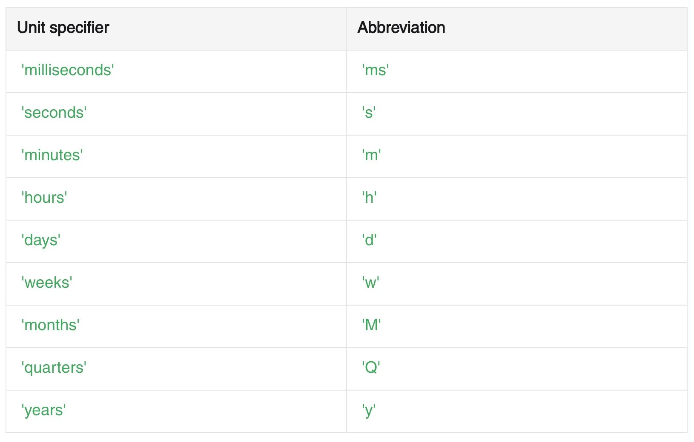
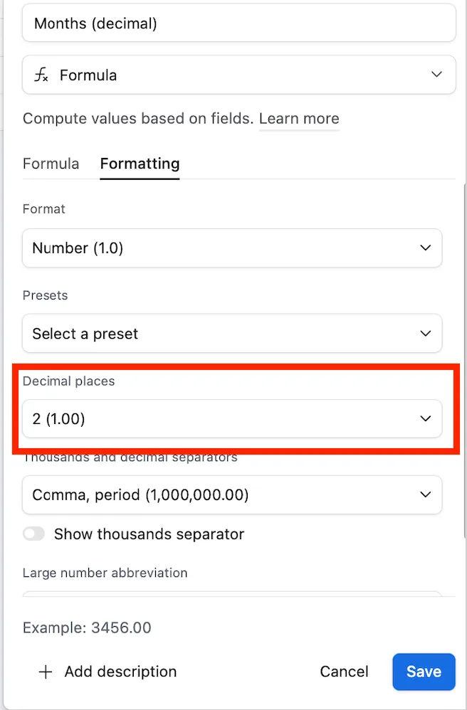

## Understanding Time Calculations in Airtable

Calculating the difference between two dates with high precision can often be a critical factor in data management and analysis. While Airtable provides straightforward functions like **DATETIME\_DIFF()**, often, these built-in functions might not suffice for nuanced calculations such as partial weeks, months, quarters, years or any other time frame. Let’s explore how to perform these detailed time calculations in Airtable effectively.

## Using DATETIME\_DIFF() for Basic Calculations

The **DATETIME\_DIFF()** function is a fundamental tool in Airtable to compute differences between two dates. The syntax is simple: **DATETIME\_DIFF({Date 2 field}, {Date 1 field}, “unit”)**, where ‘unit’ can be miliseconds, seconds, minutes, hours, days, weeks, months, quarters, or years. This simple formula will always work straightforward differences, where only whole units are needed.

Below you’ll find the supported units -do note that you can use the specifier or it’s abbreviation, and both will work!

## Accurate Calculations with Custom Formulas

More detailed calculations, such as those that require decimals for partial units, demand a more robust approach. Typically, you would measure the difference in days and then convert this number into the desired fractional unit. For example:

- **Monthly Differences:** Use DATETIME\_DIFF({Date2}, {Date1}, “days”) / 30.
- **Annual Differences:** Similarly, you can find the annual difference by dividing the number of days by 365: DATETIME\_DIFF({Date2}, {Date1}, “days”) / 365.

These formulas can be fine-tuned depending on the specificity of your requirement, such as accounting for leap years.

## Adjusting Formula Formatting

To ensure that your results display decimals for a more precise calculation, you will need to configure the formatting settings of your formula field in Airtable. Navigate to the formula field settings and select the amount of decimal places to suit your needs.

## Implementing Advanced Date Calculations

For those looking to automate processes or trigger actions based on these calculated times, Airtable’s **automations** can be an invaluable tool. By setting up an automation based on date calculation thresholds (e.g., an exact number of days before an event), you can automate reminders, notifications, or other actions. These I’ll call “Time Based Automations” and you can find a step by step for them on the following video:

<figure class="article-embed"><iframe src="https://www.youtube-nocookie.com/embed/pbi3qfAZQVI" title="A Guide to More Accurate Date Differences in Airtable — video" loading="lazy" allowfullscreen></iframe></figure>

By understanding and utilizing these formula adjustments and settings, you can enhance your Airtable data, ensuring that the base handles time-sensitive information with the precision your project needs! If you need additional help handling date differences, make sure to [hire an expert](/#book).
