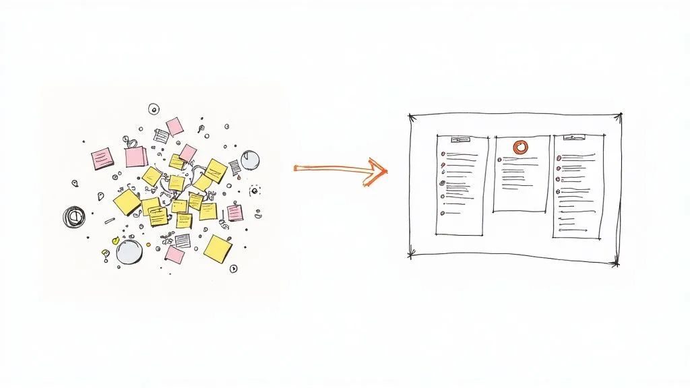
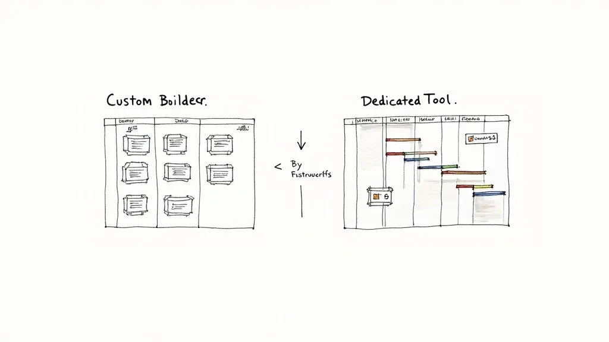

Choosing the right **agency project management software** can feel like the difference between chaos and clarity. But here’s the real question: do you build a completely custom system on a flexible platform like [Airtable](https://www.airtable.com/), or do you go with a dedicated, off-the-shelf tool? This guide digs past the usual feature lists to give you a real-world comparison that will actually help you decide.

## Finding the Right Agency Project Management Tool

Let’s be honest, the tool you choose to run your agency on is a huge decision. It hits everything—profitability, team burnout, and client happiness. The market for these tools is exploding for a reason. The global project management software market is expected to hit **USD 18.9 billion by 2035**, a massive jump from where it will be in 2025. This tells us one thing: agencies everywhere are pouring money into platforms to get a handle on their work.

This guide breaks down the two main paths you can take:

- **Custom Airtable System:** This is the DIY approach. You build your project management tool from scratch using Airtable’s ridiculously powerful database-spreadsheet hybrid. It gives you total control, which is perfect for agencies with one-of-a-kind workflows that don’t fit into a neat box. **Actionable Insight:** Start by mapping your most critical workflow on paper first—like client onboarding—before you even open Airtable. This blueprint will guide your build and prevent rework.
- **Dedicated Agency Software:** This means signing up for a ready-made platform like [Asana](https://asana.com/), [Monday.com](https://monday.com/), or [Teamwork](https://www.teamwork.com/). These tools are built with common agency needs in mind and come with structured features ready to go, so you can get up and running fast. **Actionable Insight:** Run a one-month trial with a single project team. This real-world test will reveal more about the software’s fit than any demo call.

This isn’t just a features-versus-features debate; it’s a strategic choice about how your agency is wired to operate. If you’re just starting your search, a broad overview of the [best agency project management software solutions](https://www.timetackle.com/best-agency-project-management-software/) can be a good place to get your bearings.

Our goal here is to give you a clear framework so you can pick the software that actually fits your agency’s size, maturity, and where you’re headed.

| Aspect             | Custom Airtable System                         | Dedicated Agency Software                       |
| ------------------ | ---------------------------------------------- | ----------------------------------------------- |
| **Primary Value**  | Unmatched flexibility and customization        | Streamlined efficiency and pre-built workflows  |
| **Initial Setup**  | Some effort; requires design and build time    | Low effort; quick to implement and use          |
| **Best For**       | Agencies with unique or evolving processes     | Agencies with standardized, repeatable services |
| **Learning Curve** | Moderate; requires a dedicated internal expert | Low to moderate; designed for user-friendliness |

## Airtable vs. Dedicated Tools: Defining the Core Approaches

Before we jump into a feature-by-feature showdown, it’s critical to understand the philosophy behind each type of **agency project management software**. This isn’t just about choosing between Gantt charts and Kanban boards; it’s about matching a tool’s fundamental DNA with your agency’s way of working. You’re looking at two completely different paths.

A custom Airtable setup is the ultimate builder’s toolkit. It’s built on the idea that your agency’s processes are unique and deserve a system tailored to your exact needs. Don’t think of it as a pre-built house. Think of it as a prime piece of land with a pile of high-quality building materials.

You get to design everything from the ground up. This means creating bespoke project trackers, super-granular resource planners, and even interactive client portals. The big win here is total control and adaptability, letting you build workflows that perfectly mirror how your team actually operates.

### The Custom-Built Blueprint

When you build in Airtable, you’re starting with a powerful database that just happens to look like a spreadsheet. You define every single field, link every record, and design every interface to match your vision. This is ideal for agencies that run non-standard projects or are constantly iterating on how they get work done.

**Practical Example:** A creative agency that produces commercials can build an Airtable base with linked tables for `Talent`, `Locations`, `Shot Lists`, and `Equipment`. A producer can then create a daily “call sheet” view that automatically pulls in the right talent, location address, and required equipment for that day’s shoot—a level of custom detail most generic software can’t handle. The process usually starts small and grows into a sophisticated hub for your entire operation. A key piece of this is automation, and you can explore a step-by-step guide to automating project task creation to see how powerful this can get.

### The Plug-and-Play Powerhouse

On the other side of the spectrum, you have dedicated agency software like [Asana](https://asana.com/), [Monday.com](https://monday.com/), or [Teamwork](https://www.teamwork.com/). These platforms offer a structured, plug-and-play experience. They’re designed around the idea that most agencies face similar challenges that can be solved with proven, pre-built modules.

They arrive with ready-to-go features for task management, time tracking, and client reporting, all based on established agency best practices. The goal isn’t to reinvent the wheel—it’s to get up and running fast and be efficient from day one.

> The core difference really lies in the starting point. Airtable asks, “What do you want to build?” while dedicated software asks, “Which of our proven workflows do you want to use?” This distinction shapes everything from the initial setup effort to long-term scalability.

This pre-built approach is a huge reason for the market’s explosive growth. A recent assessment puts the agency management software market at roughly **USD 6.58 billion in 2024**, with projections to hit **USD 14.29 billion by 2033**. This surge is driven by the growing complexity of agency work, which creates demand for reliable, out-of-the-box solutions. You can dig into the [market trends for agency software](https://www.businessresearchinsights.com/market-reports/agency-management-software-market-104181) to get the full picture.

Understanding these two foundational mindsets is the first and most important step toward making the right call for your agency’s future.

## Comparing Critical Agency Workflows

Talking about features is one thing, but the real test of any PM tool is how it handles the daily grind of agency life. Does it actually make your team’s day easier, or does it just add another layer of complexity? This is where we get into the nitty-gritty, comparing how a custom Airtable system stacks up against dedicated software in the workflows that matter most.

We’re going to look at the practical trade-offs. What’s the real cost to your ops manager’s week when you decide to build a resource planner from scratch? How does your custom-built client portal _actually feel_ to a client compared to a polished, off-the-shelf solution? Let’s dive in.

### Task And Project Tracking

At its core, any PM tool has to answer a simple question: who is doing what, and when is it due? The two approaches here are worlds apart, forcing a choice between total control and out-of-the-box efficiency.

With a custom Airtable setup, you’re the architect. You can build hyper-specific views for every role on your team—a high-level dashboard for account managers, a granular to-do list for designers, or a Kanban board showing just what’s due this week. For agencies with unique processes, this is a huge win.

**Practical Example:** A video production agency can build a view that links tasks not just to projects, but to specific cameras and shoot locations. You’ll never find that in a generic PM tool. The catch? Building and maintaining things like Gantt charts takes serious effort, often needing third-party apps and complex formulas to work.

Dedicated software, on the other hand, gives you professionally designed project views from day one. Their Gantt charts are interactive, their Kanban boards are slick, and dependencies are handled with a simple drag-and-drop. **Actionable Insight:** Use project templates. For a repeatable service like a “Monthly SEO Report,” create a template in your dedicated software with all standard tasks pre-loaded. This saves hours of setup time each month and ensures no steps are missed.

> The core difference is this: Airtable lets you build the exact dashboard you want, but you _have_ to build it. Dedicated software gives you a powerful, ready-to-use dashboard that is **90%** of what you need, instantly.

### Resource Management And Scheduling

Good resource management is what keeps your team from burning out and your projects profitable. It’s non-negotiable for a growing agency, and the difference in how you get there is stark.

Building a resource planner in Airtable is a serious undertaking. It means creating interconnected tables for team members, their weekly capacity, and every single task they’re assigned, then weaving it all together with formulas to track workloads. It can be incredibly powerful, but it requires an in-house Airtable guru to build and, more importantly, to fix when it breaks.

**Practical Example:** A digital marketing agency tracking specialist hours in Airtable must manually update task durations if a project’s scope expands. A broken formula in the ‘Team Capacity’ table could incorrectly show a developer as “available,” leading to them being double-booked. This requires constant vigilance. You can see how [marketing agencies can leverage Airtable to streamline their business](/how-marketing-agencies-can-leverage-airtable-to-streamline-their-business/), but it’s a hands-on process.

Dedicated software typically has resource scheduling built right in. These tools give you a clean, visual overview of your team’s capacity, letting managers assign tasks based on who’s free. They automatically flag anyone who’s overbooked and generate reports on team utilization—making it a core feature, not a complex DIY project.

### Client Collaboration And Reporting

The way you communicate with clients can make or break a relationship. Each approach offers a different philosophy on how to handle client portals and project updates.

In Airtable, you can build a completely custom client portal using Interfaces. You can design a branded dashboard that shows a client _only_ what they need to see—key deadlines, files needing approval, and project status. It feels personal and can be a cool selling point.

The downside is that the client experience can feel a bit raw. At the end of the day, your clients are interacting with a database interface, which might not be as intuitive as a portal designed for non-technical users.

Dedicated software provides clean, professional client dashboards out of the box. These portals are built for one thing: making it dead simple for clients to review work, leave feedback, and check progress without needing a tutorial. **Actionable Insight:** Schedule automated weekly progress reports to be sent directly from the software. This keeps clients informed without any manual effort from your account managers.

### Financial Management And Invoicing

Let’s be honest, an agency is a business. Connecting the work you do to the money you make is critical, and this is often where the choice between custom and dedicated becomes crystal clear.

Airtable has no native tools for time tracking or invoicing. To handle financials, you’re either building your own system with timers and integrations or leaning heavily on tools like Zapier to shuttle data over to your accounting software. This can get messy fast, and you’re the one responsible for making sure the data syncs correctly.

For agencies, accurate [agency time tracking software](https://deskcove.com/agency-time-tracking-software/) isn’t just about logging hours; it’s the foundation of your profitability.

On the flip side, dedicated **agency project management software** almost always has time tracking baked in. Time logged against a task can be automatically pulled into an invoice, and many platforms integrate directly with payment processors. **Practical Example:** In a tool like Teamwork, a designer can log 3 hours on a “Logo Design” task. At the end of the month, the project manager can generate an invoice that automatically includes that 3-hour line item, its billable rate, and a description of the work, reducing billing errors to near zero.

### Core Feature Comparison: Custom Airtable vs Dedicated PM Software

To put it all together, here’s a side-by-side look at how each approach handles core agency functions. This isn’t about which is “better,” but about understanding the trade-offs you’re making.

| Core Function            | Custom Airtable Approach                                                 | Dedicated Software Approach                                                    | Key Takeaway                                                                               |
| ------------------------ | ------------------------------------------------------------------------ | ------------------------------------------------------------------------------ | ------------------------------------------------------------------------------------------ |
| **Task Tracking**        | Highly customizable views for specific roles; requires manual setup.     | Optimized, pre-built views (Gantt, Kanban) that work instantly.                | Airtable offers total control; dedicated software offers immediate speed.                  |
| **Resource Management**  | Powerful but requires a complex, expert-level build and maintenance.     | Built-in, user-friendly modules for scheduling and capacity planning.          | A core, easy-to-use feature in dedicated software vs. a DIY project in Airtable.           |
| **Client Collaboration** | Bespoke, branded portals; can have a steeper learning curve for clients. | Polished, intuitive client dashboards that are ready to use immediately.       | Airtable provides a unique feel; dedicated tools offer a frictionless experience.          |
| **Financial Management** | Relies on third-party integrations and manual syncs for time tracking.   | Native time tracking and invoicing features for a seamless financial workflow. | Dedicated software provides an end-to-end solution; Airtable requires piecing it together. |

Ultimately, the choice comes down to your agency’s priorities. If you have unique workflows and an in-house expert ready to build, Airtable offers unparalleled flexibility. But if you need a reliable, feature-rich system that just works, a dedicated PM tool will get you there faster.

## Analyzing the Total Cost of Ownership

Picking project management software based solely on the sticker price can be misleading. What matters is the **Total Cost of Ownership (TCO)**—the sum of all direct and indirect expenses over the life of the tool. Subscriptions are just one piece of the puzzle; setup, training, maintenance, and opportunity costs fill in the rest.

**Actionable Insight:** Calculate your internal cost. Estimate the weekly hours your most tech-savvy team member will spend on setup and maintenance. Multiply that by their hourly rate. This reveals the “hidden” cost of a custom build.

### The Hidden Costs Of A Custom Airtable Build

At first glance, Airtable’s entry-level tiers look budget-friendly. But those low monthly fees hide a more expensive truth: the hours your team pours into building and sustaining a custom system.

Key time-sinks include:

- **Initial Build-Out (100–200+ hours):** Senior staff diverted from billable client work
- **Training & Onboarding:** Sessions, documentation, and one-on-one coaching
- **Ongoing Maintenance:** Debugging formulas, updating automations, preserving base performance

> “Every hour your operations manager spends debugging a formula is an hour they aren’t optimizing client delivery or improving team efficiency.”

Without an Airtable specialist on standby, small errors can snowball into major workflow bottlenecks.

### The Scaling Costs Of Dedicated Software

With dedicated agency PM tools, costs are transparent: a **per-user subscription** that scales with headcount. You skip the build-out phase and plug in on day one.

| Factor                      | Custom Airtable           | Dedicated Software                      |
| --------------------------- | ------------------------- | --------------------------------------- |
| Setup Time                  | **30–200+ hours**         | **0 hours**                             |
| Subscription Fee (10 Users) | **$\~$0–$70**             | **$25/user/month → $250/month**         |
| Subscription Fee (30 Users) | **$\~$0–$70**             | **$25/user/month → $750/month**         |
| Support & Maintenance       | Internal team; consultant | Vendor-led updates, security, help desk |
| Opportunity Cost            | High                      | Low                                     |

Advantages of a dedicated solution:

- **Immediate Functionality:** Jump straight into client work
- **Professional Support:** Help desk resolves issues fast
- **Automatic Updates:** Security patches and performance tweaks handled for you

The agency software sector was valued at **USD 2.5 billion in 2023** and is on track to nearly double by 2032. That growth signals a shift: many agencies find that predictable subscription fees beat open-ended internal investments. You can explore the full [agency software market report on Dataintelo](https://dataintelo.com/report/agency-management-software-market) for more context.

## Which Tool Is Right for Your Agency?

Choosing the right agency project management software isn’t just a technical decision—it’s a strategic one. The right tool should feel like a natural extension of your agency’s size, workflows, and ambitions.

To make this choice more concrete, let’s skip the abstract feature lists and dive into the real-world situation. We’ll walk through three distinct agency scenarios, look at their specific pain points, and figure out which solution offers the most direct, practical fix.

### Scenario: The Creative Studio

First up, picture a creative studio with **multiple** employees. This is a tight-knit, agile team that thrives on producing highly unique work, from experiential marketing campaigns to custom brand identities. Their projects almost never follow the same script, so rigid, standardized workflows just get in the way.

Their primary pain points are pretty clear:

- **Non-Standard Workflows:** Every project has a different set of steps and resources.
- **Tight Budget:** They can’t justify a high per-user subscription for a tool loaded with features they’ll never touch.
- **Need for Agility:** The team needs a system that can pivot on a dime as a project’s creative direction evolves.

For a studio like this, **a custom Airtable setup is the perfect fit**. It delivers maximum flexibility without breaking the bank. The team can design a project tracker that perfectly mirrors their creative process, linking everything from mood boards and contractor availability to client feedback in a way no off-the-shelf tool could. They get to build exactly what they need and nothing more, avoiding the bloat of bigger platforms.

> **Practical Example:** The studio can spin up an [Airtable](https://www.airtable.com/) base for a new client campaign. One table tracks core deliverables, another manages freelance illustrators and their rates, and a third works as a simple content calendar. Using Airtable’s Interfaces, they can build a branded client portal to share proofs for approval—all without writing a single line of code.

## How to Make Your Final Decision

Alright, let’s get down to it. Choosing the right **agency project management software** isn’t about finding a “perfect” tool—it’s about finding the _right fit_ for your agency’s unique DNA. The choice between a custom Airtable setup and a dedicated platform really hinges on three things: your operational maturity, your technical resources, and your growth plans.

To cut through the noise, just ask yourself a few direct questions.

### Guiding Your Choice With Key Questions

First, be honest about your operational maturity. Are your workflows solid, repeatable, and ready to be standardized? Or are they still a bit fluid, changing with every new client or experimental project? If you’re all about process enforcement and consistency, a dedicated tool is built for that world. But if you need a sandbox to keep tinkering and refining how you work, Airtable’s flexibility is your best friend.

By taking an honest look at your agency’s maturity, resources, and growth goals, you can pick a solution that not only handles today’s headaches but also sets you up for success down the road.

## Got Questions? We’ve Got Answers

When you’re trying to pick the right project management software for your agency, a few questions always seem to pop up. Getting clear on these helps you decide whether to go with a custom-built solution or an off-the-shelf tool.

Here are some straightforward answers to the questions we hear most often.

### How Long Does It Take To Build an Agency PM System in Airtable?

Honestly, there’s no one-size-fits-all timeline. The real answer depends entirely on how complex you need it to be. For a small team just looking to track simple projects, you could probably knock out a basic system in **20-30 hours** of design and testing.

But if you’re aiming for a more advanced setup with resource management, client portals, and a bunch of slick automations, you’re looking at **100-200+ hours** of focused work from someone who really knows their way around [Airtable](https://www.airtable.com/). That time includes not just the initial build, but also testing and tweaking it based on your team’s feedback. **Actionable Insight:** Adopt a “Minimum Viable Product” (MVP) approach. Build the absolute simplest version of your system first, use it for two weeks, and then gather feedback to guide the next phase of development.

### Can Dedicated PM Software Be Customized for Our Agency Workflow?

Yes, but it’s crucial to know the difference between _configuration_ and true _customization_. Most dedicated tools like [Asana](https://asana.com/) or [ClickUp](https://clickup.com/) offer tons of **configuration options**. You can add custom fields, tweak your dashboards, and set up project templates to make the software fit your process.

**Practical Example:** You can easily configure a workflow in Asana for your five-step content approval process by creating custom stages in a Kanban board (“Drafting,” “Internal Review,” “Client Review,” “Revisions,” “Approved”). What you _can’t_ do is change the fundamental way Asana is built to handle tasks or dependencies. That’s where you step into customization territory, which is what Airtable is all about.

> The bottom line is this: dedicated software lets you adapt its features to your workflow, while a tool like Airtable lets you build a workflow from scratch. Your choice comes down to whether your process needs a solid framework or a completely blank canvas.

### What’s the Biggest Mistake Agencies Make When Implementing New PM Software?

The single biggest mistake we see is getting completely hung up on features while ignoring **team adoption and change management**. A platform can have the most beautiful Gantt charts and reporting dashboards on the planet, but it’s completely worthless if your team doesn’t actually use it—or uses it incorrectly.

**Actionable Insight:** Identify “champions” within each department (creative, accounts, etc.) to help lead the transition. These are tech-savvy team members who can provide peer support and feedback, making the rollout feel collaborative rather than top-down. Provide great training that shows them how the tool makes _their_ specific jobs easier, and roll it out in phases.

---

If you’re ready to build a powerful, custom agency PM system without the headache of figuring it all out yourself, **Automatic Nation** is here to help. We build bespoke Airtable solutions that organize your projects, automate your workflows, and grow right alongside your business. [Book a call with Automatic Nation to streamline your agency’s operations](/).
