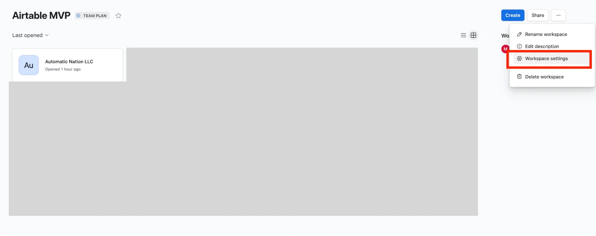
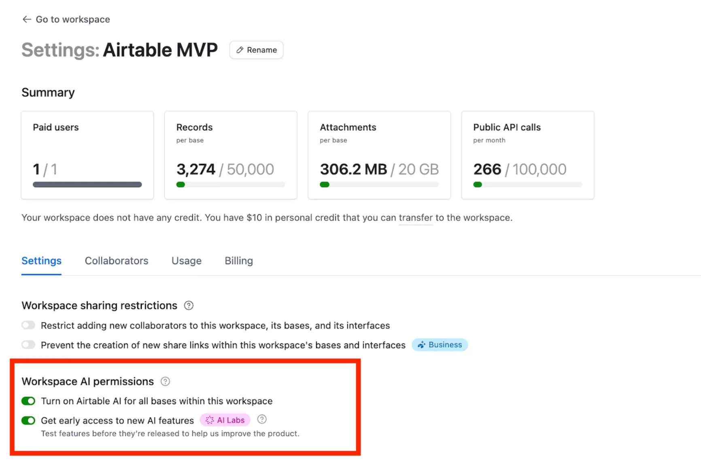

Airtable AI is available at the workspace level. Therefore, setup starts in workspace settings, not inside a base.

In this guide, you will learn how to enable Airtable AI correctly. Additionally, you will understand why this step matters for scaling AI use. This setup takes less than two minutes. However, many teams miss it and block AI features by accident.

## **What Is Airtable AI and Why It Matters**

Airtable AI adds native intelligence to your workflows. For example, it can summarize text, classify records, and generate content. Moreover, it works directly inside fields, automations, and interfaces. As a result, teams reduce manual work and improve consistency. However, Airtable AI stays disabled by default. Therefore, workspace owners must enable it explicitly.

## **How to Enable Airtable AI in Workspace Settings**

Only workspace owners can manage AI permissions. Consequently, editors cannot enable Airtable AI themselves. Before continuing, confirm the following you have workspace owner access! Otherwise, AI features will remain hidden.

### **Step 1: Open Workspace Settings**

First, go to your Airtable workspace ([you can access your workspaces here](https://airtable.com/workspaces)).

Then, click **Workspace settings** from the top navigation.

This opens the workspace configuration panel. From here, global permissions apply.

### **Step 2: Enable Airtable AI Permissions**

Next, scroll to **Workspace AI permissions**. You will see two toggles.

Enable both options:

- **Turn on Airtable AI for all bases within this workspace******

- **Get early access to new AI features (AI Labs)**

As a result, AI becomes available everywhere.

### **Step 3: Confirm the AI Status**

Once enabled, changes apply instantly, so no refresh is required. You should now see AI features rolled out on your bases within such workspace.

That is it! You now have access to AI features within your Airtable base, fields, automations, and interfaces!

Feel free to [book a call using this link](/#book) if you need any help setting this up.
