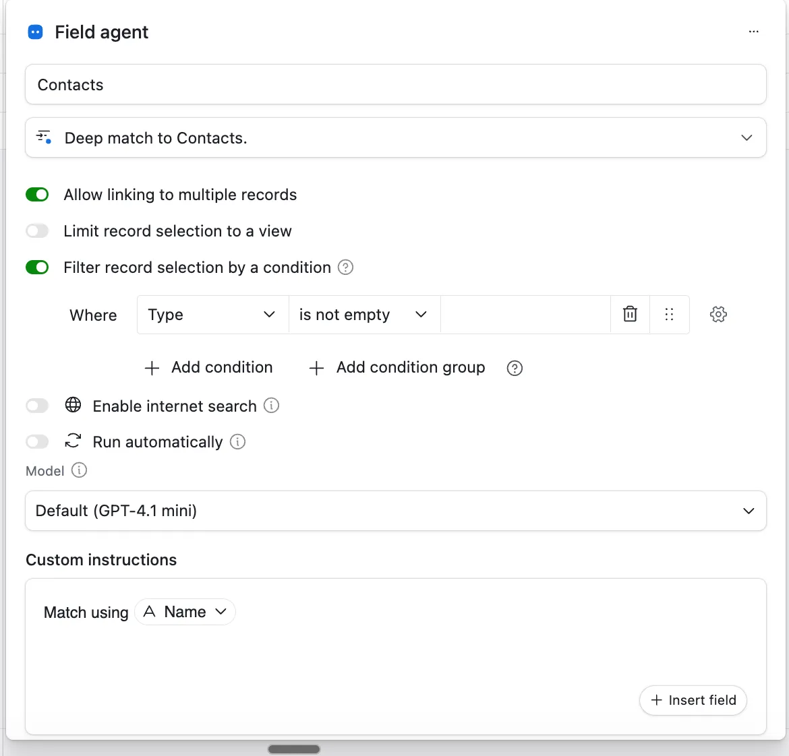

If you use [Airtable](http://airtable.com/) regularly, you’ve probably heard about the new **Airtable Deep Match** feature. This AI-powered field type automatically links records between tables based on smart matching criteria. By saving you hours of manual work, Airtable Deep Match helps you build more connected, dynamic, and accurate databases.

In this article, you’ll learn what Airtable Deep Match is, how to set it up step-by-step, and practical ways to use it to improve your workflows.

## How Does It Work?

Airtable Deep Match is an AI Agent field designed to create automatic links between records across different tables. Unlike traditional linked record fields where you select related records manually, Deep Match finds the best matches for you based on criteria set in your base.

### Features of Airtable Deep Match fields include:

- Option to select **single** or **multiple linked records** for more control.

- Matches only against a chosen **filtered view** in the target table, optimizing relevance.

- Customizable matching rules based on fields in your current and target tables.

- Powered by Airtable’s AI Agent, eliminating the need for formulas or scripts.

  

## How to Set Up Airtable Deep Match: A Step-by-Step Guide

Imagine managing tables like **Projects** and **Clients**, where you want projects automatically linked to clients based on regions or industries. Airtable Deep Match automates this linking process effortlessly.

1. **Add a new AI field** in your Projects table and choose the “Deep Match” option.
2. **Select the target table and view:** For example, link to the Clients table filtered by “Active Clients in APAC.”
3. **Define your matching criteria:** Map fields like Project “Region” to Client “Region” for accurate connections.
4. **Choose between single or multiple linking:** Decide if one or multiple clients should be linked to each project.
5. **Save and let Airtable’s AI work:** The Deep Match agent scans and links matching records automatically.

This setup keeps your project-client relationships up to date and relevant without manual effort.

## Top Use Cases

**Automated CRM Connections:** Streamline your CRM by auto-linking contacts or companies based on attributes like location or industry segment, reducing data entry errors.

**Enhanced Project Management:** Automatically assign team members or resources to tasks by matching skills, availability, or departments using filtered views.

**Efficient Inventory and Supplier Linking:** Connect purchase orders to suppliers or assets using categories or conditions, making procurement workflows seamless.

**Smarter Campaign and Content Planning:** Link marketing campaigns to brand ambassadors filtered by region or engagement levels for targeted outreach.

## Pro Tips to Get the Most from Airtable Deep Match

- **Craft filtered views carefully:** Since matching depends on filtered views, create them to capture relevant records like “High Priority Clients.”
- **Integrate with automations:** Pair Deep Match with Airtable automations for notifications or updates to enhance productivity.
- **Regularly audit matches:** Review linked records periodically to ensure AI accuracy and data quality.
- **Select appropriate link types:** Use single or multiple link options thoughtfully to maintain clean and meaningful connections.

## Why Airtable Deep Match Matters for Your Database

Airtable Deep Match revolutionizes how records connect by automating the linking process with AI precision. It reduces manual work, minimizes errors, and keeps your data consistent. This makes your bases more dynamic and actionable without needing complex coding or third-party tools.

To further optimize your Airtable setups, explore other AI field types and best practices for relational database design.

## Final Thoughts on Airtable Deep Match

Using Airtable Deep Match unlocks smarter and faster data relationships across your bases. Whether managing projects, clients, inventory, or campaigns, this AI-powered tool transforms how you connect and manage data. Start implementing Deep Match today and elevate your Airtable workflows.

Need help with your Airtable setup? [Book a free call with us!](/#book)
