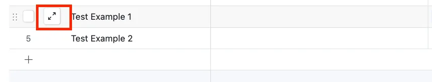
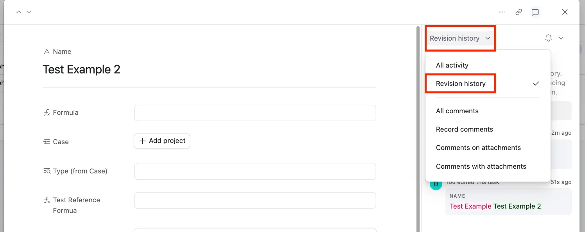
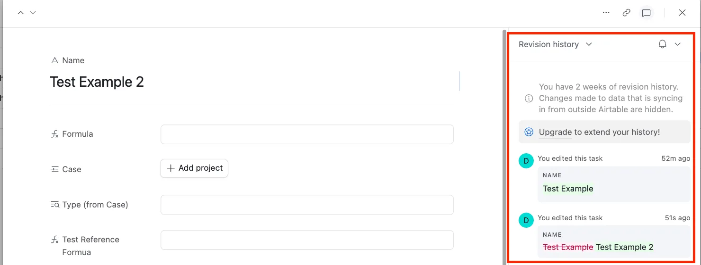

Airtable Revision History is crucial. It offers a comprehensive view of changes over time, on a record basis. Users can see what changes were made, by whom, and when. This enhances Airtable’s collaboration potential. Indeed, understanding this feature ensures accountability and efficient data management. Therefore, it is a cornerstone for effective operations.

## How to Access Airtable Revision History

Navigating Airtable’s changes log is simple.

1. First, go to the desired base and table (within the Data layer -not interfaces)

   

2. Then, select the record. Expand it by clicking a field and pressing the spacebar or using the expand icon.

   

3. Next, choose “Revision history” from the dropdown to view logs.

## Plan Limitations

However, be aware of plan limitations:

- Free plan users see two weeks of history.
- In contrast, Team plan members get access to one year.
- Business plans offer two years, and Enterprise Scale plans extend to three years. Comments remain visible unless deleted, providing a robust communication history.
