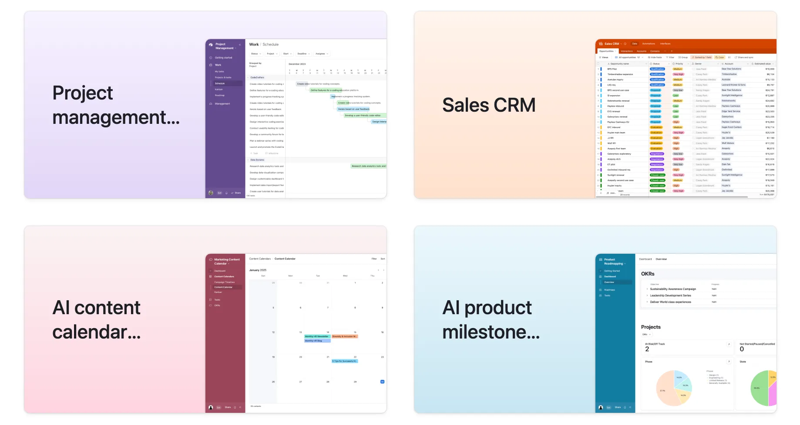

Airtable templates offer operations teams a fast way to optimize and automate recurring business workflows. Therefore, by using pre-built templates, teams can avoid building processes from scratch. This approach saves time, reduces errors, and ensures consistency across projects. Many operations teams have found that adopting pre-set templates leads to significant improvements in efficiency.

Templates are designed for quick implementation. Teams can select a template that matches their workflow, customize fields, and start tracking tasks immediately. As a result, this simplicity allows even non-technical users to set up complex processes. As a result, onboarding new team members becomes easier, and everyone can follow the same procedures.

### Key benefits of using Airtable templates for operations teams include:

1. Rapid deployment of new workflows
2. Standardized processes across departments
3. Easy customization for unique business needs
4. Built-in Airtable workflow automation features\
   Reduced manual data entry and fewer mistakes

To get started, explore the best templates for business operations. Look for templates that address common needs, such as project management, inventory tracking, or client onboarding. Many templates come with automation options, allowing teams to trigger notifications, update records, or generate reports automatically. This level of Airtable process optimization frees up valuable time for higher-priority tasks.

### When choosing templates, consider the following:

- Does the template align with your current processes?
- Can it be easily customized for your team’s requirements?
- Are there built-in Airtable workflow automation options?
- Is the template regularly updated or supported by the community?

### Where to find Airtable templates?

You can find Airtable templates on the [Airtable Universe](https://www.airtable.com/universe/expkRR7no88IKYiCZ/random-record-reviewer), or you can [reach out to us](/#book) (via email, or schedule a brief call) with your specific needs and we’ll be happy to share a template with you, for your very specific needs.

### Conclusion

In conclusion, Airtable templates are a powerful tool for operations teams seeking to streamline processes and save hundreds of hours. By leveraging the best Airtable templates for business, teams can achieve faster implementation, better process optimization, and more reliable workflow automation. Start exploring Airtable templates today to transform your operations and boost productivity.
