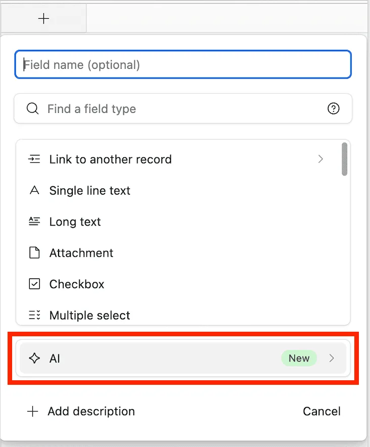
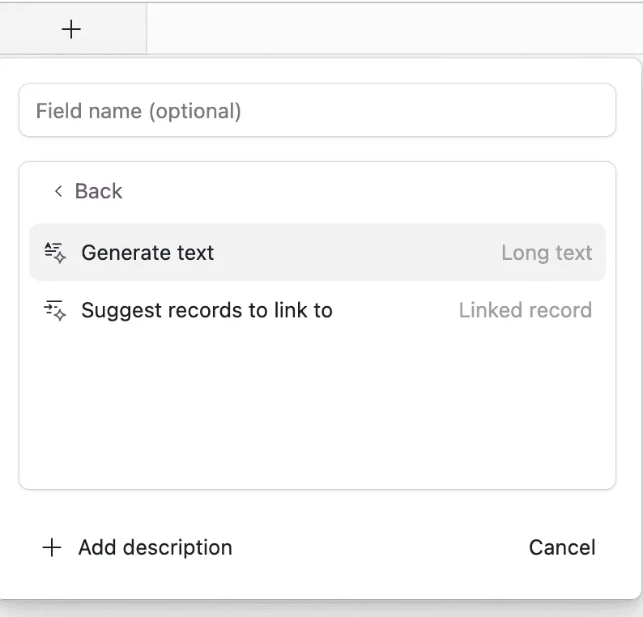
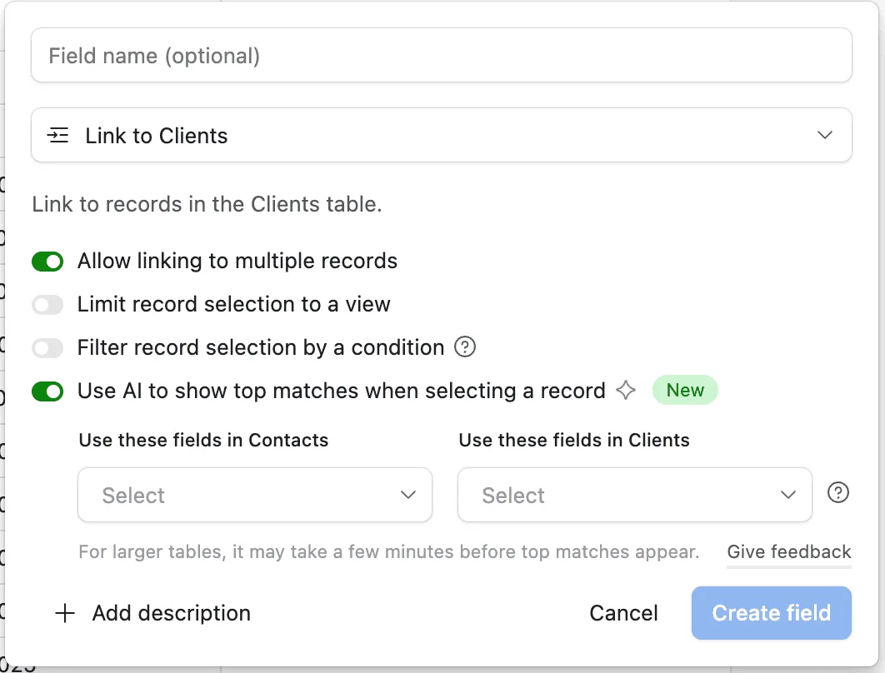
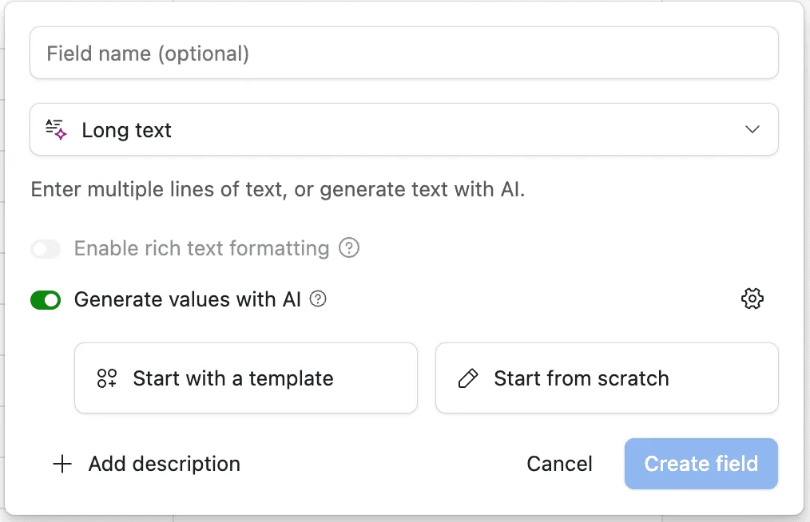
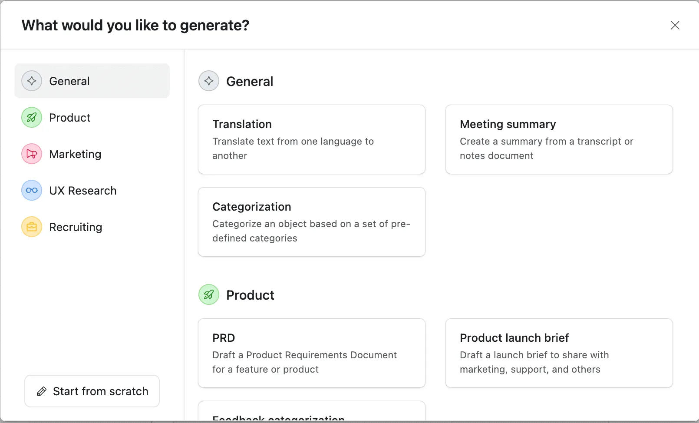
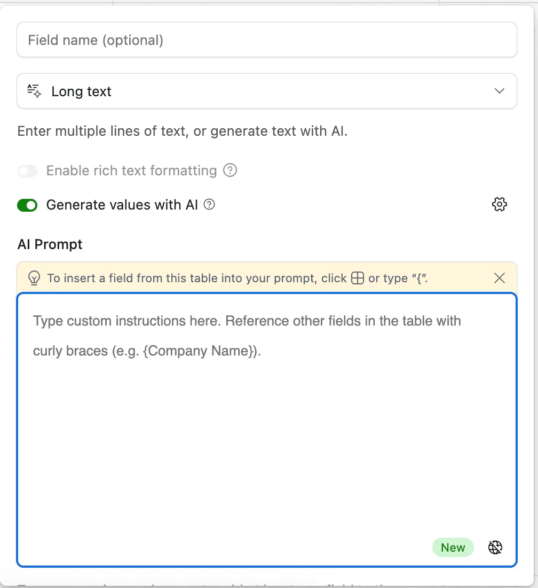

Have you ever wished your Airtable base could automatically generate text, summarize content, or analyze patterns without manual input? With Airtable’s **AI Field**, you can do just that! This new feature harnesses the power of artificial intelligence to simplify workflows, enhance data insights, and save time.

Whether you want to generate product descriptions, craft email drafts, or categorize text data, Airtable’s AI Field makes it easy. Let’s walk through how it works, how to set it up, and why it’s a game-changer for your data-driven workflows.

**How to Set Up an AI Field in Airtable**

1\. **Open Your Table**

Navigate to the table where you want to add AI-powered capabilities.

2\. **Add a New Field**

Click the **“+”** button to add a new field. Select **“AI”** as the field type (note that this is a Teams plan feature).\

3\. **Choose Your AI Task**

Airtable will allow you to either (i) Generate text; or (ii) Suggest records to link to.\

Whilst the latter will create a linked record field, where the AI will be suggesting what record(s) to link to the record you are working on based on the context provided from specific fields you’ll be selecting, the former will automatically generate text for you depending on a given template or prompt.\
For suggesting records, the configuration will look like this:\

For generating text, the options will be these:\

If you’d like to go with a template, Airtable will provide several different options as shown below!\

Otherwise, you can set your own prompt! The AI Field can pull data from other fields in the same record. Use curly braces (e.g., {Product Name}) to reference fields dynamically. -see image below.\

For example:

• **For generating product descriptions**:

_“Write a product description for {Product Name}, highlighting its features: {Features}.”_

• **For sentiment analysis**:

_“Analyze the sentiment of this customer review: {Review Text}.”_

4\. **Create the Field and Test**

Once you create the field, you can review the generated content and refine the prompt if needed.

**Why the AI Field Is Useful**

**Automates Repetitive Tasks**:

Stop manually writing product descriptions, summaries, or tags. The AI Field can handle these tasks automatically.

**Improves Data Quality**:

Consistent descriptions, categories, and tags make your database more reliable and easier to analyze.

**Saves Time**:

AI-generated content frees your team to focus on more strategic work.

**Flexible and Customizable**:

The AI Field can adapt to various tasks with simple prompt adjustments.

**Use Cases for the AI Field**

**Marketing Teams**:

• Generate social media captions based on campaign details.

• Write product descriptions using product features and benefits.

**Sales and CRM**:

• Summarize meeting notes directly in your CRM.

• Auto-generate personalized follow-up emails using customer names and previous interactions.

**Customer Support**:

• Analyze support tickets to determine sentiment and urgency.

• Generate knowledge base articles based on FAQs.

**Content Creation**:

• Translate blog post summaries into multiple languages.

• Generate SEO-friendly descriptions for website pages.

**Tips for Getting the Most Out of AI Fields**

• **Be Specific with Prompts**: The more detailed your instructions, the better the results.

• **Test and Refine**: Run test records to fine-tune prompts for accuracy.

• **Combine with Automations**: Trigger AI tasks when new records are added or updated.

• **Use Clear Context**: If your prompt requires background information, make sure the fields used are descriptive and consistent.

**Conclusion**

Airtable’s **AI Field** adds a new level of intelligence to your databases, automating repetitive tasks and generating useful insights with ease. Whether you’re writing content, categorizing feedback, or analyzing text, this feature helps you work smarter, not harder.

Try adding an AI Field to your Airtable base today and experience how automation can simplify your workflow!
