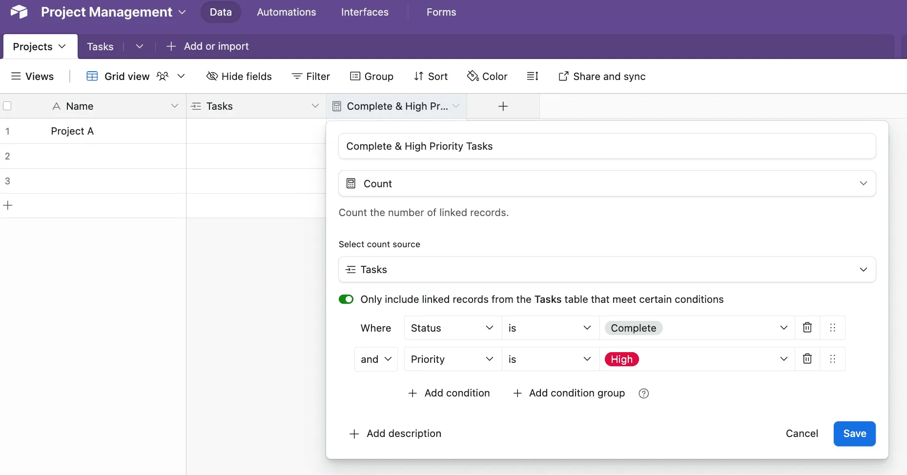

The Count field in Airtable is a simple but powerful tool. It allows you to count linked records in real-time and, with conditions, filter exactly which records are included in that count. Here’s a quick guide to using it effectively.

**How to set it up:**\
1\. **Create a Linked Field**: Ensure you have a linked record field connecting two tables. For example, a “Projects” table linked to a “Tasks” table.

2\. **Add a Count Field**: In the parent table (e.g., “Projects”), add a new field, select “Count,” and choose the linked field to count.

3\. **Set Conditions**: Click “Only include linked records from the Tasks table that meet certain conditions” to filter the records being counted -see image below. For example:

- Count tasks where {Status} = “Complete”; AND
- Only include records with {Priority} = “High”.

The Count field updates dynamically as records change in the linked table.

**Why It’s Powerful:\&#xA;**

- **Filter and Focus**: Add conditions to count only the records that matter, like overdue tasks, unpaid invoices, or low-stock items.
- **Trigger Automations**: Use Count fields with Airtable’s automations to send alerts or create tasks when counts hit certain thresholds.
- **Simplify Workflows**: Avoid extra formulas or manual calculations. The Count field does it all for you.

**Use Cases:\&#xA;**

- **Project Management**: Track completed vs. overdue tasks.
- **Sales**: Count open deals or high-value opportunities.
- **Inventory**: Monitor low-stock items and trigger reorders.
- **Events**: Count RSVPs or VIP attendees.

The Count field may not grab headlines, but its flexibility and ease of use make it a must-have for streamlining your Airtable workflows. Try it out and see how much simpler your tracking can be!\
Feel free to read this other post on [Airtable Lookup Fields](/airtables-lookup-field-a-quick-guide/), or this one on [Airtable Rollup Fields](/airtables-rollup-field-a-quick-guide/).
