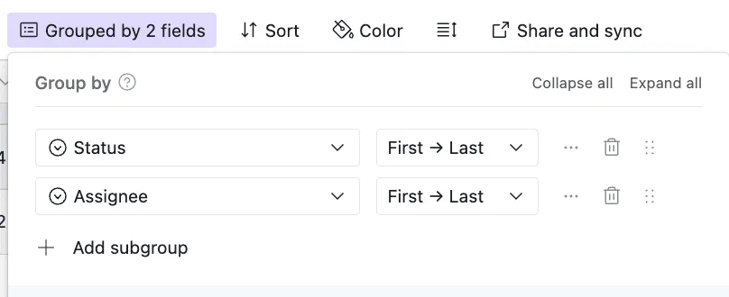
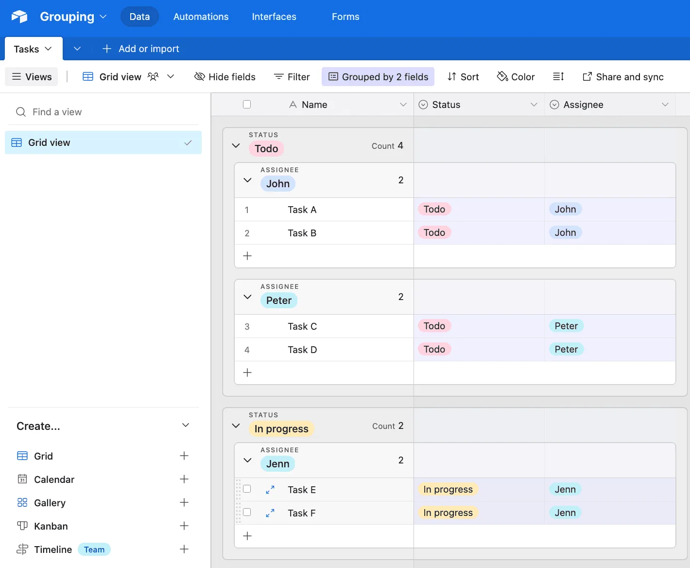

Have you ever wanted to organize your Airtable data visually, making it easier to spot trends or categorize records? With **Groups**, you can achieve just that! A **Group** in Airtable allows you to cluster your records by shared values in a specific field, creating a clear and organized view of your data. Whether you’re tracking tasks, managing inventory, or analyzing sales, the Group feature helps you focus on what matters most at a glance. Let’s dive into how it works and why it’s so powerful.

**How to Set Up a Group in Airtable**

1\. **Open Your Table and Choose the Specific View**: Go to the table and view you’d like to organize (for [more information on Airtable views](/airtables-views-a-quick-guide/), feel free to read this other post). Make sure it has at least one field containing values you’d like to group by (e.g., task status, project name, or category).

2\. **Click the “Group” Button**: At the top of your table view, click the “Group” button. A dropdown will appear with a list of all your fields.

3\. **Select a Field to Group By**: Choose the field whose values will determine your groups. For example, group tasks by “Status” to see tasks in categories like “To Do,” “In Progress,” and “Complete.” Or, group sales by “Region” to analyze performance geographically.

4\. **Customize Your Groups (Optional)**: You can collapse groups by clicking the small arrow next to a group header, sort records within groups by clicking the sorting option, or add multiple group levels to nest groups. For instance, group by “Region” first, then by “Salesperson.”\

**Why the Group Feature Is Useful**

**Improves Organization**: Grouping records clusters them by key categories, making it easy to navigate and analyze large datasets.

**Visual Clarity**: Seeing records grouped together makes patterns and outliers stand out. For example, you can quickly identify which tasks are overdue or which categories are driving the most revenue.

**Flexible and Dynamic**: Groups update automatically as your data changes. If a task moves from “In Progress” to “Complete,” it will appear in the correct group instantly.

**Enhanced Collaboration**: Teams can focus on specific groups relevant to their responsibilities, streamlining collaboration.\

**Use Cases for the Group Feature**

**Project Management**: Group tasks by “Status” to quickly see which ones are “To Do,” “In Progress,” or “Complete.” Add a second group level for “Assigned To” to break tasks down by team member.

**Sales Analysis**: Group records by “Region” to analyze performance geographically. Add a second group for “Salesperson” to evaluate individual contributions.

**Inventory Management**: Group products by “Category” to review stock levels across product types.

**Event Planning**: Group attendees by “RSVP Status” to see who’s confirmed, declined, or hasn’t responded yet.

**Conclusion**

Airtable’s Group feature is a simple yet powerful way to organize and analyze your data. By clustering records based on shared values, you gain visual clarity, improve collaboration, and unlock insights that might otherwise be hard to see. Whether you’re managing tasks, tracking sales, or planning events, Groups help you make sense of your data at a glance. Try using the Group feature in your next project and see how it transforms your workflow!
