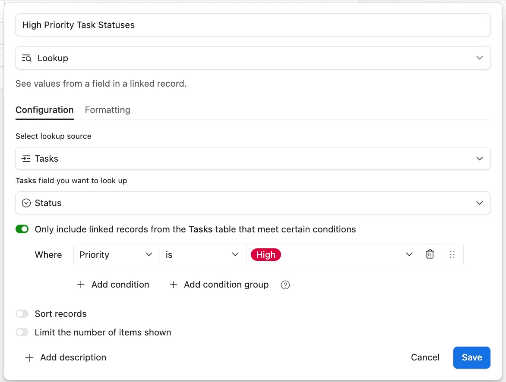

A **Lookup Field** in Airtable pulls information from linked records and displays it in your current table. This means you can reference data from one table while working in another, keeping everything connected and up-to-date.

### **How to Set Up a Lookup Field&#x20;**

1\. **Start with a Linked Field**

Ensure your table has a linked field connecting it to another table (e.g., Projects linked to Tasks).

2\. **Add a Lookup Field**

• Create a new field and select **“Lookup”** as the type.

• Choose the linked field and then the specific field from the linked table to display.

3\. **Set Conditions (Optional)**

• Add conditions directly in the Lookup Field configuration, by clicking on “Only include linked records from the Tasks table that meet certain conditions”, to filter the records being displayed.

• For example, show only tasks where {Status} = “Complete” or only products with {Stock} > 0.

4\. **Create Field**

Airtable will pull and display only the data matching your conditions.

#### **&#x20;Why Lookup Fields Are Useful**

• **Dynamic Updates**: Any changes made in linked records are reflected automatically.

• **Filtered Data**: Use conditions to focus on the most relevant information, such as completed tasks or overdue invoices.

• **Centralized View**: Pull details like contact info, product descriptions, or task statuses into one place for easy reference.

#### **Example: Managing Projects and Tasks**

Imagine you’re managing projects, each with multiple tasks. Your **Tasks** table includes details like task names, statuses, and assigned team members, all linked to a project.

In your **Projects** table, a **Lookup Field** can pull task statuses or team member names directly from the linked tasks. For example, the project “Marketing Campaign” might show task statuses like “Complete” and “In Progress” or team members like “Alice” and “Bob.”

If a task’s status changes in the **Tasks** table—say “Create Social Media” is marked as “Complete”—the Lookup Field in the **Projects** table will update automatically. You can also set conditions to display only incomplete tasks, helping you focus on what still needs to be done.

This real-time connection ensures that critical project information is centralized, actionable, and always up-to-date.

#### **Use Cases**

• **Project Management**: Display task statuses or assigned team members for each project.

• **CRM**: Show customer contact details or recent interactions.

• **Inventory**: Pull product descriptions or stock availability into orders.

#### **Limitation&#x20;**

Airtable Lookup fields do not support formulas within the field itself e.g. MAX(), MIN(), ARRAYUNIQUE(). If this is needed, you will want to use [Airtable’s Rollup field](/airtables-rollup-field-a-quick-guide/) instead.

#### **&#x20;Conclusion**

Airtable’s Lookup Field makes it easy to pull data from linked records, keeping your tables up-to-date. With its ability to include only relevant data through conditions, the Lookup Field is a must-have for streamlining your workflows.
