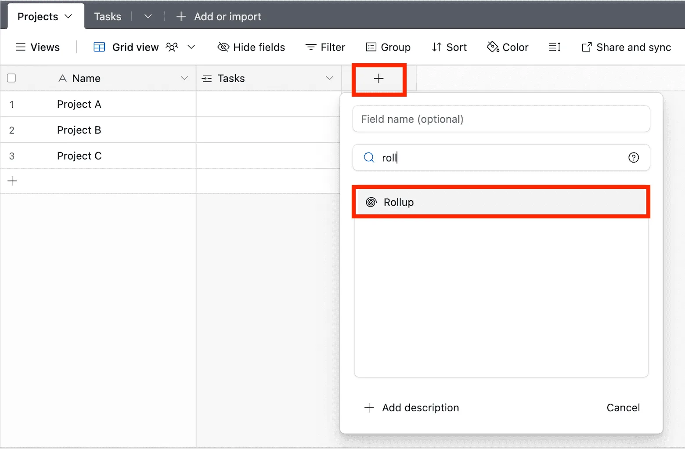
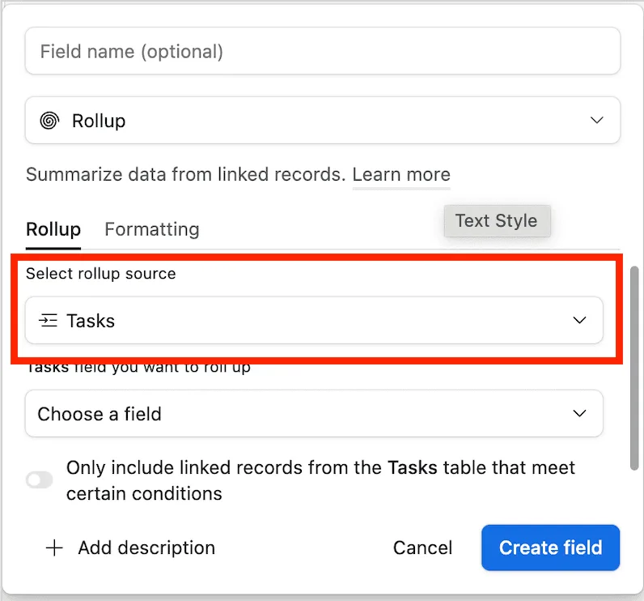
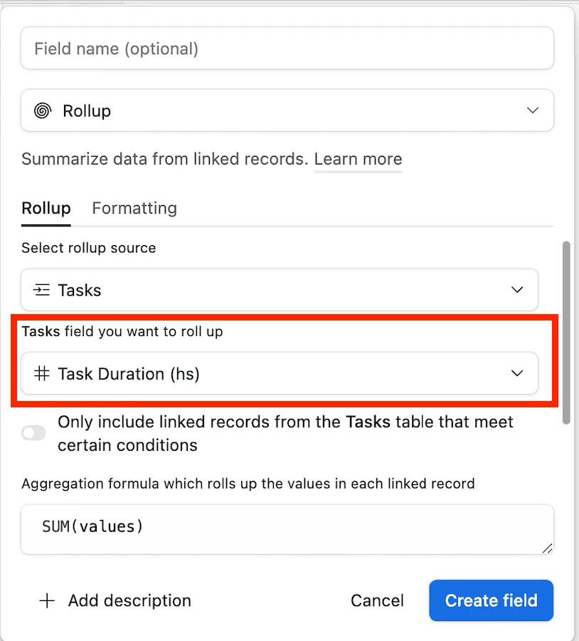
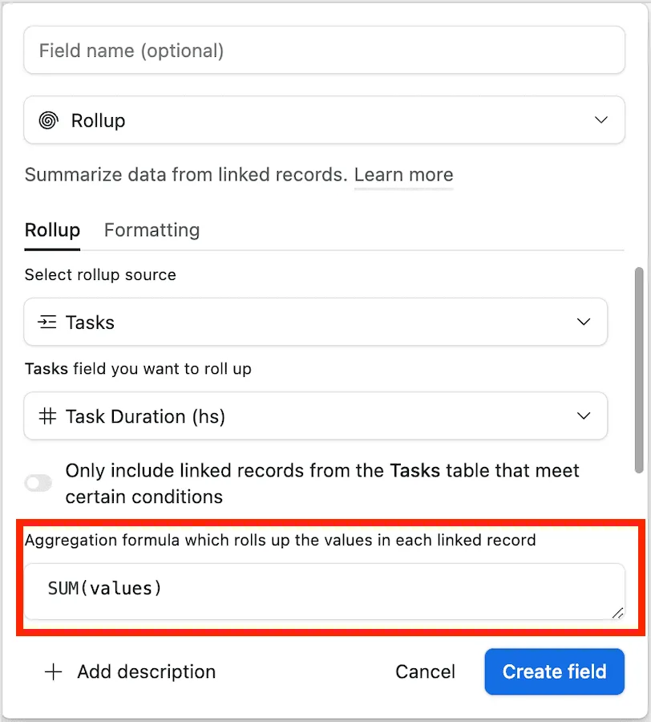
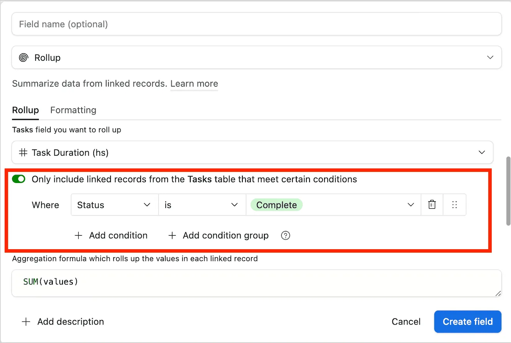
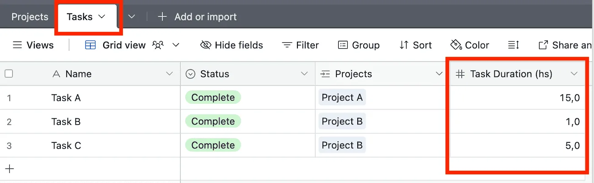
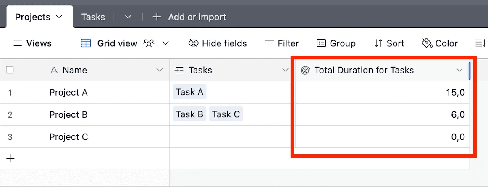

Have you ever wanted to summarize or calculate data across linked records in Airtable? With **Rollup Fields**, you can achieve exactly that! A **Rollup Field** in Airtable allows you to aggregate data from linked records, applying functions like sum, average, count, and more.

Whether you need to total expenses for a project, calculate an average rating for customer feedback, or track the latest order date for a client, Rollup Fields help automate these calculations without manual data entry. Let’s explore how to set them up and why they are so powerful.

#### **How to Set Up a Rollup Field**

1\. **Ensure You Have a Linked Record Field**: Rollup Fields work by aggregating data from linked records. Start by making sure your table has a **Linked Record Field** connecting it to another table. For example, a **Projects** table linked to a **Tasks** table.

2\. **Add a Rollup Field**: In your table, click the “+” button to add a new field and select **Rollup** as the field type.\

3\. **Choose the Linked Field**: Select the **Linked Record Field** that connects your table to another table.\

4\. **Select the Field to Roll Up**: Choose the specific field from the linked table that you want to summarize. For example, if rolling up tasks in a project, you might select a **“Task Duration”** field to calculate total time spent.\

5\. **Apply a Function**: Airtable offers built-in functions like:

• SUM(values): Adds up all values in the linked records.

• AVERAGE(values): Calculates the average.

• MAX(values): Returns the highest value.

• ARRAYJOIN(values, “, “): Lists all values as a text string.

• COUNTALL(values): Counts how many linked records exist.\

6\. **Add an Optional Condition**: You can filter which records get included in the rollup. For example, only sum completed tasks by setting {Status} = “Complete”.\

7\. **Save the Field**: Airtable will automatically calculate the rollup based on the linked records.\

#### **&#x20;Why Rollup Fields Are Useful**

**Automated Calculations**: No need for manual data entry—Rollup Fields dynamically update as records change.

**Summarized Insights**: Quickly see totals, averages, or key statistics at a glance.

**Conditional Logic**: Apply filters to roll up only relevant records, such as completed tasks or paid invoices.

**Better Organization**: Rollup Fields keep your tables structured by eliminating the need for repetitive calculations.

#### **Use Cases for Rollup Fields**

**Project Management**: Roll up task durations to calculate the total time spent on a project. Use SUM(values) to get the total hours.

**Sales Tracking**: Roll up order values in a “Customers” table to see the total amount each customer has spent.

**Inventory Management**: Roll up stock levels from multiple warehouse locations to get the total available stock.

**Event Planning**: Roll up RSVP responses to count confirmed attendees.

**Customer Feedback**: Roll up review scores to get the average rating per product using AVERAGE(values).

#### **&#x20;Conclusion**

Airtable’s Rollup Field is a game-changer for summarizing and calculating data across linked records. Whether you’re tracking project hours, sales revenue, or customer feedback, Rollup Fields provide automated insights with minimal effort. Try adding a Rollup Field to your Airtable base today and streamline your workflow! Psst. you might also be interested in reading about [Airtable’s lookup fields](/airtables-lookup-field-a-quick-guide/).
