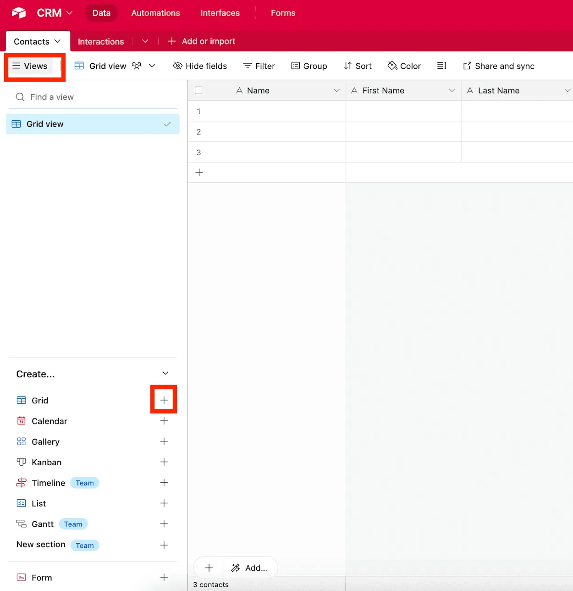

Have you ever wished for a way to display your data exactly how you need it, whether that’s for organizing tasks, tracking progress, or presenting information? With **Views** in Airtable, you can achieve all that and more! A **View** in Airtable is a customizable way to display and interact with your data. Each table can have multiple views, allowing you to organize the same data in different ways for different purposes. From simple grids to Kanban boards and calendars, Views let you tailor your tables to fit your workflow and focus on what matters most.

Let’s explore how to set up Views, why they’re so powerful, and how they can transform your Airtable experience.

**How to Set Up a View in Airtable**

1\. **Open Your Table**: Start by opening the table in which you want to create the view. Each table’s default view is typically a Grid View.

2\. **Click “Views”**: On the top left corner, click on “Views” to expand the left sidebar (if not expanded already).

3\. **Choose a View Type**: Select the type of view that best suits your needs. Airtable offers several options, which are shown as options on the left margin (bottom section):

• **Grid View**: The classic spreadsheet layout, perfect for editing and organizing data.

• **Calendar View**: Displays records with dates in a calendar format.\
• **Gallery View**: Ideal for showcasing visual or creative content.

• **Kanban View**: Great for visualizing workflows, grouped by a single select or status field.

• **Timeline View**: Displays records along a horizontal timeline, perfect for tracking schedules and project phases.

• **List View**: A streamlined format for viewing records one by one, great for focused task or entry management.

• **Gantt View**: A project planning view that shows tasks as timeline bars with dependencies for managing complex workflows.

• **Form View**: Allows you to collect data through a user-friendly form.

4\. **Create the View**: Click the corresponding “+” next to the Views type that you’d like to create.\

Do note that you can create multiple views for the same table, each customized to serve a specific purpose!

1. **Customize Each View**: Each view can be tailored independently. For example:

• In a Grid View, filter for tasks marked as “In Progress” and hide unnecessary fields.

• In a Kanban View, group tasks by their current stage, like “To Do,” “In Progress,” and “Complete.”

• In a Calendar View, show only deadlines for the next month.

**Why Views Are Useful**

**Multiple Perspectives**: Each table can have multiple views, enabling you to see your data from different angles. For example, one view could focus on high-priority tasks, while another provides a calendar of deadlines.

**Customizable Display**: Views let you adapt your data layout to match the way you work, whether that’s visually, chronologically, or grouped by categories ([more on Airtable’s grouping feature here](/airtables-grouping-feature-a-quick-guide/)).

**Focus on What Matters**: By using filters and field visibility settings, Views help you focus on specific parts of your data, such as tasks due this week or high-priority items.

**Improved Collaboration**: Create Views tailored to team roles or individual needs, ensuring everyone sees the most relevant data without clutter.

**Dynamic Updates**: Views automatically reflect changes made to records, keeping everything up to date in real time.

**Use Cases for Airtable Views**

**Project Management**: Use a Kanban View to track tasks across stages like “To Do,” “In Progress,” and “Complete,” while a Calendar View maps out project deadlines. Maintain a Grid View for detailed task tracking.

**CRM**: Create a Grid View for detailed client data, a Gallery View for visualizing customer profiles, and a Kanban View for tracking leads through stages like “New,” “Contacted,” and “Closed.”

**Event Planning**: Use a Calendar View to track important dates, a Grid View to organize vendor details, and a Form View to collect RSVPs or feedback.

**Inventory Management**: Set up a Grid View for tracking stock levels and a Kanban View to monitor items through procurement, shipping, and delivery.

**Content Creation**: Build a Gallery View to showcase designs or photos, a Kanban View to track content through idea, draft, and published stages, and a Calendar View to schedule release dates.

**Conclusion**

Airtable’s Views are one of its most versatile and powerful features, giving you the flexibility to display your data in ways that suit your workflow. Each table can have multiple views, allowing you to switch between perspectives depending on your needs. Whether you’re managing projects, planning events, or tracking sales, Views help you focus on what matters most and make sense of your data at a glance. Experiment with different Views in your next project and unlock the full potential of Airtable!
