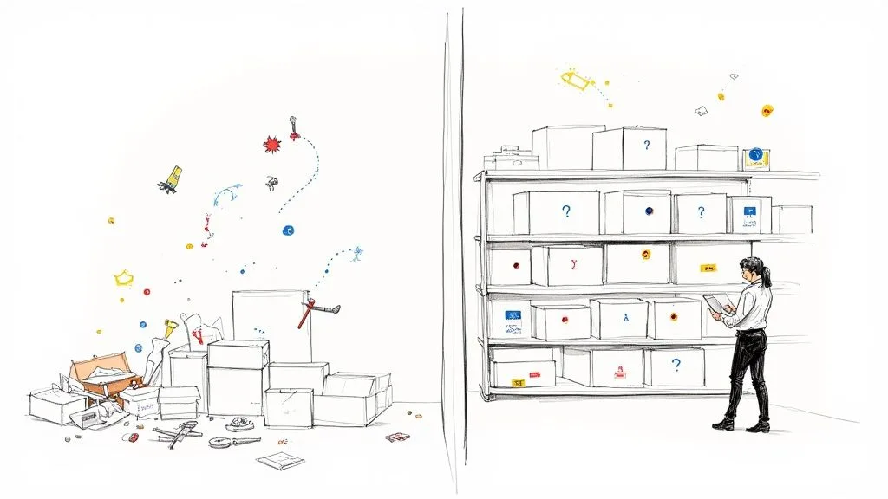
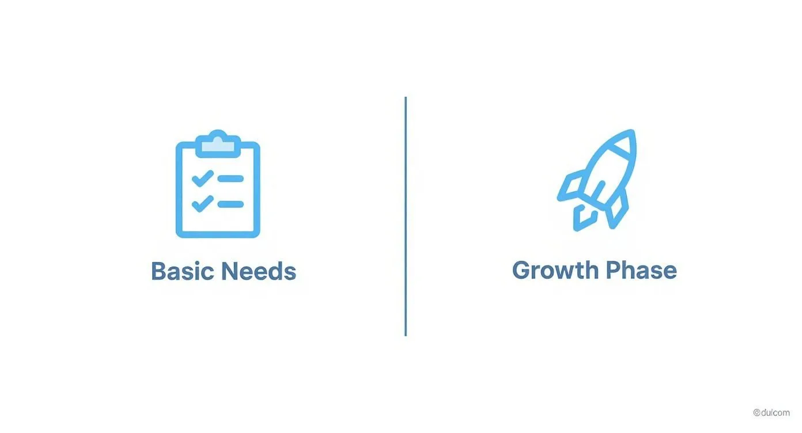
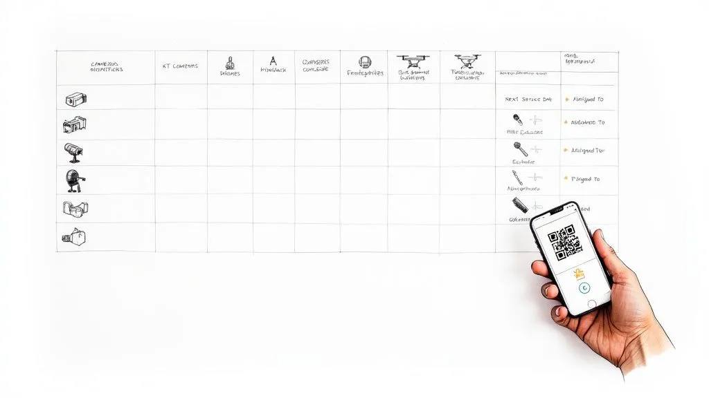

Finding the **best asset tracking software** for your business usually means picking a system that can grow with you. You might start with a simple, off-the-shelf tool, but eventually, you’ll need something more powerful. This is where custom-built systems, especially those using a flexible platform like Airtable, really shine by matching your unique workflows perfectly.

## Why Smart Asset Tracking Matters More Than Ever

Lost equipment, wasted time, and surprise costs—this is the expensive reality of not knowing where your stuff is.

Imagine a busy construction manager trying to drive through a new city without a map. They might get to the job site eventually, but they’ll burn through fuel, take a dozen wrong turns, and end up completely frustrated. Running a business without a solid asset tracking system is pretty much the same chaotic journey, but the wasted fuel is your team’s time and money.

When you don’t have a clear system, you’re just operating in the dark. **For example**, a project foreman wastes an hour hunting for a high-powered generator that a different crew moved to another site, holding up the entire project and costing hundreds in labor. An IT specialist realizes a laptop from a former employee was never returned, and now it’s gone for good—a data security risk and a financial loss. These seemingly small hiccups add up, draining your resources and hitting your bottom line hard.

### The Shift From Chaos to Clarity

Now, picture having a live GPS for every single critical item your business owns. That’s what effective asset tracking gives you. It turns chaos into clarity, offering a real-time dashboard of all your company’s physical resources. You know exactly where everything is, who has it, and what condition it’s in.

This move is about more than just finding things faster; it’s about making smarter business decisions. This growing need is why the asset tracking software market is projected to explode from **USD 20.32 billion in 2024 to USD 62.18 billion by 2035**. It’s a clear sign of just how vital this technology has become.

> An asset tracking system isn’t just another IT upgrade. It’s a fundamental business strategy for protecting your investments and boosting productivity. It finally answers the critical questions of ‘what, where, when, and who’ for every asset you own.

This newfound clarity delivers real, tangible benefits across the entire organization. For instance, in supply chain management, understanding the role of [QR codes for logistics](https://openqr.io/qr-codes-for-logistics/) shows just how profound the impact can be.

To help you see the bigger picture, here’s a quick breakdown of what you stand to gain.

### Core Benefits of Effective Asset Tracking

| Benefit                     | Impact on Your Business                                                            | Actionable Example                                                                                                                                  |
| --------------------------- | ---------------------------------------------------------------------------------- | --------------------------------------------------------------------------------------------------------------------------------------------------- |
| **Reduced Costs**           | Eliminates losses from misplaced, stolen, or “ghost” assets.                       | An audit reveals you’ve been paying insurance on five “ghost” laptops that were retired years ago. Removing them saves over $500 annually.          |
| **Increased Efficiency**    | Teams spend less time searching for tools and more time doing productive work.     | A field technician locates a specific diagnostic tool in 2 minutes via their mobile app, instead of spending 30 minutes calling colleagues.         |
| **Improved Accountability** | Clear ownership and history for every asset, so you always know who’s responsible. | When a camera lens is returned damaged, the system shows exactly who checked it out last, allowing for a direct conversation about proper handling. |
| **Better Maintenance**      | Schedule and track maintenance proactively, extending the life of your equipment.  | The system automatically alerts you that a delivery van is due for an oil change, preventing a costly engine repair down the road.                  |
| **Data-Driven Decisions**   | Gain insights into asset usage to optimize purchasing and allocation.              | Reports show a specific model of power drill is constantly in for repair. You decide to switch to a more reliable brand, saving money long-term.    |

Ultimately, choosing the right asset tracking software is a crucial step to [improve operational efficiency](/how-to-improve-operational-efficiency/). By automating manual processes and creating a single source of truth, you free up your team to focus on high-value work instead of getting bogged down by administrative headaches.

## Decoding The Must-Have Software Features

Finding the right asset tracking software means cutting through the noise. It’s easy to get lost in feature lists, but the real value comes from understanding how each feature solves a real-world problem for _your_ business. It’s the difference between knowing a car has an engine and knowing how it handles a steep, winding road.

Let’s break down what actually matters. Instead of just listing “real-time tracking,” think about a construction firm juggling three active job sites. When a foreman needs a specific, high-value generator, he shouldn’t have to spend an hour making calls. **The actionable insight here** is that he should be able to glance at a map on his phone, see the generator’s exact location at the North Street site, and dispatch a driver to move it. That’s a practical feature preventing costly rentals and keeping a project on schedule.

### Centralized Dashboards for At-a-Glance Oversight

A centralized dashboard is your command center. It pulls all your asset data into a single, easy-to-digest view, giving you an instant picture of your entire operation. This isn’t just a jumble of numbers; it’s a visual story of your assets’ health, location, and status.

**For a practical example**, an IT manager can instantly see a chart showing that 75% of laptops are deployed, 15% are in storage, and 10% are out for repair. They can also see a list of which ones are due for a warranty renewal next month. This prevents over-purchasing and ensures resources are always ready for new hires. The dashboard turns raw data into intelligence you can act on immediately.

### Proactive Maintenance and Automated Alerts

Equipment failure is expensive. It’s not just the repair bill—it’s the lost productivity and project delays that really sting. The best asset tracking software acts as a preventive shield for your tools and machinery by flagging issues before they become catastrophes.

> A well-configured system doesn’t just tell you where an asset _is_—it tells you what it _needs_. Proactive alerts for scheduled service, warranty expirations, or performance flags are crucial for extending asset lifespan and avoiding unexpected downtime.

Picture a logistics company with a fleet of delivery vans. **Here’s an actionable setup**: create an automation that flags any vehicle approaching its **30,000-mile** service interval. The system then automatically sends an alert to the fleet manager’s email and adds a “Schedule Service” task to their calendar. This simple, proactive step keeps the fleet on the road and avoids the massive cost of a breakdown during a critical delivery run. For businesses with vehicles, understanding the tech is key; you can explore this [ultimate guide to vehicle GPS trackers](https://mobilesystems.nz/blogs/technology/vehicle-gps-tracker) to learn more.

To help you figure out what’s critical now versus what can wait, here’s a quick breakdown of essential and advanced features.

### Essential vs. Advanced Asset Tracking Features

Every business starts somewhere. You might only need the basics today, but it’s smart to know what advanced capabilities are out there as you grow. This table helps you prioritize.

| Feature                    | Essential For (Business Type)                                               | Advanced Application (Growth Stage)                                                                                                               |
| -------------------------- | --------------------------------------------------------------------------- | ------------------------------------------------------------------------------------------------------------------------------------------------- |
| **Real-Time GPS Tracking** | Logistics, construction, field services—any business with mobile assets.    | Geofencing alerts that trigger when a truck enters a delivery zone, route optimization, and historical location playback for dispute resolution.  |
| **QR/Barcode Scanning**    | IT departments, warehouses, event management—for indoor asset check-in/out. | Automated inventory counts by scanning a room and linking physical assets to digital work orders or service tickets.                              |
| **Maintenance Alerts**     | Any business with high-value machinery, vehicles, or specialized equipment. | Predictive maintenance using sensor data (e.g., engine hours, temperature) to forecast failures before they happen.                               |
| **Centralized Dashboard**  | All businesses need a single source of truth for asset status and location. | Customizable, role-based dashboards with deep analytics. For example, a CFO sees depreciation reports while a manager sees team asset allocation. |
| **Mobile App Access**      | Teams working in the field, on-site, or away from a desk.                   | Offline data syncing for remote areas without cell service and instant condition reporting with photos uploaded directly to the asset’s record.   |

Choosing features is about matching capability to need. Start with what solves your biggest headaches today, but keep an eye on the tools that will support you tomorrow.

### Mobile Access and Field Team Empowerment

Your assets are out in the world, not sitting in an office, and your team is right there with them. Mobile access is non-negotiable. It puts the power of your tracking system into the hands of your field team via a smartphone or tablet. They can check assets in or out, update their condition, and report issues right on the spot.

This is a game-changer for any team on the move. **For a real-world example**, imagine an event management company setting up for a huge conference. Staff can use their phones to scan QR codes on speakers, projectors, and monitors as they’re deployed to specific rooms. **The actionable insight** is that the project manager can then see a live dashboard confirming that “Room 201 Setup” is 100% complete without having to physically check. No more clipboards or guesswork—just a real-time, accurate account of every single item.

Looking ahead, artificial intelligence is making these systems even smarter. The AI-powered asset tracking market is expected to rocket from **$2.4 billion in 2024 to $15.6 billion by 2034**. This explosion is driven by AI’s ability to predict maintenance needs and manage inventory with incredible precision. You can build these smart capabilities right into your system, especially when you explore how [Airtable automations can boost your workflow productivity](/airtable-automations-boost-your-workflow-productivity/).

## Off-the-Shelf vs Custom-Built Systems

When you’re picking an asset tracking software, you’ll hit a classic fork in the road. It’s a lot like buying a suit: do you grab one off the rack that’s good enough for now, or do you invest in a custom-tailored one that fits your business perfectly?

Each path has its perks, and the right choice really boils down to your specific needs.

Off-the-shelf software is your ready-to-wear suit. It’s fast to set up, often cheaper upfront, and it gets the job done for most standard requirements. The catch? You might find yourself stuck with features you’ll never use while missing the ones you desperately need. **For instance**, the software might not have a field for “Client Project Code,” forcing your team to bend its workflows around the software’s rigid rules by using the “Notes” section as a messy workaround.

A custom-built system, on the other hand, is designed from scratch to mirror your exact processes. It’s like having that suit tailored to your precise measurements—every stitch is intentional. This approach means you only pay for what you use and get a tool that feels completely natural for your team to work with.

### Speed vs Flexibility

The biggest selling point for off-the-shelf solutions is speed. You can literally sign up and start tracking assets on the same day. For businesses drowning in tracking chaos and needing an immediate fix, this is a huge win. The downside is that what you see is what you get; meaningful customization is almost always off the table.

Custom solutions take more time to build, but they offer unbeatable flexibility. We use platforms like [Airtable](https://www.airtable.com/) as a powerful foundation, which lets us create a system that reflects your company’s unique operational DNA. **Practically speaking**, this means if you need to track software license renewal dates alongside the hardware, you can just add a “License Expiry” field and set up automated reminders—a feature that might be impossible to add in a rigid, pre-built tool.

> The core trade-off is immediate functionality versus long-term adaptability. An off-the-shelf system solves today’s problem quickly, while a custom build creates a scalable foundation for all your future needs.

This decision-making process helps illustrate whether your company is in a phase that requires a simple solution or one built for growth.

This infographic shows a decision tree to help you choose between a solution for basic needs versus one for your growth phase.

The visual makes it clear: as your operational complexity grows, the benefits of a custom, growth-oriented system become impossible to ignore.

### Weighing the Costs and Long-Term Value

Cost is always a major factor. Off-the-shelf software usually locks you into a recurring subscription fee per user, which can really add up over time, especially as your team grows. A custom build often has a higher initial development cost, but it can lead to lower long-term expenses since you own the system without those endless per-user fees.

This strategic choice is becoming more and more relevant. North America, for instance, holds between **36% to 39%** of the global market share for asset tracking. This is largely driven by sectors like manufacturing and logistics that demand advanced, and often tailored, solutions to stay competitive. You can dig into more [asset tracking market trends on mapsted.com](https://mapsted.com/blog/asset-tracking-market-forecast-and-its-key-statistics) if you’re curious.

Ultimately, the best asset tracking software is the one that lines up with your budget, complexity, and growth plans. Whether it’s off-the-rack or custom-tailored, the goal is always the same: to gain clarity and control over your most valuable resources.

## How to Build a Custom Tracker with Airtable

For a lot of businesses, the _best asset tracking software_ isn’t a pre-packaged product you buy off the shelf. It’s something you build yourself. So many out-of-the-box solutions are bloated with features you’ll never touch, yet somehow they’re missing the one or two specific fields you actually need. This is where a flexible platform like [Airtable](https://www.airtable.com/) comes in, letting you build a lean, powerful system that mirrors how your business truly operates.

Let’s walk through a real-world scenario. Imagine you run a video production company. Your assets are more than just laptops; we’re talking about expensive cameras, fragile drones, specialized microphones, and entire lighting kits. Tracking this gear isn’t just about knowing where it is. It’s about managing its condition, its availability for the next shoot, and who has it checked out.

### Starting with Your Core Asset Database

The first move is creating your central “Assets” table in Airtable. Think of this as your digital gear locker. Instead of being stuck with generic fields, you build columns that mean something to your day-to-day work. This isn’t just a static list; it’s a dynamic database that understands your equipment.

**Your actionable first step** is to list the key information you need. A practical setup could include fields like:

- **Asset Name:** (e.g., “Sony FX6 Camera Body”)
- **Asset ID:** A unique identifier, maybe tied to a QR code you stick on the gear.
- **Category:** A clean dropdown menu (Camera, Audio, Lighting, Drone) to make filtering easy.
- **Purchase Date & Price:** Super useful for tracking age and depreciation.
- **Last Service Date:** This one is critical for scheduling maintenance.
- **Status:** A simple single-select field (Available, In Use, Maintenance, Damaged).

This structure gives you immediate, sortable information right out of the gate. In just a few clicks, you can create a view that shows all available cameras or flag every piece of equipment that hasn’t been serviced in the last six months.

This screenshot from Airtable shows just how clean and approachable the interface is. It feels like a spreadsheet but has the power of a database, making it easy to define custom fields for your assets.

The real magic here is that visual simplicity. It hides some seriously powerful database functionality, which makes the whole thing accessible even if you’re not a technical person.

### Connecting Your Assets to Your Workflows

Okay, now let’s make this system truly smart by plugging it into your actual operations. You’ll create two more tables: one for “Projects” and another for “Team Members.” Using Airtable’s linked record fields, you can now connect each piece of gear to a specific project _and_ the team member who checked it out.

So, when a producer is prepping for a shoot, they can link the “Sony FX6,” a “Sennheiser MKH 416” mic, and the “DJI Mavic 3 Pro Drone” directly to the “Nike Commercial” project record. At the same time, they assign all that gear to the lead videographer. Suddenly, you have a perfect, unbroken chain of accountability.

> The real power of a custom system emerges when your data starts talking to itself. Linking assets to projects and people doesn’t just track location; it creates a complete operational history for every piece of equipment you own.

This web of connected data lets you answer complicated questions instantly with a simple filter:

1. **What gear was used on the Nike shoot?** Filter the Assets table by the “Nike Commercial” linked project.
2. **Who has the drone right now?** Look at the drone’s record to see the linked Team Member.
3. **Which assets are free for a new project starting next week?** Create a view showing all assets where the “Status” is “Available.”

### Automating Maintenance and Reminders

The final layer is where you get your time back: automation. You can set up simple rules that trigger actions automatically, cutting out countless hours of manual nagging and follow-up.

**Here’s a practical automation** for our video company: create a rule that watches the “Last Service Date” field. If an asset’s last service was more than **180 days** ago, the system can automatically:

- Change its status from “Available” to “Maintenance Due.”
- Send a Slack notification to the `#gear-maintenance` channel, tagging the equipment manager.
- Create a new record in a “Maintenance Tasks” table, pre-filled with the asset’s details.

This hands-on approach means you stop paying for features you don’t use and start building a system that gives you complete control. You’re not just buying software; you’re creating your own version of the **best asset tracking software**—one that works exactly the way you do.

## Partnering with Experts for a Tailored System

Building a custom system in Airtable is incredibly powerful, but what if you want the perfect fit without the steep learning curve? This is where partnering with an expert comes in, turning a great idea into a fully functional reality.

It’s a bit like building a custom home. You have the vision, but you hire an architect and a builder to handle the complex blueprints and construction. An Airtable expert does the same for your operational workflow.

The process kicks off with a simple conversation to get to the root of your specific pain points. Are you a construction firm constantly losing expensive tools across scattered job sites? Or maybe you’re an IT department struggling to manage laptops for a growing remote team. A real expert digs deep to identify the exact problems that need solving.

This discovery phase is crucial. Instead of forcing your operations into a pre-made box, a specialist designs a bespoke Airtable system that’s built around your team’s natural workflow. The result is a system that just _feels_ right because it was made for you.

### From Pain Points to Practical Solutions

Let’s go back to that IT department. Their old spreadsheet was a nightmare for managing new hire equipment, leading to delays and confusion. A consultant would translate these challenges into a powerful, automated system that handles the entire employee lifecycle.

Here’s what that looks like in practice with actionable examples:

- **Onboarding Automation:** When HR marks a new hire as “Active” in their system, an automation kicks off. It instantly generates a checklist of required equipment (e.g., MacBook Pro 14″, Dell Monitor, Magic Keyboard) in the asset system and assigns tasks to the IT team. No more forgotten items on day one.
- **Software License Management:** The system actively tracks every single software license (like Adobe Creative Cloud or Microsoft 365), linking each one to a specific employee and their laptop. This prevents overspending on unused licenses and keeps you compliant.
- **Automated Offboarding:** When an employee’s status changes to “Terminated,” the system automatically creates a “Return Ticket.” It then sends scheduled email reminders to both the departing employee and their manager until every piece of equipment is scanned back into inventory.

> A custom-built system delivered by an expert doesn’t just track assets; it automates the processes _around_ them. This shift from passive tracking to active management is what saves your team hours of administrative work each week.

### Finding the Right Partner for Your Build

Working with an expert means you get a powerful, user-friendly solution without having to become a database architect yourself. You get all the benefits of a custom tool—intuitive dashboards, integrated barcode scanning, and smart workflows—with the confidence that it’s built on a solid foundation.

The key is finding a partner who understands both the technology and your business needs. If you’re considering this path, it’s worth knowing [how to find the right Airtable consultant](/how-to-hire-and-where-to-find-the-right-airtable-consultant/) who can turn your operational headaches into a real competitive advantage. This approach ensures your investment pays off for years to come.

## Your Asset Tracking Questions Answered

When you’re ready to pick an asset tracking system, a few practical questions always come up. How much is this going to cost? What’s the right tech to use? And how long until my team can actually start using it?

Let’s break down the real-world answers to get you pointed in the right direction.

Costs can be all over the map, but they really boil down to two models. Off-the-shelf software usually locks you into a subscription, charging you somewhere between **$30 to $70 per user, per month**. A custom [Airtable](https://www.airtable.com/) system, on the other hand, is a one-time project cost. It’s an upfront investment, but it often works out to be cheaper in the long run since you’re not stuck paying those per-user fees forever.

### What Technology Should I Use for Tracking?

The best technology is all about what you’re tracking and where it lives. You don’t need the most expensive, high-tech solution for every single thing; you just need the one that actually makes sense for the job.

It’s like picking a tool from a toolbox. A sledgehammer is great for demolition, but you wouldn’t use it to hang a picture. In the same way, the tech you pick for laptops in your office will be completely different from what you need for a fleet of service trucks out on the road.

Here’s a quick rundown of the most common options with practical use cases:

- **Barcodes and QR Codes:** These are your best friends for any items that stay put in one location, like an office or a warehouse. Team members can just use their phones to scan an item when they check it in or out. It’s simple and effective. **Actionable example**: An IT department can slap QR codes on laptops and monitors. When an employee gets a new laptop, IT scans the code, which automatically assigns that asset to the employee’s record in the system.
- **GPS (Global Positioning System):** This is the go-to for anything that moves around a lot. GPS trackers give you real-time location data for vehicles, trailers, or high-value equipment that travels between job sites. **Actionable example**: A construction company uses GPS to know exactly where its excavators are. A manager can pull up a map and see three are at the downtown site and one is currently in transit on the I-5, ensuring it gets to the next job on time.
- **RFID (Radio-Frequency Identification):** RFID is perfect when you need to scan a bunch of items at once without having to see each one. Think of it as a bulk scanner. It’s ideal for taking inventory of a large number of assets in a specific area, fast. **Actionable example**: A warehouse manager can walk down an aisle with an RFID reader and inventory hundreds of tagged boxes in minutes, a task that would take hours with a barcode scanner.

> Choosing the right tech is a balancing act between cost and function. For most businesses, a mix of simple QR codes for internal stuff and GPS for your expensive mobile assets is a powerful and budget-friendly way to start.

### How Long Does Implementation Take?

The timeline really depends on which path you take. An off-the-shelf tool can be up and running in a day, but that speed often comes at the cost of flexibility. A custom Airtable solution, however, is built and rolled out in phases to make sure it actually fits how you work.

A typical custom build follows a pretty clear schedule. We’ll spend a week or two in a discovery and design phase, where we map out exactly what you need. From there, the core system—your main database and essential automations—is usually ready within two to four weeks.

After that, we can start adding more advanced features in later phases. This approach gets a working tool into your team’s hands quickly, so you see value right away, but it also leaves room to tweak and improve things over time.

---

Ready to build an asset tracking system that actually works the way your business does? **Automatic Nation** designs and implements custom Airtable solutions that replace manual work with organized, automated workflows. Stop hunting for assets and start making smarter decisions.

[Get your custom asset tracking system from Automatic Nation](/)
