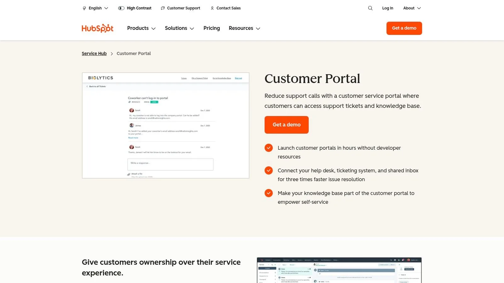
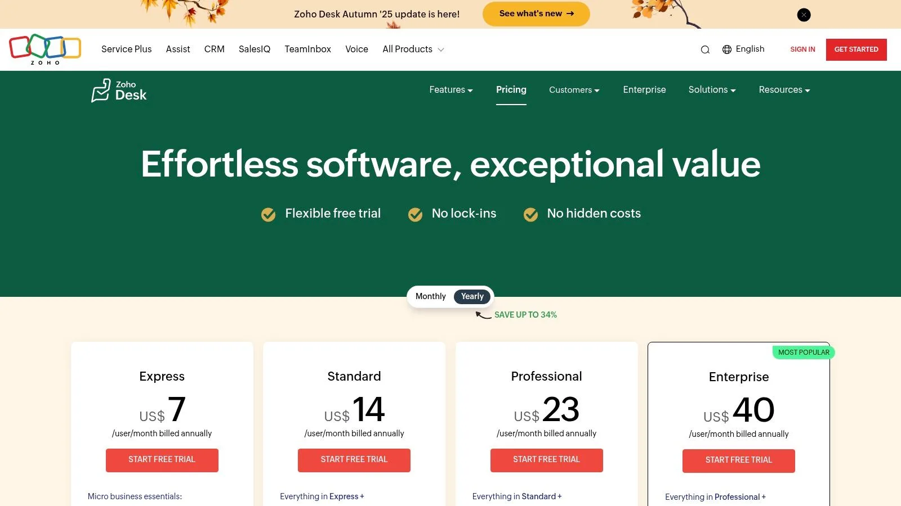
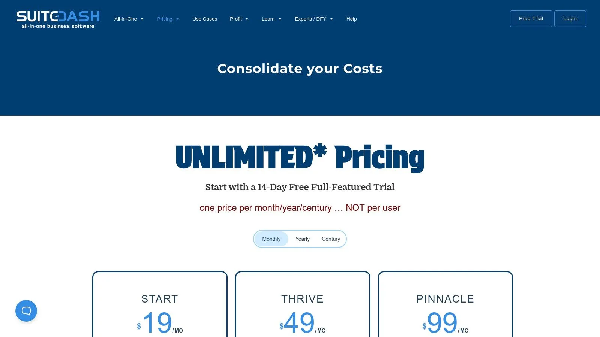
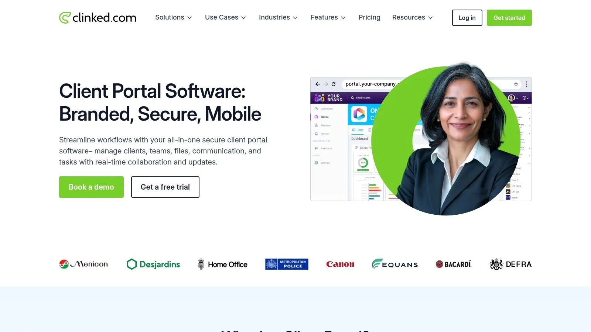
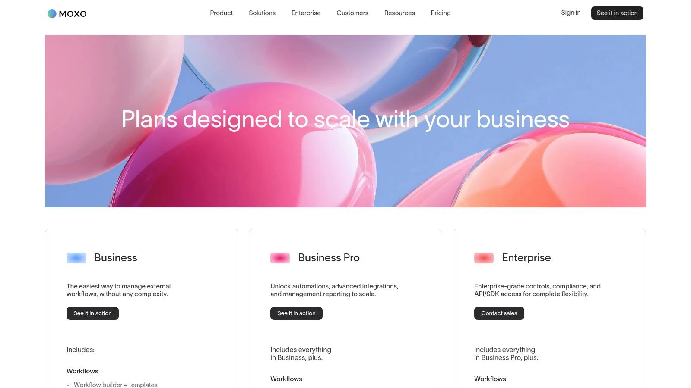
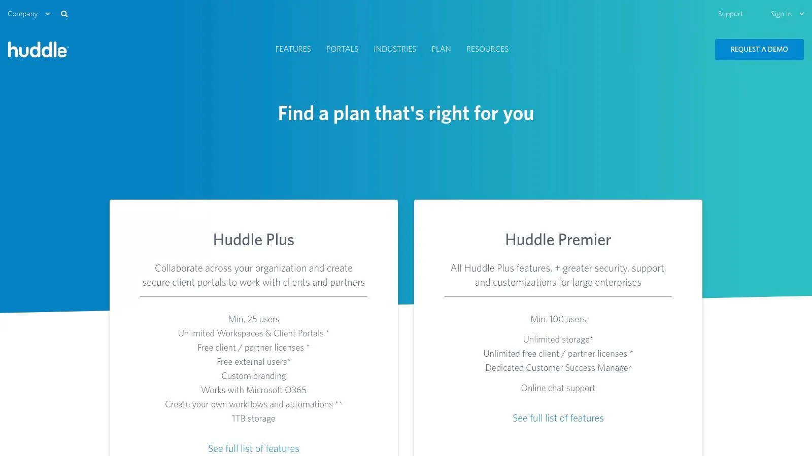
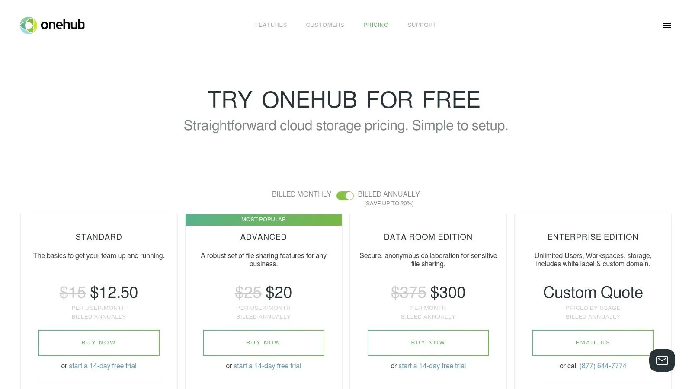

In a world of scattered emails and endless file versions, a centralized client portal is no longer a luxury—it’s a necessity for operational efficiency and a premium client experience. An effective portal streamlines communication, secures document exchange, and automates routine tasks, freeing up your team to focus on high-value work. But with so many options, finding the **best client portal software** for your specific needs can be challenging. A tool that works perfectly for a creative agency might be entirely wrong for a financial services firm.

This guide moves beyond marketing hype to provide an in-depth, practical comparison of the 11 leading client portal solutions available today. We’ll analyze their unique strengths, hidden limitations, and ideal use cases with actionable insights to help you select a solution that truly aligns with your business goals. For many, the goal is to create a robust hub where clients can find answers and manage their accounts independently. To delve deeper into the core concept and benefits, consider exploring a comprehensive guide to a [customer self-service portal](https://www.guidejar.com/blog/your-guide-to-a-customer-self-service-portal).

Instead of generic feature lists, we provide detailed reviews that cover everything from implementation difficulty to real-world performance. You’ll find direct comparisons, screenshots, and links for each platform, helping you visualize how each tool would function within your existing workflows. Whether you need a simple, out-of-the-box system for file sharing or a fully custom-built workflow engine to manage complex projects, this resource will equip you to make an informed decision and invest in a platform that enhances both your team’s productivity and your clients’ satisfaction.

## 1. No-Code simple solution

Instead of offering a one-size-fits-all platform, you can build a completely custom client portals using the powerful and flexible foundation of Airtable in a very lean way. In addition to Airtable’s back-end, you can use Airtable’s own user portals, or leverage other tools such as Softr, Noloco, Glide, or Stacker. This bespoke service is designed for businesses with unique workflows that cannot be easily accommodated by off-the-shelf products, transforming scattered spreadsheets and disjointed processes into a centralized, automated, and intuitive system.

What makes this a standout choice is its focus on creating a relational database that acts as your business’s single source of truth. The portal’s interface is then built on top of this organized data, ensuring that every piece of information is connected and consistent. For instance, a client’s project status, invoice history, and support tickets can all be linked back to a single client record, providing a complete 360-degree view. This structure is ideal for managing complex projects, tracking detailed client communication, handling multi-stage invoicing, or even building a custom CRM.

### Key Strengths and Use Cases

Lean custom no-code solutions excel where standard software falls short. Their deep integration capabilities with tools like Slack, Shopify, Make, and Zapier unlock powerful automation that saves significant time and reduces manual errors.

- **For Creative Agencies:** Imagine a portal where clients can submit revision requests that automatically create tasks in your project management system, update timelines, and notify the assigned designer via Slack.
- **For Service-Based Businesses:** A consultant could have a portal that tracks project milestones, logs billable hours, and automatically generates and sends invoices upon phase completion, with clients able to view and pay directly within the portal.
- **For E-commerce Operations:** A business could use a custom portal to manage wholesale orders, track inventory levels in real-time by integrating with Shopify, and provide vendors with a self-service hub to view order history and account status.

The service includes hands-on training, empowering your team to not only use the system but also adapt and expand it as your business evolves. This ensures long-term value and scalability.

**Visit the website:** [https://automaticnation.com](/)

## 2. HubSpot Service Hub — Customer Portal

For businesses already invested in the HubSpot ecosystem, the Service Hub’s customer portal is a natural and powerful extension. It’s not a standalone product; instead, it’s a feature that leverages the full power of HubSpot’s CRM, providing a unified space where clients can track support tickets, access a curated knowledge base, and manage their communications with your team. This deep integration is its primary differentiator.

Unlike many dedicated portal tools, HubSpot’s portal is directly linked to every contact record. This means when a client logs in, their experience can be personalized based on their entire history with your company. For a practical example, you can create an automated workflow that enrolls a new client in the portal as soon as a deal is marked “Closed-Won” in the Sales Hub. This action could simultaneously grant them access to a specific “New Client Onboarding” section of your knowledge base, making the transition from prospect to customer seamless. This makes it one of the **best client portal software** options for teams prioritizing automation and a single source of truth for customer data. If you’re exploring robust platforms, you can find more details in this comparison of the [best CRMs for small businesses](/best-crm-for-small-business/).

### Key Considerations

The portal’s strength is its native connection to HubSpot’s ticketing and shared inbox systems, which streamlines support operations significantly. However, access is limited to the Professional and Enterprise tiers of the Service Hub, starting at $450/month (billed annually) for 5 users. This per-seat pricing can become costly compared to competitors with flat-fee structures.

- **Best For**: Businesses deeply integrated with HubSpot CRM seeking to streamline customer support and self-service.
- **Standout Feature**: Seamless integration with the HubSpot CRM, enabling highly contextual and automated client interactions.
- **Limitation**: The portal is not a standalone product and is only available on higher-tier, more expensive Service Hub plans.

[Visit HubSpot Service Hub](https://www.hubspot.com/products/service/customer-portal)

## 3. Zendesk — Client Portal (Help Center + Tickets)

For organizations prioritizing robust, scalable customer support, Zendesk offers a client portal that is a cornerstone of the modern help desk experience. It functions as a powerful combination of a branded Help Center and a ticket management system, designed to empower customers with self-service options while giving support teams the tools they need to manage complex inquiries efficiently. Its main differentiator is its mature, AI-enhanced ecosystem built for omnichannel support.

Unlike all-in-one business platforms, Zendesk is laser-focused on the service experience. When a client logs in, they can immediately search a knowledge base with AI-powered suggestions, view the status of their current and past tickets, and participate in community forums. For a practical example, a SaaS company can use Zendesk’s AI to automatically suggest relevant troubleshooting articles as a user types their support request. This “ticket deflection” feature can resolve common issues before a human agent is ever involved, freeing up the support team to handle more complex problems. This makes it one of the **best client portal software** options for dedicated support teams that require enterprise-grade security and detailed analytics to handle high volumes of interactions.

### Key Considerations

Zendesk’s strength lies in its scalability and the depth of its support-centric features, from advanced reporting on ticket deflection to powerful role-based permissions. However, its comprehensive features are spread across various product suites and add-ons, which can make the pricing structure more complex than some competitors. Plans with portal access start at the Suite Team tier, which costs $55 per agent/month (billed annually).

- **Best For**: Support-heavy businesses and enterprises needing a scalable, customizable, and AI-driven portal for customer self-service and ticket management.
- **Standout Feature**: A highly customizable Help Center integrated with AI-powered search and community forums, designed to maximize ticket deflection.
- **Limitation**: Pricing can be higher than SMB-focused tools, and navigating the various product suites to get all desired features can be complex.

[Visit Zendesk](https://www.zendesk.com/service/customer-portal/)

## 4. Freshdesk (Freshworks) — Customer Portal

Freshdesk delivers a powerful yet accessible customer portal designed for businesses focused on efficient customer support and self-service. As a core component of the Freshworks ecosystem, its portal seamlessly integrates with a robust ticketing system and a comprehensive knowledge base. This combination makes it easy for small and medium-sized businesses to offer a branded, centralized hub where clients can submit and track support requests, find answers to common questions, and manage their interactions.

Unlike platforms where the portal is an expensive add-on, Freshdesk includes it even in its free tier, making it one of the **best client portal software** options for startups and budget-conscious teams. Its primary strength lies in its simplicity and speed of deployment. A practical action you can take is to set up a fully branded portal in under an hour, configuring ticket submission forms to automatically route issues to the correct support agent based on keywords like “billing” or “technical.” Once a ticket is created, it can trigger automated workflows, a process you can refine further by learning from this guide to automating project task creation. The platform also supports multilingual helpdesks, allowing you to serve a global customer base effectively from a single interface.

### Key Considerations

The portal’s value is amplified by Freshdesk’s clear, value-based pricing and feature-rich plans, which include optional AI support through its “Freddy” add-ons. While the free plan is generous for small teams, advanced customization, branding, and analytics are reserved for higher-tier plans like Pro and Enterprise. The cost of AI sessions can also become a factor for businesses with very high ticket volumes, requiring careful planning.

- **Best For**: Small to medium-sized businesses prioritizing a fast, easy-to-deploy, and cost-effective customer support portal.
- **Standout Feature**: A generous free tier and straightforward pricing that includes core portal functionality without a high initial investment.
- **Limitation**: Deep customization and advanced features are locked behind higher-priced plans, and per-session AI costs can add up.

[Visit Freshdesk](https://www.freshworks.com/freshdesk/pricing/)

## 5. Zoho Desk — Help Center and Customer Portal

For businesses operating within the extensive Zoho ecosystem, Zoho Desk provides a highly integrated and feature-rich customer portal solution. It functions as a Help Center where clients can independently find answers through a knowledge base, engage with peers in a community forum, and submit and track support tickets. Its primary advantage is the deep, native integration with other Zoho applications like Zoho CRM and Zoho Projects, creating a unified customer management experience.

Zoho Desk excels at multichannel support, consolidating interactions from email, social media, live chat, and telephone into a single, cohesive thread. This allows support agents to have full context of a client’s history without switching between platforms. As a practical example, imagine a client submits a support ticket through the portal. The assigned agent can immediately see the client’s entire interaction history from their Zoho CRM record, including past purchases and recent sales conversations, providing crucial context to resolve the issue more effectively. This seamless data flow makes Zoho Desk one of the **best client portal software** options for teams prioritizing a centralized, affordable, and scalable customer service operation.

### Key Considerations

The platform’s strength lies in its powerful automation capabilities, which allow teams to set up workflows, assignment rules, and escalations to manage tickets efficiently. However, while Zoho Desk offers a free plan and affordable paid tiers starting at $14/agent/month (billed annually), some of its most advanced features, like the Zia AI assistant, are reserved for the higher-priced plans. Some users also note that the extensive customization options can present a learning curve during initial setup.

- **Best For**: Small to enterprise-level businesses, especially those already using or planning to adopt the Zoho suite of applications.
- **Standout Feature**: Multichannel support consolidated into a single platform, providing a 360-degree view of customer interactions.
- **Limitation**: The initial setup and navigation can be complex due to the breadth of features, and the most powerful AI tools are restricted to premium plans.

[Visit Zoho Desk](https://www.zoho.com/desk/pricing.html)

## 6. SuiteDash — All-in-One Client Portal Platform

For businesses seeking a comprehensive, white-label solution, SuiteDash presents a powerful all-in-one platform. It goes far beyond a simple portal by integrating CRM, project management, invoicing, e-signatures, and even a learning management system (LMS) into a single environment. Its core differentiator is a flat-fee pricing model that includes unlimited clients and staff members, making it highly scalable for agencies, consulting firms, and service businesses that want predictable costs as they grow.

SuiteDash allows you to create a completely branded experience with custom domains, login screens, and even a branded mobile app on higher tiers. This makes it one of the **best client portal software** options for companies prioritizing brand consistency. As a practical action, you can build a client onboarding workflow that automatically creates a project, assigns a welcome task-list, sends an invoice for the initial deposit, and shares the contract for e-signature—all triggered the moment you add a new client to the CRM. This level of consolidation can replace multiple separate subscriptions, simplifying your tech stack. For those evaluating how such an integrated system fits their needs, it’s helpful to see [which automation tool best suits your business](/what-automation-tool-suits-your-business/).

### Key Considerations

The platform’s immense feature set is both its greatest strength and a potential challenge. New users may face a steep learning curve when configuring the system to their specific workflows. However, the payoff is a highly customized and efficient client management hub. Plans start at a very accessible $19/month (billed annually), with all plans offering unlimited client and staff portals.

- **Best For**: Agencies, consultants, and service-based businesses wanting a fully brandable, all-in-one platform with predictable, flat-fee pricing.
- **Standout Feature**: Unlimited clients, staff, and portals on every plan, combined with extensive white-labeling for a truly custom-branded experience.
- **Limitation**: The sheer number of features and settings can be overwhelming for new users, requiring a significant initial time investment for setup.

[Visit SuiteDash](https://suitedash.com/pricing/)

## 7. Clinked — Dedicated Client Portal Software

Clinked is a highly secure, purpose-built platform designed for businesses that need a professional and branded environment for client collaboration. It moves beyond simple file sharing to offer a complete digital workspace with features like task management, integrated chat, shared calendars, and discussion forums. Its main strength lies in its extensive white-labeling capabilities, allowing professional services firms like accountants, lawyers, or consultants to present a seamless brand experience to their clients.

The platform is engineered around secure, compartmentalized groups or workspaces. For a practical example, a financial advisor could create a unique, private portal for each client. Within that secure space, they can share sensitive quarterly reports, assign a task for the client to upload their tax documents, and schedule an annual review meeting using the shared calendar—all under the firm’s branding. The granular permissions and detailed audit trails provide the control necessary for compliance-heavy industries, making it one of the **best client portal software** options for organizations prioritizing security and brand consistency.

### Key Considerations

Clinked’s dedication to a branded client experience is evident, but its pricing reflects its positioning as a premium tool, starting at $119/month for 100 members. Advanced security features like SSO, advanced integrations, and file watermarking are reserved for its higher-tier Enterprise plans, which may put them out of reach for smaller businesses. The platform also offers dedicated iOS and Android apps, extending the branded experience to mobile devices.

- **Best For**: Professional service firms and enterprises that require a secure, fully branded, and collaborative workspace for client engagement.
- **Standout Feature**: Extensive white-label options, including custom domains and mobile apps, combined with granular permission controls for secure collaboration.
- **Limitation**: The entry-level price is higher than many competitors, and critical enterprise features are locked behind more expensive plans.

[Visit Clinked](https://www.clinked.com/client-portal)

## 8. Moxo — Client Interaction Hub with Portal Add-On

Moxo positions itself as a secure, workflow-driven client interaction hub, where the portal is a central piece of a larger client management ecosystem. Originally built for high-touch industries like wealth management and consulting, it excels at guiding clients through complex processes. The platform combines secure messaging, document exchange, task management, and e-signatures into a structured, one-stop client portal. This workflow-centric approach is its core differentiator.

Unlike portals focused solely on file sharing or support tickets, Moxo is built around “flows”—templated, step-by-step client journeys. As a practical example, a mortgage broker can create an “Application Flow” that guides a client through each step: first, securely uploading financial statements, then completing a digital application form, and finally, e-signing the disclosure documents. Each step unlocks only after the previous one is completed, ensuring a compliant and error-free process. This makes it one of the **best client portal software** choices for businesses that need to manage structured, multi-step client projects.

### Key Considerations

Moxo’s strengths lie in its security and compliance features, such as SAML SSO and long-term audit trails, making it suitable for regulated industries. However, its pricing is not publicly listed and is customized based on user count and required features. The most powerful features, like private-labeled mobile apps and advanced branding, are often paid add-ons that can increase the total cost significantly compared to all-in-one solutions.

- **Best For**: Professional service firms (financial, legal, consulting) that manage structured, multi-step client processes and require high security.
- **Standout Feature**: Workflow automation that guides clients through predefined processes, combining tasks, documents, and communication in one place.
- **Limitation**: Opaque pricing structure and the best features (like private-labeled apps) are often expensive add-ons.

[Visit Moxo](https://www.moxo.com/pricing)

## 9. Ideagen Huddle — Secure Client Portals and Document Collaboration

For organizations in highly regulated industries like government, legal, or finance, Ideagen Huddle offers a client portal solution built on a foundation of government-grade security. It excels at secure document collaboration, providing a branded space where teams can manage file requests, control document versions, and handle approvals with a clear audit trail. This security-first approach is its core differentiator in a crowded market.

Unlike platforms that charge per client seat, Huddle’s model often includes unlimited client and partner licenses, making it cost-effective for projects involving extensive external collaboration. For a practical example, a government agency can create a secure portal to collaborate with multiple external contractors on a sensitive project. They can request specific documents from each contractor, who can only see their own files, while the agency maintains a complete, version-controlled overview of all submissions with a clear audit trail. This makes it one of the **best client portal software** choices for enterprises prioritizing compliance and seamless document management.

### Key Considerations

Huddle’s strength lies in its robust security and collaboration features tailored for enterprise needs. However, its pricing is not publicly available and is provided by quote only, often with minimum user counts (e.g., 25+ seats), which may place it outside the budget of smaller businesses. The platform is designed for complex, high-stakes collaboration rather than simple project updates.

- **Best For**: Government agencies, professional services, and enterprises in regulated industries needing secure, auditable document collaboration.
- **Standout Feature**: Government-grade security combined with unlimited guest licenses on most plans, enabling secure, large-scale external collaboration.
- **Limitation**: Opaque, quote-based pricing and high minimum user counts make it less accessible for small to mid-sized businesses.

[Visit Ideagen Huddle](https://huddle.ideagen.com/product/pricing)

## 10. Microsoft SharePoint Online — Build Client/Extranet Portals

For organizations already embedded in the Microsoft 365 ecosystem, SharePoint Online offers a powerful, albeit more technical, path to creating secure client portals. It isn’t an out-of-the-box portal solution; instead, it’s a flexible platform for building custom extranet sites focused on document-centric collaboration. Its primary strength lies in its deep integration with the entire Microsoft suite, including Teams, OneDrive, and the Power Platform.

Unlike dedicated portal software, SharePoint requires initial setup and customization to function as a client hub. However, this offers unparalleled control. As a practical example, an engineering firm can set up a SharePoint site for a large construction project, giving clients access to specific document libraries containing blueprints and reports. Using Power Automate, they can create a workflow where uploading a new “Site Inspection Report” automatically notifies the client lead and creates a task in Microsoft Planner for review. This makes it one of the **best client portal software** options for businesses that need enterprise-grade security and have the IT resources to manage the configuration.

### Key Considerations

SharePoint’s value is immense for document management and secure collaboration, backed by Microsoft’s robust security and compliance framework. The platform is included in many Microsoft 365 Business and Enterprise plans, making it a cost-effective choice for existing subscribers. However, the learning curve is steep, and creating a user-friendly client experience requires a clear plan and technical expertise.

- **Best For**: Medium to large businesses heavily invested in Microsoft 365 needing highly secure, document-focused client collaboration sites.
- **Standout Feature**: Native integration with Microsoft 365 apps (Teams, OneDrive, Office) and extensibility through the Power Platform for custom automations.
- **Limitation**: It is not a ready-made portal and requires significant technical setup, customization, and user training to be effective.

[Visit Microsoft SharePoint Online](https://www.microsoft.com/en-us/microsoft-365/sharepoint/compare-sharepoint-plans)

## 11. Onehub — Branded Client Portals and Virtual Data Rooms

Onehub specializes in providing highly secure, white-labeled client portals with a strong focus on document management and collaboration. It stands out by combining branded workspaces with robust virtual data room (VDR) capabilities, making it ideal for industries like finance, legal, and real estate where secure document exchange is critical. The platform allows businesses to create custom-branded portals using their own domain, colors, and logo, ensuring a seamless client experience that reinforces brand identity.

Unlike all-in-one platforms, Onehub hones in on security and control. It offers granular, role-based permissions, audit trails, and advanced features like watermarking and password-protected links. This makes it one of the **best client portal software** options for managing sensitive transactions. As a practical example, an investment firm can create a secure VDR for a due diligence process, inviting multiple potential investors to review confidential documents. Using Onehub’s “Stealth Mode,” each investor can be made unaware of the others’ presence, while the firm tracks who has viewed which documents and for how long. If your needs are highly specialized, understanding how a dedicated [data room for due diligence](https://kytes.app/blogs/data-room-for-due-diligence) can accelerate sales might provide further insight.

### Key Considerations

Onehub’s strength lies in its blend of branding and security. Pricing is transparent, with plans starting at $15 per user/month and a free 14-day trial. However, its focus is primarily on secure file sharing, so it lacks integrated ticketing, project management, or invoicing tools found in more comprehensive client portal solutions.

- **Best For**: Professional services firms, financial institutions, and legal teams needing a secure, branded portal for document-heavy collaboration and deal management.
- **Standout Feature**: A powerful combination of white-label branding and virtual data room (VDR) security features like audit trails and watermarking.
- **Limitation**: Functionality is heavily document-centric, with limited features for broader client service management like support ticketing or knowledge bases.

[Visit Onehub](https://www.onehub.com/pricing)

## Client Portal Software Feature Comparison

| Solution                      | Core Features/Automation ✨                                                | User Experience/Quality ★★★★☆                | Value Proposition 💰                      | Target Audience 👥                                    | Unique Selling Points 🏆                                |
| ----------------------------- | ------------------------------------------------------------------------- | -------------------------------------------- | ----------------------------------------- | ----------------------------------------------------- | ------------------------------------------------------- |
| **🏆 Lean No-Code solutions** | Custom and easy to set-up portals, deep Slack/Shopify/Zapier integrations | Intuitive, relational DBs, hands-on training | Saves hours weekly, reduces manual errors | SMBs & growing businesses wanting tailored automation | Custom-fit portals + full team training + proven impact |
| HubSpot Service Hub           | No-code portal, CRM integration, ticketing, knowledge base                | Strong CRM context, easy to launch           | Per-seat pricing, tier-based access       | Teams needing embedded CRM service portal             | Deep CRM linkage & automation                           |
| Zendesk                       | AI-powered Help Center, ticket history, role-based security               | Mature, scalable, omnichannel support        | Higher pricing, complex product suites    | Support teams needing scalable portals                | AI search & enterprise-grade security                   |
| Freshdesk (Freshworks)        | Ticketing, multilingual KB, AI add-ons, free trial                        | Easy onboarding, competitive pricing         | Free tier, clear value tiers              | SMBs looking for accessible helpdesk                  | AI (Freddy) add-ons + free tier                         |
| Zoho Desk                     | Knowledge base, multichannel support, automation                          | Broad features but some learning curve       | Multiple tiers, free trial                | Zoho ecosystem users & SMBs                           | Deep Zoho app integration                               |
| SuiteDash                     | Unlimited users, white-labeling, built-in billing & projects              | Broad but complex feature set                | Flat fee, no per-user charges             | Agencies & service firms needing all-in-1             | Unlimited users + strong branding options               |
| Clinked                       | Secure portals, document collaboration, chat, mobile apps                 | Strong permission controls                   | Higher entry price                        | Professional services needing client workspaces       | Enterprise scalability + audit trails                   |
| Moxo                          | Workflow automation, branded portals, mobile-first, audit trails          | Mobile-first, strong security                | Pricing varies, add-ons for apps          | Enterprises prioritizing mobile + security            | 7-year audit trails + SDK/APIs                          |
| Ideagen Huddle                | Gov-grade security, Office 365 integration, unlimited external users      | Secure, compliance-focused                   | Quote-based pricing, minimum seats        | Regulated industries & public sector                  | Unlimited external users + enterprise success teams     |
| Microsoft SharePoint Online   | Document libraries, coauthoring, external sharing                         | Highly extensible but complex setup          | Low cost via MS35 subscription            | MS365-standardized enterprises                        | Enterprise security + Power Platform extensibility      |
| Onehub                        | Branded portals, secure file sharing, virtual data rooms                  | Strong security, audit trails                | Clear pricing, free trial                 | Teams needing secure document collaboration           | Virtual data room + DocuSign + stealth mode             |

## Making Your Final Decision: From Software to System

Navigating the landscape of client portal software can feel overwhelming. We’ve explored everything from dedicated, all-in-one platforms like SuiteDash and Clinked to integrated solutions within larger ecosystems like HubSpot and Zendesk, and even powerful document-centric options such as Huddle and SharePoint. The key takeaway is clear: the **best client portal software** isn’t a one-size-fits-all product. It’s the one that transforms your disparate processes into a cohesive, streamlined system that elevates your client experience.

Your final decision should hinge less on a flashy feature list and more on a deep understanding of your operational DNA. A small consulting firm might find Moxo’s client interaction hub perfect for managing high-touch projects, while a large enterprise will appreciate the robust ticketing and knowledge base features of Zoho Desk or Freshdesk. The goal is to move beyond simply organizing files and messages; it’s about creating a centralized, branded environment where clients feel supported and empowered.

### From Evaluation to Implementation: Your Action Plan

Selecting a tool is just the first step. The real value is unlocked through thoughtful implementation. To ensure your chosen software becomes an asset rather than another administrative burden, follow this structured, actionable approach to making your final decision.

**1. Revisit Your Core Needs (The “Why”):**\
Before you sign any contract, return to your initial goals. Are you trying to reduce support tickets, streamline project approvals, or securely share sensitive documents? Map your primary objectives back to the tools we’ve discussed.

- **Practical Example:** If your primary pain point is endless email chains for design feedback, your core need is “streamlined project approvals.” This immediately prioritizes tools with strong task management and file annotation features over those focused on support tickets.
- **Actionable Insight:** Create a simple checklist of your top three “must-have” outcomes. Score each potential software against these outcomes. If a tool doesn’t solve your main problem well, its other features are just distractions.

**2. Conduct a Workflow Audit:**\
Take a practical look at how your team and clients interact today. Where are the bottlenecks? A simple manual process, like emailing a client a new draft and waiting for feedback, involves multiple steps that are prone to error and delay.

- **Practical Example:** Map out the client onboarding process. Step 1: Send contract via email. Step 2: Wait for signed copy. Step 3: Send welcome packet. Step 4: Send first invoice.
- **Actionable Insight:** Identify which platform can automate this entire chain. For example, an all-in-one like **SuiteDash** could trigger the contract, welcome packet, and invoice automatically once a new client is added. If your process is highly unique, a standard solution may not fit, pointing towards a custom build.

**3. Factor in the Total Cost of Ownership:**\
Pricing is more than just the monthly subscription fee. Consider these hidden or secondary costs:

- **Implementation and Training:** How much time will your team need to learn the new system? Is professional onboarding included or an extra expense?
- **Integration Gaps:** Will you need to pay for a third-party tool like Zapier to connect the portal to your existing software stack?
- **Scalability:** Review the pricing tiers. Will a sudden growth in clients or users push you into an expensive enterprise plan unexpectedly?
- **Actionable Insight:** Create a simple spreadsheet projecting costs over two years. Include the subscription, any one-time setup fees, and potential integration costs. This gives you a more realistic financial picture than the marketing price.

### Beyond the Software: Building Your System

The most powerful client portals are those that feel like a natural extension of your business, not a generic, third-party add-on. As we’ve seen with platforms like SharePoint or a custom-built solution from Automatic Nation, ultimate flexibility allows you to build a system that perfectly mirrors your unique operational model.

This is the final, crucial consideration: Do you adapt your processes to fit the software, or do you find a solution that adapts to you? For many businesses, especially those with specialized services or a desire for a distinct competitive edge, a rigid tool is a ceiling on their potential. The right choice will not only solve today’s problems but will also serve as a scalable foundation, ready to support your business as it grows and evolves. Ultimately, you are not just buying software; you are investing in a better way of working with your clients.

---

If you’ve reviewed the off-the-shelf options and realized your unique workflows demand a more tailored solution, **Automatic Nation** can help. We specialize in building custom, flexible client portals on platforms like Airtable that perfectly match your business processes, automate manual work, and deliver an unparalleled client experience. Visit us at [Automatic Nation](/) to learn how a purpose-built system can become your greatest competitive advantage.
