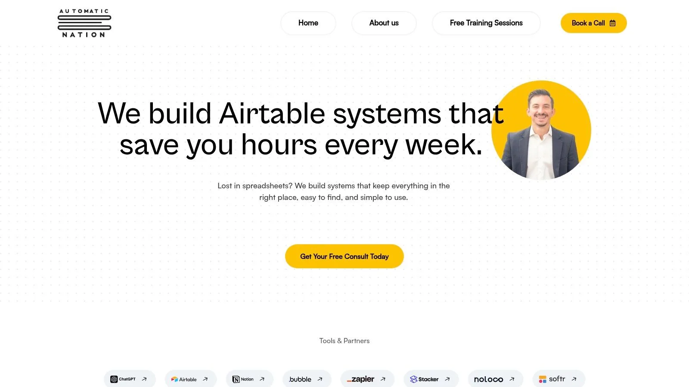
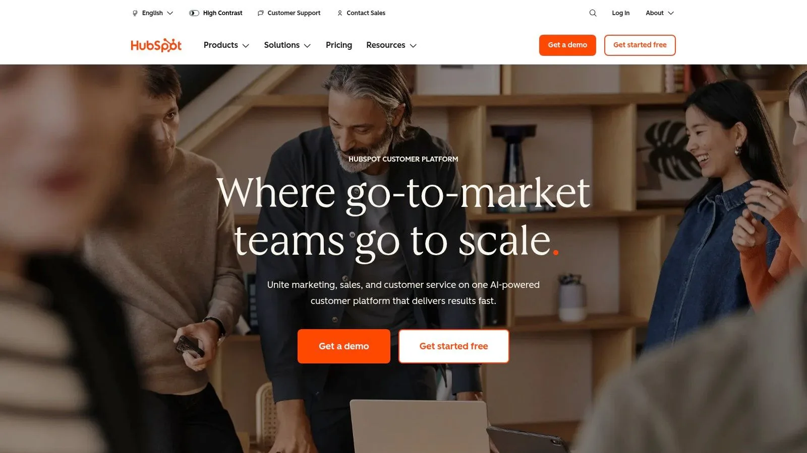
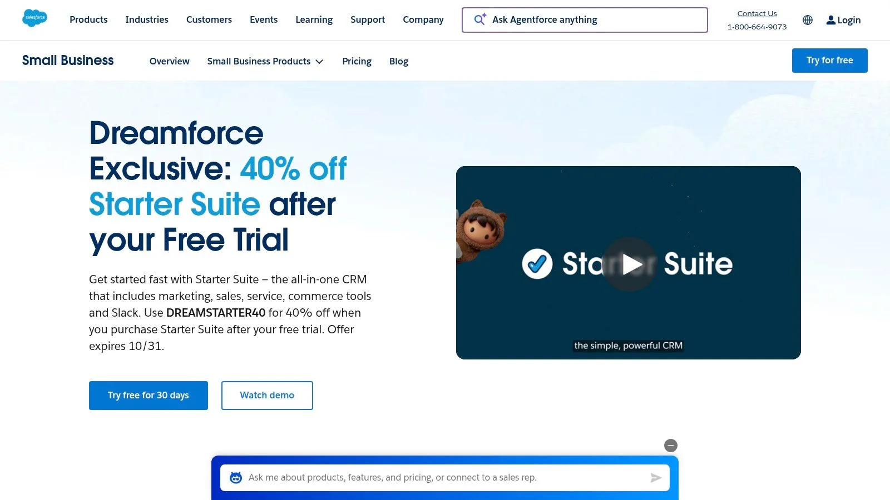
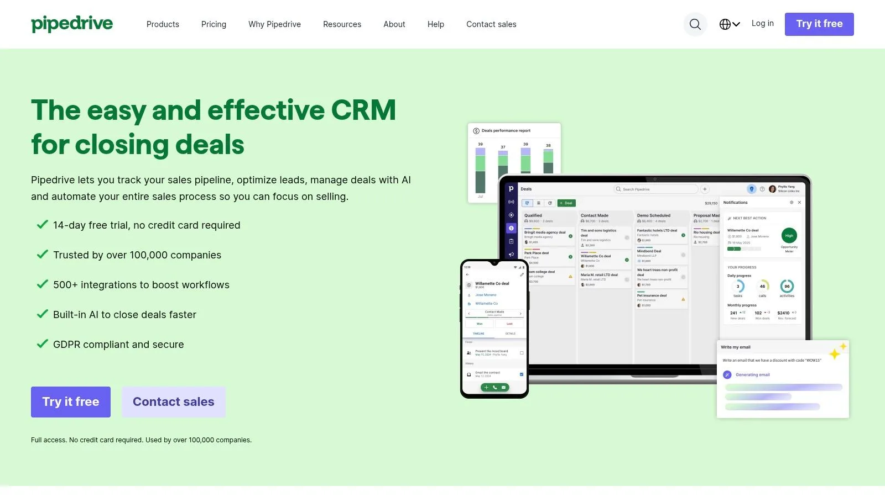
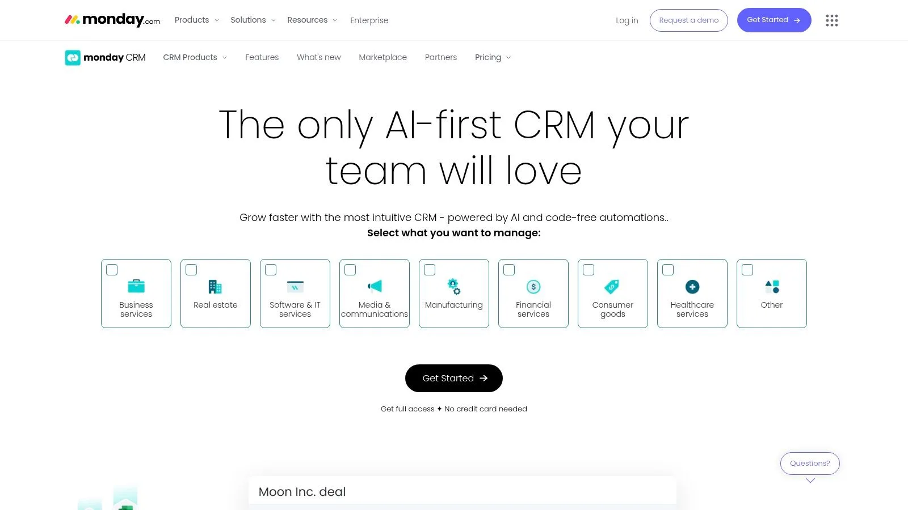
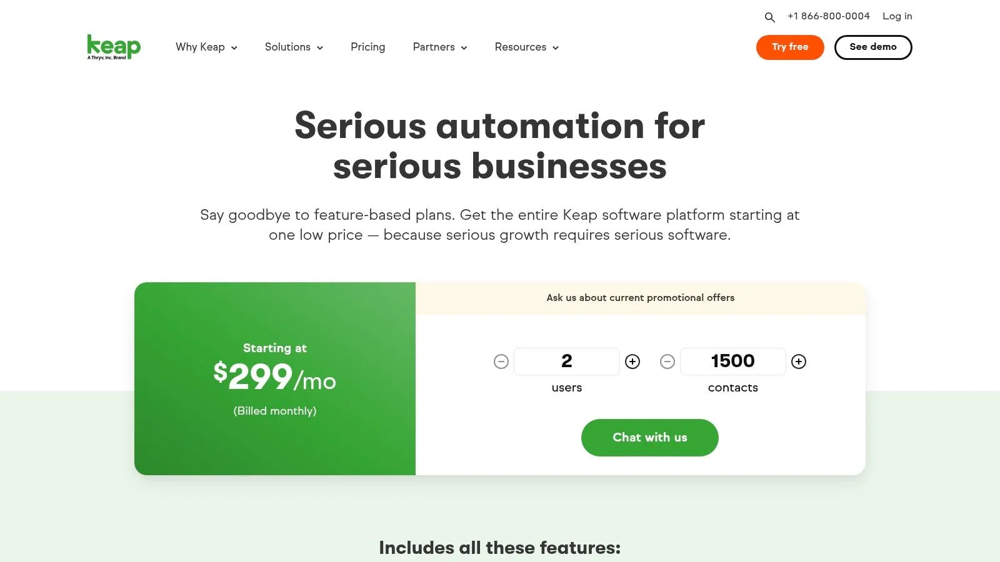
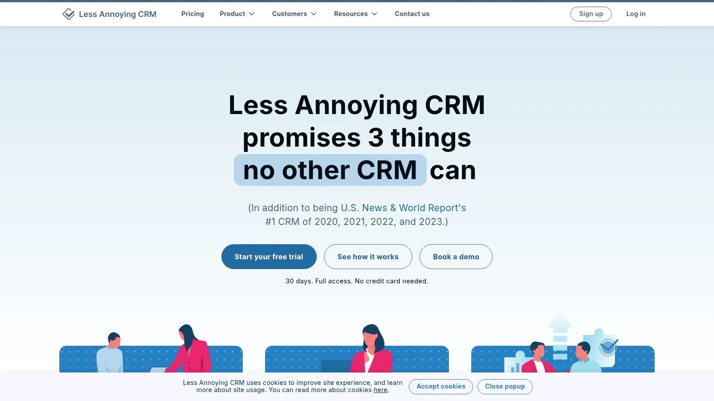
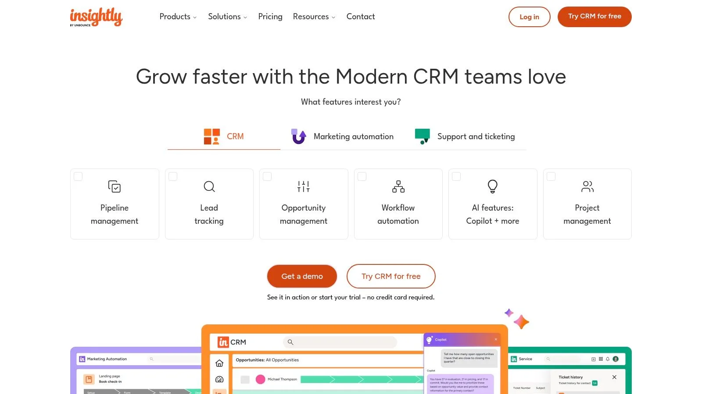
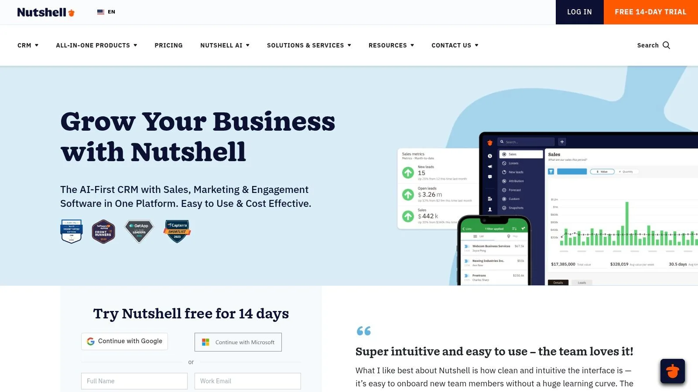
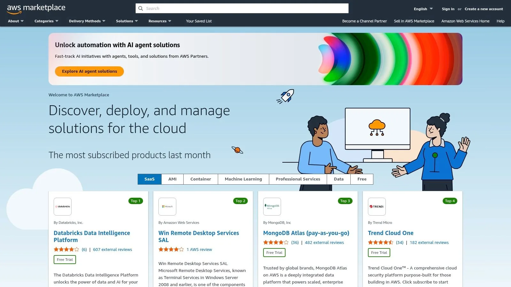

For small businesses, managing customer relationships is everything. Yet, many teams are stuck in a cycle of scattered spreadsheets, missed follow-ups, and disconnected data. This not only wastes time but also lets valuable opportunities slip through the cracks. The right Customer Relationship Management (CRM) system acts as a central nervous system for your sales, marketing, and service efforts, but choosing one can feel overwhelming.

This guide cuts through the noise. We won’t just list features; we’ll provide actionable insights and practical examples to help you identify the **best CRM for your small business** needs. We’ll dive deep into twelve leading platforms, complete with screenshots and direct links, to give you a clear view of each tool’s real-world application. A foundational aspect of any CRM system is its ability to centralize and manage all customer information effectively. Understanding how to build a [powerful customer database CRM](https://www.chatiant.com/blog/customer-database-crm) is key to optimizing your business operations.

Our goal is to give you a comprehensive resource for making an informed decision. We will explore how different platforms solve specific problems, from automating lead nurturing for a service-based business to tracking complex sales pipelines for a B2B startup. You’ll see how each option stacks up in key areas:

- **Key Features & Use Cases:** Discover what each CRM excels at. For example, which one is best for a real estate agent versus a software startup?
- **Pricing & Implementation:** Understand the true cost and what it takes to get started, with actionable tips for a smooth rollout.
- **Honest Limitations:** Learn what each platform _doesn’t_ do well to avoid a poor fit for your business.

By the end, you’ll have a clear framework to choose a tool that not only organizes your contacts but actively helps you grow.

## 1. AirTable

A distinct alternative to off-the-shelf CRM software, Airtable consultants and agencies can build build bespoke systems on the versatile Airtable platform. This approach is ideal for small businesses whose unique processes are often constrained by rigid, one-size-fits-all CRM solutions. Instead of forcing your workflow into a pre-built box, they design a system that mirrors your company’s specific sales funnel, project management stages, and reporting requirements.

The core strength lies in transforming scattered spreadsheets into a centralized, automated relational database. This custom-built CRM becomes the single source of truth for client interactions, deal stages, and team tasks, significantly reducing manual data entry and the risk of human error. It stands out as one of the **best CRM for small business** options for companies that need more than just contact management.

### Key Features and Use Cases

Automatic Nation’s solutions extend far beyond a traditional CRM. They engineer comprehensive business operating systems that can manage multiple functions from a single, intuitive interface.

- **Tailored Workflow Automation:** Imagine your sales process involves multiple stakeholders and custom approval stages. **Practical Example:** A creative agency can build an automation where moving a deal to the “Proposal Sent” stage automatically generates a task for the design lead to create mockups, sends a notification to the finance department to prepare billing terms, and updates the client’s record simultaneously.
- **Integrated Business Functions:** They can build interconnected systems for project management, invoicing, recruiting, and even lightweight ERPs. **Practical Example:** A consulting firm marks a deal “Closed-Won” in their CRM. This can automatically create a new project in the project management base, assign a project manager from a predefined list, and generate the initial invoice in QuickBooks via an integration.
- **Seamless Tech Stack Integration:** Using tools like Make (Integromat) and Zapier, they connect your Airtable CRM to other essential apps. **Practical Example:** A new order on your Shopify store can instantly create a new client record and sales opportunity in your CRM, or a message containing “urgent support” in a specific Slack channel can trigger a new high-priority support ticket in your Airtable base.

### Implementation and Support

A significant advantage is the hands-on training included with every build. Their team ensures your staff can confidently use, manage, and even adapt the system as your business evolves. While the initial setup requires an investment of time to map out your processes, the result is a system that provides unparalleled operational efficiency. Because this is a custom service, pricing is project-based; you’ll need to consult with them for a quote tailored to your specific needs.

- **Pros:**

  - Fully custom-built CRM tailored to your exact workflows.
  - Reduces manual tasks and errors through automation.
  - Integrates smoothly with tools like Slack, Shopify, and Google Sheets.
  - Includes hands-on team training for confident adoption.

- **Cons:**

  - Dependent on the Airtable platform, which may not suit all enterprise needs.
  - Initial setup and customization require a dedicated implementation period.

**Website:** [https://automaticnation.com/](/)

## 2. HubSpot CRM

HubSpot CRM ranks among the best CRM for small business thanks to its always-free core and modular upgrade path that grows with your team. New users get contact management, deal tracking, pipeline reports, and basic automation at zero cost. Upgrading to Starter, Professional, or Enterprise unlocks deeper marketing, sales, and service tools without having to switch platforms.

### Pricing

| Tier         | Cost (USD)              | Includes                                    |
| ------------ | ----------------------- | ------------------------------------------- |
| Free         | $0                      | Contacts, deals, pipelines, basic reporting |
| Starter      | From $20 per user/month | Email marketing, simple automation          |
| Professional | From $800 per month     | Advanced automation, custom reporting       |
| Enterprise   | From $3,200 per month   | Custom objects, predictive lead scoring     |

### Key Features

- **Always-free core**: Unlimited users, 1M contacts, basic sales dashboard.
- **AI insights**: Automated deal scoring and email recommendations. **Practical Example:** The AI can suggest which of your 50 open leads is most likely to close this month based on their email engagement and website activity.
- **View-only seats**: Share reports with non-licensed users at no extra seat cost.
- **Broad integrations**: Native links to Shopify, Zoom, Slack, QuickBooks, Airtable.
- Learn more about HubSpot CRM [on domain.com](/how-quickbooks-and-airtable-streamline-your-small-business-finances/)

### Implementation Tips

1. **Actionable Insight:** Audit existing contacts _before_ importing. Create a simple CSV with columns for First Name, Last Name, Email, and Lead Status (e.g., “Hot,” “Warm,” “Cold”) to make segmentation easier from day one.
2. Map pipelines to real-life stages. **Practical Example:** For a SaaS business, stages could be “Demo Scheduled,” “Trial Started,” “Proposal Sent,” “Negotiation.”
3. Schedule 30-minute onboarding calls with each team lead.
4. Roll out automation rules in phases. **Actionable Insight:** Start with one simple rule, like “When a lead fills out the contact form, create a task for a sales rep to call them within 24 hours.” Monitor its success before adding more complex rules.

### Use Cases

- **Marketing teams:** Automating a 5-part email nurture sequence for new blog subscribers.
- **Small sales groups:** Visualizing pipeline velocity to see how long deals spend in each stage.
- **Operations managers:** Syncing “Closed-Won” deals with QuickBooks to automatically generate invoices.

### Pros and Cons

**Pros**

- True free tier with no expiry
- Clear per-seat pricing and upgrade path
- Large app marketplace and HubSpot Academy resources

**Cons**

- Costs scale quickly with contacts and seats
- Advanced automation and reporting require higher-priced plans

Website: [https://www.hubspot.com](https://www.hubspot.com/)

## 3. Salesforce Starter Suite

Salesforce’s SMB-focused Starter Suite offers an all-in-one solution that bundles essential sales, service, and marketing tools into a single, simplified package. It provides small businesses with access to the power of the world’s leading CRM platform, offering a clear and direct upgrade path to more advanced Pro or Enterprise editions as the company scales. This makes it a strong contender for the best CRM for small business for those planning for significant growth.

### Pricing

| Tier       | Cost (USD)               | Includes                                  |
| ---------- | ------------------------ | ----------------------------------------- |
| Starter    | From $25 per user/month  | Sales, Service, and Marketing essentials  |
| Pro Suite  | From $100 per user/month | Forecasting, advanced automation, quoting |
| Enterprise | Contact Sales            | Customization, advanced reporting         |

### Key Features

- **Unified platform**: Combines lead, contact, and opportunity management with case management.
- **Guided onboarding**: Simplified setup and in-app guidance to accelerate adoption.
- **Seamless scalability**: Upgrade to more powerful Salesforce editions without migrating data.
- **AppExchange access**: Tap into a massive ecosystem of third-party apps and integrations. **Practical Example:** Install the DocuSign app to send sales contracts for e-signature directly from an opportunity record.

### Implementation Tips

1. Use the guided setup to map core objects like Accounts, Contacts, and Opportunities.
2. **Actionable Insight:** Immediately connect your email (Gmail or Outlook). This logs all client communication automatically, ensuring anyone on your team can see the full conversation history before a call.
3. Define a simple case management process. **Practical Example:** Create statuses like “New,” “In Progress,” and “Resolved” for all incoming customer support tickets.
4. Explore the AppExchange for one or two key integrations, like a document signing tool or a CTI (computer telephony integration) app for click-to-dial functionality.

### Use Cases

- **Startups:** Needing a foundational CRM that can scale from one to 100 employees without painful data migration.
- **Service-based businesses:** Managing customer support tickets alongside sales deals to get a 360-degree customer view.
- **Sales teams:** Requiring a unified view of every customer interaction, from marketing email opens to support case history.

### Pros and Cons

**Pros**

- Access to a powerful, enterprise-grade platform at a small business price point.
- Excellent scalability ensures you won’t outgrow the platform.
- Strong analytics and reporting capabilities from the start.

**Cons**

- Can have a steeper learning curve compared to simpler, SMB-only CRMs.
- The cost can increase significantly with add-ons and higher-tier plans.

Website: <https://www.salesforce.com/small-business/starter>

## 4. Zoho CRM

Zoho CRM is a powerhouse for small businesses seeking a full-featured yet affordable solution. It stands out with a robust free plan and deep integration into the expansive Zoho ecosystem, making it one of the best CRM for small business options for teams that need more than just contact management. It allows users to build multiple sales pipelines, create complex workflows, and deploy lead scoring rules without immediately hitting a paywall.

### Pricing

| Tier         | Cost (USD)              | Includes                                                   |
| ------------ | ----------------------- | ---------------------------------------------------------- |
| Free         | $0 for up to 3 users    | Lead, contact, and deal management, basic workflows        |
| Standard     | From $14 per user/month | Multiple pipelines, custom dashboards, scoring rules       |
| Professional | From $23 per user/month | Sales signals, inventory management, process management    |
| Enterprise   | From $40 per user/month | AI tools (Zia), advanced customization, multi-user portals |

### Key Features

- **Multiple pipelines**: Create distinct sales processes for different products or services. **Practical Example:** A digital agency can have one pipeline for “Website Design Projects” and another for “Monthly SEO Retainers.”
- **Deep integrations**: Natively connects with the entire Zoho suite (Books, Campaigns, etc.), Google Workspace, and Microsoft 365.
- **Strong price-to-feature ratio**: Access advanced features like scoring and workflows on lower-priced tiers.
- **CRM Plus suite**: Option to bundle CRM with eight other Zoho apps for an all-in-one business platform.

### Implementation Tips

1. **Actionable Insight:** Start with the free plan to configure basic modules and import a test batch of contacts. This lets you validate your setup before committing to a paid plan.
2. Define one primary sales pipeline first, then expand to others as the team gains confidence.
3. Use Zoho’s pre-built workflow templates. **Practical Example:** Use the “Send Welcome Email to New Lead” template to immediately engage website inquiries without manual effort.
4. Integrate with Zoho Books early to sync customer data with invoicing and financial records, eliminating double entry.

### Use Cases

- **Sales teams:** Managing different product lines (e.g., hardware vs. software subscriptions) with unique sales cycles.
- **Businesses already using other Zoho apps:** Seeking a unified system where CRM, accounting, and marketing data flow seamlessly.
- **Operations managers:** Automating lead assignment based on territory or product interest and creating follow-up tasks for sales reps.

### Pros and Cons

**Pros**

- Very competitive per-user pricing across all paid tiers.
- Broad functionality is included without requiring expensive add-ons.
- Excellent for businesses invested in the Zoho ecosystem.

**Cons**

- The user interface can feel complex and overwhelming for new users.
- AI and other advanced features are locked behind higher-tier plans.

Website: <https://www.zoho.com/crm>

## 5. Pipedrive

Pipedrive earns its spot as one of the best CRM for small business by focusing intently on the sales process. Built by salespeople, its design prioritizes clear pipeline visualization and activity tracking to help teams close deals faster. The interface is highly intuitive, allowing new users to get started with minimal training by simply dragging and dropping deals between stages.

### Pricing

| Tier         | Cost (USD)                 | Includes                                         |
| ------------ | -------------------------- | ------------------------------------------------ |
| Essential    | From $14.90 per user/month | Lead, deal, calendar, and pipeline management    |
| Advanced     | From $27.90 per user/month | Email sync, workflow automation, group emailing  |
| Professional | From $49.90 per user/month | One-click calling, smart docs, revenue forecasts |
| Enterprise   | From $99 per user/month    | Enhanced security, phone support, project fields |

### Key Features

- **Sales-focused design**: Visual drag-and-drop pipelines are central to the user experience.
- **Activity tracking**: Prompts users to schedule the next action for every open deal. **Practical Example:** After you finish a call, Pipedrive immediately asks, “What’s your next step?” prompting you to schedule a follow-up email or meeting.
- **Robust integrations**: Over 500 apps including Trello, Asana, Slack, and Google Workspace.
- **AI Sales Assistant**: Provides performance tips, sales forecasts, and automation recommendations.

### Implementation Tips

1. **Actionable Insight:** Define your sales stages clearly before building your first pipeline. Use simple, action-oriented names like “Initial Contact,” “Demo Done,” “Proposal Out,” “Negotiating.”
2. Integrate your email to sync conversations and track opens and clicks automatically.
3. Use the activity scheduler to ensure no lead is ever forgotten.
4. Set up workflow automations for repetitive tasks. **Practical Example:** Create a rule that automatically sends a templated welcome email and creates a “Follow-up Call” activity three days after a new lead is added.

### Use Cases

- **Sales teams:** Needing a simple yet powerful tool to visualize and manage their pipeline, ensuring no deal falls through the cracks.
- **Businesses focused on an activity-based sales model:** Where success is measured by the number of calls made, emails sent, and meetings booked.
- **Companies:** That need to integrate CRM data with project management tools like Trello to manage post-sale client onboarding.

### Pros and Cons

**Pros**

- Extremely user-friendly and easy to adopt for small sales teams.
- Excellent at visualizing the sales pipeline and prompting next actions.
- Clear and predictable per-seat pricing.

**Cons**

- Lacks native, in-depth marketing tools, requiring add-ons or integrations.
- Costs can increase significantly if you need marketing or project management add-ons.

Website: [https://www.pipedrive.com](https://www.pipedrive.com/)

## 6. Freshsales by Freshworks

Freshsales earns its place as one of the best CRM for small business by bundling core communication tools directly into its platform. It provides a true all-in-one sales solution with built-in phone, email, and live chat, eliminating the need for separate subscriptions. Its AI-powered insights help teams prioritize leads and automate outreach, making it a strong contender for businesses focused on sales velocity.

### Pricing

| Tier       | Cost (USD)              | Includes                                                   |
| ---------- | ----------------------- | ---------------------------------------------------------- |
| Free       | $0 for up to 3 users    | Contact & account management, built-in chat, email, phone  |
| Growth     | From $15 per user/month | Sales pipelines, product catalog, visual sales pipelines   |
| Pro        | From $39 per user/month | Sales sequences, AI deal insights, multiple pipelines      |
| Enterprise | From $69 per user/month | Custom modules, advanced AI forecasting, dedicated manager |

### Key Features

- **Built-in communication**: Native phone with call recording, email sync, and live chat.
- **Freddy AI**: Provides predictive contact scoring, deal insights, and chatbot functions. **Practical Example:** Freddy AI can automatically assign a score of 95/100 to a lead who visited your pricing page three times and opened every email, flagging them for immediate follow-up.
- **Kanban pipeline view**: Drag-and-drop interface to visually manage deals through stages.
- **Freshsales Suite**: Unifies sales and marketing data for a complete customer view.
- Learn more about choosing the right automation tool [on domain.com](/what-automation-tool-suits-your-business/)

### Implementation Tips

1. **Actionable Insight:** Port existing business phone numbers into the Freshsales dialer. This allows you to make and record calls directly from the CRM, automatically logging them to the correct contact record.
2. Set up your sales sequences for different lead segments. **Practical Example:** Create a 4-step email sequence for “Website Inquiry” leads and a different 3-step sequence for “Trade Show” leads.
3. Configure chatbot rules on key website pages to capture and qualify visitors.
4. Define pipeline stages in the Kanban view to mirror your exact sales process.

### Use Cases

- **Sales teams:** Needing a single tool for calling, emailing, and deal tracking without juggling multiple apps.
- **Businesses:** Looking to implement AI-driven lead scoring to help reps prioritize the most promising opportunities.
- **Startups:** Wanting a free, multi-user CRM to manage initial customer interactions across chat, email, and phone.

### Pros and Cons

**Pros**

- Strong all-in-one value, especially at lower-priced tiers
- Generous free plan supports up to 3 users with key features
- Intuitive user interface is easy for new teams to adopt

**Cons**

- Smaller third-party app ecosystem compared to major competitors
- Advanced customization and reporting are limited to the Enterprise plan

Website: <https://www.freshworks.com/crm>

## 7. monday sales CRM

Built on monday.com’s flexible Work OS, monday sales CRM is one of the best CRM for small business options for teams needing highly visual and customizable workflows. It transforms the often rigid CRM experience into a dynamic system of boards, dashboards, and automations that can be tailored to any sales process. This flexibility allows businesses to manage not just sales, but entire project and operational workflows within a single platform.

### Pricing

| Tier       | Cost (USD)              | Includes                                                 |
| ---------- | ----------------------- | -------------------------------------------------------- |
| Basic      | From $12 per user/month | Unlimited contacts, unlimited boards, pre-made templates |
| Standard   | From $17 per user/month | Advanced CRM features, quotes and invoices, automations  |
| Pro        | From $28 per user/month | Sales forecasting, email tracking, mass emails           |
| Enterprise | Custom pricing          | Lead scoring, team goals, advanced reporting             |

### Key Features

- **Customizable boards**: Adapt pipelines, contact management, and deal stages to your exact process.
- **Robust automation**: Automate repetitive tasks like follow-up reminders or moving a deal to the next stage. **Practical Example:** Set a rule: “When a deal’s status changes to ‘Contract Sent,’ automatically create a task for the sales rep named ‘Follow up on contract’ with a due date 3 days from now.”
- **Integrated platform**: Combines CRM with project management, marketing, and operations.
- **Two-way email sync**: Keep all Gmail and Outlook communications logged automatically against contacts and deals.
- Learn more about customizable platform templates [on domain.com](/airtable-templates-why-to-use-them-where-to-find-them/)

### Implementation Tips

1. **Actionable Insight:** Start with a pre-built sales pipeline template. Customize the columns to match your business terminology (e.g., change “Lead” to “Inquiry” or “Deal” to “Project”).
2. Set up an automation rule to create a follow-up task whenever a deal’s status changes.
3. Integrate your team’s email inboxes during the initial setup to ensure all communication is captured from day one.
4. Build a central dashboard to track key metrics. **Practical Example:** Add widgets to show “Deals Won This Month,” “Lead Source Performance,” and “Sales Rep Activity.”

### Use Cases

- **Sales teams:** That require a visual, drag-and-drop interface for pipeline management that feels like a Trello board.
- **Businesses:** Needing a single platform to manage the entire customer lifecycle, from sales and client onboarding to project delivery.
- **Operations managers:** Who want to automate lead handoffs between marketing and sales to ensure nothing is missed.

### Pros and Cons

**Pros**

- Highly flexible and visual platform.
- Strong automation and workflow capabilities.
- Serves as a multi-use platform for projects and operations.

**Cons**

- No permanent free CRM plan, only a trial is available.
- Pricing starts with a 3-seat minimum, increasing initial cost.

Website: <https://monday.com/crm>

## 8. Keap

Keap positions itself as an all-in-one platform, making it a strong contender for the best CRM for small business owners who want to unify sales, marketing, and client management. It combines contact management with powerful automation, invoicing, scheduling, and text marketing, aiming to reduce the number of separate tools a business needs. This integrated approach helps streamline workflows from lead capture to final payment.

### Pricing

| Tier        | Cost (USD)          | Includes                                            |
| ----------- | ------------------- | --------------------------------------------------- |
| Pro         | From $159 per month | 2 users, sales & marketing automation, appointments |
| Max         | From $229 per month | 3 users, e-commerce, promo codes, recurring upsells |
| Max Classic | Custom pricing      | Advanced e-commerce and affiliate management        |

_Note: Keap often requires a one-time onboarding package for new customers._

### Key Features

- **Drag-and-drop automation**: Build sophisticated follow-up sequences for both marketing campaigns and sales pipelines. **Practical Example:** A user fills out a form to download an ebook. Keap can automatically tag them as a “Warm Lead,” send them the ebook via email, and schedule a task for a sales rep to follow up in two days.
- **Built-in payments and invoicing**: Send invoices and process payments directly from the CRM contact record.
- **Text marketing**: Engage leads and customers via SMS and MMS messaging (available as an add-on).
- **Onboarding support**: New users are typically assigned a Customer Success Manager to guide implementation.

### Implementation Tips

1. **Actionable Insight:** Before starting, use a whiteboard to visually map your ideal customer journey, from how they first hear about you to how you ask for a referral. This map will become your blueprint for building automations in Keap.
2. Use the mandatory onboarding sessions to build your most critical automation campaign first, such as a new lead follow-up sequence.
3. Connect your payment processor (like Stripe or WePay) during setup to enable one-click invoicing.
4. Start with a simple pipeline (e.g., New Lead > Contacted > Meeting Scheduled > Proposal Sent) and add complexity only after the team masters the basic workflow.

### Use Cases

- **Service-based businesses:** Such as coaches or consultants, automating appointment reminders and follow-ups.
- **Online course creators:** Managing client intake, scheduling kickoff calls, and billing, all within one system.
- **E-commerce businesses:** Using automation for abandoned cart recovery sequences and sending targeted promotional text messages.

### Pros and Cons

**Pros**

- Powerful, combined sales and marketing automation under one login.
- Strong onboarding services and US-based phone support.
- Native invoicing and payment processing simplifies the sales cycle.

**Cons**

- Higher starting price point compared to entry-level CRMs.
- Additional costs from required or encouraged implementation packages can be significant.
- The interface can have a steeper learning curve for users new to automation.

Website: <https://keap.com/pricing>

## 9. Less Annoying CRM

Less Annoying CRM (LACRM) earns its spot as one of the best CRM for small business options by focusing on simplicity and transparent pricing. It’s built for teams that need core contact management, lead tracking, and calendaring without the overwhelming complexity of larger platforms. The entire system is designed around a straightforward, single-tier subscription model, eliminating confusing feature gates and upsells.

### Pricing

| Tier           | Cost (USD)         | Includes                                       |
| -------------- | ------------------ | ---------------------------------------------- |
| Simple Pricing | $15 per user/month | All features, unlimited contacts, free support |

### Key Features

- **Simple pipeline**: A clean, single-page view to track leads through customizable stages.
- **Unified calendar and tasks**: Integrates with Google Calendar to manage appointments and follow-ups.
- **Comprehensive contact view**: See all related notes, files, tasks, and pipeline information for a contact on one screen. **Practical Example:** Before calling a prospect, you can see your last meeting note, their associated support ticket, and the email your colleague sent them yesterday, all in one place.
- **Free support**: Included phone and email support for all users, regardless of team size.

### Implementation Tips

1. **Actionable Insight:** Keep your sales pipeline stages to 4-6 essential steps. **Practical Example:** A simple pipeline could be: “Lead In,” “Contact Made,” “Meeting Booked,” “Proposal Sent,” “Won/Lost.”
2. Use the “Groups” feature to segment your contacts by type (e.g., Prospect, Customer, Partner, Vendor).
3. Connect your Google Calendar immediately to sync all appointments and ensure tasks appear on your daily schedule.
4. Have each user watch the short introductory videos. The platform is simple enough that this is often all the training required.

### Use Cases

- **Solo entrepreneurs or small teams:** Needing a central place for customer notes and follow-ups without paying for features they’ll never use.
- **Service-based businesses (e.g., financial advisors, real estate agents):** Tracking client interactions and scheduling appointments efficiently.
- **Teams transitioning from spreadsheets:** Who need a simple, structured database without a steep learning curve.

### Pros and Cons

**Pros**

- Extremely easy to learn with a minimal setup time.
- Transparent, affordable, and predictable single-tier pricing.
- Highly praised customer support included at no extra cost.

**Cons**

- Lacks advanced features like marketing automation or in-depth reporting.
- Limited native integrations; often requires Zapier for connecting to other tools.

Website: [https://www.lessannoyingcrm.com](https://www.lessannoyingcrm.com/)

## 10. Insightly

Insightly solidifies its place as a best CRM for small business by uniquely combining customer relationship management with robust, built-in project management. This integration is ideal for service-based companies that need to manage the entire customer lifecycle, from lead acquisition to project delivery, within a single platform. Instead of just tracking deals, teams can convert won opportunities directly into projects, assigning tasks and monitoring progress without switching tools.

### Pricing

| Tier         | Cost (USD)         | Includes                                           |
| ------------ | ------------------ | -------------------------------------------------- |
| Plus         | $29 per user/month | Lead & opportunity management, basic project tools |
| Professional | $49 per user/month | Workflow automation, custom page layouts           |
| Enterprise   | $99 per user/month | Custom objects, advanced permissions, SSO          |

### Key Features

- **Integrated project management**: Convert won deals to projects and track milestones. **Practical Example:** A marketing agency wins a “New Website Build” deal. With one click, they convert it into a project, automatically applying a project template with tasks like “Kickoff Meeting,” “Wireframe Design,” and “Client Review.”
- **Workflow automation**: Automate tasks like sending emails or creating follow-up activities.
- **All-in-one bundles**: Optional add-ons for marketing, service desk, and integrations.
- **Customizable layouts**: Tailor contact, lead, and opportunity pages to fit your process.

### Implementation Tips

1. **Actionable Insight:** Before configuring the CRM, define your sales-to-project handoff process on paper. Who is responsible? What information needs to be transferred? This clarity will make setup much smoother.
2. Use the 14-day free trial to build a prototype of your sales pipeline and a sample project.
3. Start with the “Professional” tier to access workflow automation, a key differentiator.
4. Map out custom fields needed for projects (e.g., Project Budget, Key Deliverables, Go-Live Date) during setup so they are automatically populated from the sales deal.

### Use Cases

- **Consulting firms:** Managing client engagements from the initial proposal to the final report delivery within one system.
- **Marketing agencies:** Tracking sales pipelines for new clients and then executing their campaigns using the project management features.
- **Construction or trade companies:** Managing customer jobs, including tasks, timelines, and communication, after the initial sale is complete.

### Pros and Cons

**Pros**

- Excellent integration of CRM and project execution workflows.
- Clear, three-tier pricing model and a 14-day free trial.
- Highly customizable to match specific business processes.

**Cons**

- Can be overly complex for teams needing a simple sales CRM.
- Some bundles and plans may have additional onboarding or support fees.

Website: [https://www.insightly.com](https://www.insightly.com/)

Additionally you can find a couple of additional options:

## 11. Nutshell

Nutshell earns its spot as a top CRM for small business by combining powerful sales and marketing automation with a straightforward, user-friendly interface. It offers unlimited contacts and data storage across all plans, a standout feature at its price point. The platform focuses on guiding users toward their “next action,” ensuring sales teams stay on track with leads and follow-ups without getting lost in complex software.

### Pricing

| Tier        | Cost (USD)              | Includes                                              |
| ----------- | ----------------------- | ----------------------------------------------------- |
| Foundation  | From $16 per user/month | Unlimited contacts, pipeline management, reporting    |
| Pro         | From $42 per user/month | Sales automation, multiple pipelines, unlimited email |
| Pro+        | From $52 per user/month | Free marketing seats, guided sales playbooks          |
| Nutshell IQ | Add-on                  | AI-powered prospecting and visitor identification     |

### Key Features

- **Unlimited contacts**: Store an unlimited number of contacts and data records on every plan.
- **Guided sales process**: Use sales playbooks to standardize your outreach and ensure no steps are missed. **Practical Example:** For a complex B2B sale, a playbook can prompt a rep to collect specific qualifying information on the first call, ensure a technical demo is scheduled, and require a manager’s approval before a quote is sent.
- **Free marketing seats**: The Pro+ plan includes seats for marketers at no extra cost, promoting team collaboration.
- **Optional AI tools**: Add Nutshell IQ for AI-driven visitor identification and automated lead prospecting.

### Implementation Tips

1. **Actionable Insight:** Take advantage of the unlimited contacts by importing not just current leads but also past customers and old prospects. You can use Nutshell’s email marketing features to run re-engagement campaigns.
2. Define your primary sales pipeline first, adding more specific ones later for different products or services.
3. Set up a simple lead-nurturing email sequence to automate initial follow-ups for new website leads.
4. Integrate with your email client (Gmail or Outlook) to sync communications automatically and get open/click tracking.

### Use Cases

- **Sales teams:** Needing a clear, step-by-step process for closing deals, especially those with longer sales cycles.
- **Businesses:** Wanting to combine sales and basic email marketing without paying for two separate tools.
- **Companies:** Looking for an easy-to-use CRM that requires minimal training for new hires to become productive quickly.

### Pros and Cons

**Pros**

- Competitive and transparent per-user pricing.
- Highly rated live customer support and straightforward onboarding.
- Unlimited contacts and storage provide excellent long-term value.

**Cons**

- Smaller native integration marketplace compared to larger competitors.
- Advanced AI and automation features are tied to higher tiers or paid add-ons.

Website: [https://www.nutshell.com](https://www.nutshell.com/)

## 12. AWS Marketplace – CRM category

AWS Marketplace serves as a centralized procurement hub, not a single CRM, making it a unique contender for the best CRM for small business. It allows companies already using Amazon Web Services to discover, purchase, and deploy various third-party CRM solutions. This simplifies billing by consolidating software costs into one AWS invoice and often accelerates deployment.

### Pricing

| Tier     | Cost (USD)                    | Includes                                                              |
| -------- | ----------------------------- | --------------------------------------------------------------------- |
| Varies   | Dependent on the CRM vendor   | Each listing has unique pricing, from free trials to annual contracts |
| AWS Bill | Consolidated software charges | Software costs are added directly to your monthly AWS bill            |

### Key Features

- **Centralized procurement**: Discover and subscribe to multiple CRMs like Salesforce, Zoho, and Freshworks.
- **Consolidated billing**: Software subscription fees appear on your unified AWS invoice. **Practical Example:** Your accounting team receives one bill from AWS that includes your server costs, data storage fees, and your Zoho CRM subscription.
- **Private offers**: Negotiate custom pricing and terms directly with CRM vendors.
- **Governance controls**: Manage software permissions and costs across your organization.

### Implementation Tips

1. Use the search and filter functions to find CRMs that meet your specific feature requirements (e.g., filter for CRMs with built-in project management).
2. **Actionable Insight:** Leverage free trials offered by vendors on the Marketplace. This allows you to test the software’s functionality while still keeping the procurement process centralized.
3. Check if your preferred CRM vendor offers a private offer for custom pricing, which can lead to discounts for longer-term commitments.
4. Utilize AWS cost management tools to track and allocate your CRM software spend, treating it just like any other cloud infrastructure cost.

### Use Cases

- **Tech startups:** Already invested in the AWS ecosystem that want to simplify their software stack and billing.
- **IT managers:** Tasked with centralizing software procurement and billing for better governance and budget control.
- **Businesses:** Looking to use existing AWS credits or spending commitments on SaaS tools instead of letting them expire.

### Pros and Cons

**Pros**

- Simplifies purchasing and renewals under a single vendor (AWS).
- Allows negotiation of private offers for potentially better pricing.
- Streamlined deployment and consolidated invoicing.

**Cons**

- Not all CRM vendors are available on the marketplace.
- Product setup and configuration still occur through the CRM vendor after purchase.

Website: <https://aws.amazon.com/marketplace>

## Feature Comparison of Top 10 Small Business CRMs

| Solution                       | Core Features & Automation                       | User Experience & Quality ★                | Value & Pricing 💰                 | Target Audience 👥              | Unique Selling Points ✨                        |
| ------------------------------ | ------------------------------------------------ | ------------------------------------------ | ---------------------------------- | ------------------------------- | ---------------------------------------------- |
| **🏆 Airtable**                | Custom Airtable CRM, relational DBs, automations | Intuitive UI, hands-on training            | Scalable, time-saving              | SMBs needing tailored workflows | Bespoke Airtable systems, deep integrations    |
| HubSpot CRM                    | Free core CRM, marketing & sales integration     | Easy onboarding, broad ecosystem ★★★★☆     | Free tier, tiered per-seat pricing | Growing SMBs                    | True free tier, AI features, large marketplace |
| Salesforce Starter Suite       | Sales, service, marketing basics, AppExchange    | Enterprise-grade, guided onboarding ★★★★   | Higher cost with tiers             | SMBs scaling to enterprise      | Scalable enterprise platform                   |
| Zoho CRM                       | Multiple pipelines, workflows, dashboards        | Feature-rich but complex setup ★★★★        | Competitive per-user tiers         | SMBs needing multi-pipeline CRM | Deep Zoho app integrations                     |
| Pipedrive                      | Drag-and-drop pipelines, 500+ integrations       | Very user-friendly, strong visuals ★★★★☆   | Clear per-seat pricing             | Sales teams                     | Fast setup, robust sales automation            |
| Freshsales by Freshworks       | Built-in phone/email/chat, AI insights           | All-in-one CRM, free plan for 3 users ★★★☆ | Good value at lower tiers          | SMBs needing integrated comms   | Native telephony, AI sales insights            |
| monday sales CRM               | Custom boards, unlimited contacts, automations   | Flexible, visual platform ★★★★             | No free plan, starts at 3 seats    | Teams needing custom workflows  | Strong automation, multi-use work OS           |
| Keap                           | All-in-one CRM + marketing, payments             | Strong onboarding and US support ★★★☆      | Higher starting price              | SMBs wanting full suite         | Built-in payments, dedicated onboarding        |
| Less Annoying CRM              | Simple CRM, task & calendar tracking             | Extremely easy, minimal setup ★★★☆☆        | Flat pricing, no hidden fees       | Budget-conscious SMBs           | Simple UI, transparent pricing                 |
| Insightly                      | CRM + projects, marketing automation             | All-in-one bundles, clear pricing ★★★☆     | Possible onboarding fees           | SMBs needing CRM + projects     | CRM + project management integration           |
| Nutshell                       | Sales & marketing CRM, AI add-ons                | Friendly support, competitive pricing ★★★☆ | Many features included             | SMBs wanting next-action CRM    | AI agents, free marketing seats                |
| AWS Marketplace – CRM category | SaaS procurement, billing, governance            | Simplifies purchase, variable vendor ★★★   | Flexible billing options           | AWS-using enterprises           | Centralized SaaS buying & management           |

## Actionable Steps to Choosing Your Perfect CRM

You’ve explored a comprehensive list of contenders, from all-in-one powerhouses like HubSpot and Zoho CRM to sales-focused specialists like Pipedrive and uniquely customizable solutions from Automatic Nation. The journey to finding the best CRM for your small business doesn’t end with reading reviews; it begins with a clear understanding of your own operational reality. The perfect CRM is not the one with the longest feature list, but the one that seamlessly integrates into your team’s daily workflow and directly addresses your most significant growth barriers.

The sheer number of options can feel overwhelming, but this decision becomes much simpler when you anchor it to your specific business needs. A real estate agency might prioritize a CRM like Keap for its robust marketing automation and appointment scheduling, whereas a B2B consulting firm might find the visual pipeline and deal-focused nature of monday sales CRM or Pipedrive more aligned with their sales cycle. The key is to look past the marketing jargon and focus on the practical application within your business.

### From Theory to Action: Your Implementation Checklist

Before you commit to a long-term subscription, it’s crucial to move from analysis to hands-on testing. A CRM that looks great on paper can feel clunky and unintuitive in practice. Use this structured approach to make a confident and informed decision.

1. **Map Your Core Processes:** Before you even start a free trial, physically draw out your customer journey. What are the exact steps from the moment a lead enters your system to when a deal is closed and the customer is onboarded? **Actionable Insight:** Use a tool like Miro or even a whiteboard. For example, a roofer’s map might be: “Lead from Website -> Initial Call & Qualify -> Site Visit Scheduled -> Estimate Sent -> Follow-up Call -> Contract Signed.” This map is your blueprint for evaluation.

2. **Define Your “Must-Solve” Problem:** What is the single biggest pain point you need the CRM to fix? Is it disorganized contact data, inconsistent follow-ups leading to lost leads, or an inability to forecast sales accurately? Prioritize CRMs that excel at solving _that specific problem_. If lead organization is your primary challenge, mastering [Lead Management Best Practices](https://scalelist.com/lead-management-best-practices/) will be essential to leveraging your new tool effectively.

3. **Run a Real-World Pilot Test:** Signing up for a free trial is non-negotiable. Don’t just click around the interface; simulate your actual workflow.

   - **Import a small, real dataset:** Add 15-20 of your current contacts and leads.
   - **Move a deal through the pipeline:** Create a few sample deals and advance them through each stage you mapped out. **Practical Example:** Take a real lead and log your actual calls and emails with them in the trial CRM for a week.
   - **Test a key integration:** If you rely heavily on QuickBooks or Mailchimp, connect it and see how smoothly the data syncs.
   - **Involve your team:** Have at least one other team member test the platform. A CRM is only effective if the people who need it actually use it.

4. **Evaluate Total Cost of Ownership (TCO):** Look beyond the monthly subscription fee. Consider one-time setup costs, data migration fees, expenses for essential integrations, and the cost of training your team. A seemingly cheaper option like the Salesforce Starter Suite might become more expensive than an all-inclusive platform once you add necessary features.

### The Final Decision: Custom Fit vs. Off-the-Shelf

As you evaluate options, you’ll encounter a fundamental choice: adapt your processes to an off-the-shelf CRM or adopt a CRM that adapts to you. For many small businesses, a platform like Less Annoying CRM or Nutshell offers a perfect balance of simplicity and power.

However, if you find yourself constantly thinking, “if only it could do _this_,” or trying to force a rigid system to fit your unique business model, it might be a sign that a standard solution isn’t the right fit. A custom-built CRM, such as a solution developed on Airtable by Automatic Nation, provides the ultimate flexibility, ensuring every field, workflow, and report is tailored precisely to how you operate. This path can prevent the long-term friction and workarounds that plague poorly-fitted software implementations.

Choosing your CRM is a foundational step in scaling your business. By taking a methodical, needs-first approach, you’re not just buying software; you’re investing in a central nervous system for your customer relationships that will fuel your growth for years to come.

---

If you find that standard CRMs force your business into a box it doesn’t fit, consider a system built around your unique processes. **Automatic Nation** specializes in creating custom, flexible CRM and operational systems on platforms like Airtable that adapt to your workflow, not the other way around. Explore how a tailored solution can unlock your team’s true potential at [Automatic Nation](/). [Book a call](/#book) with an Airtable expert.
