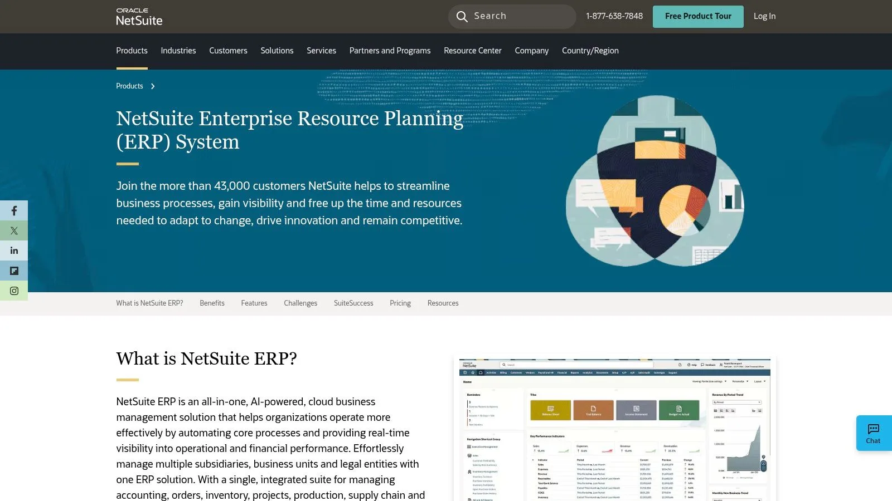
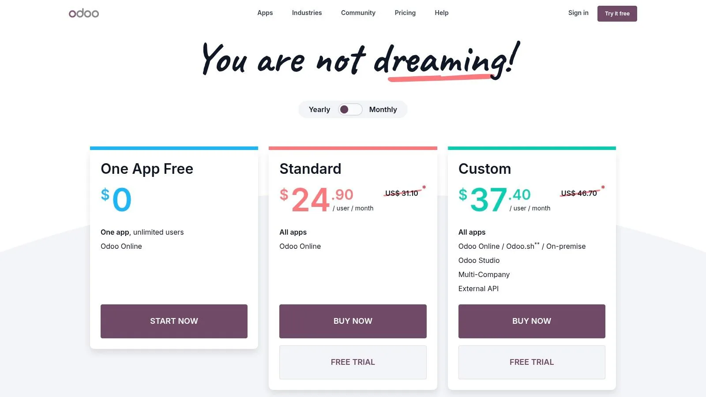
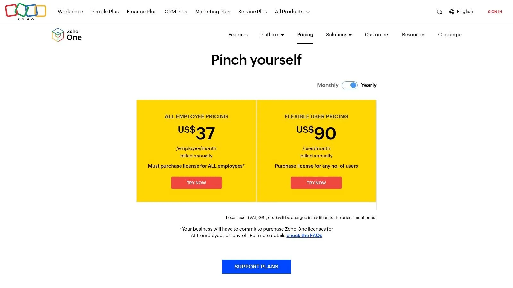
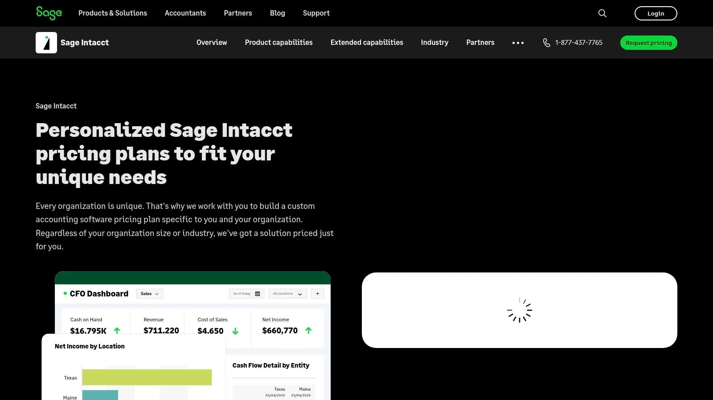
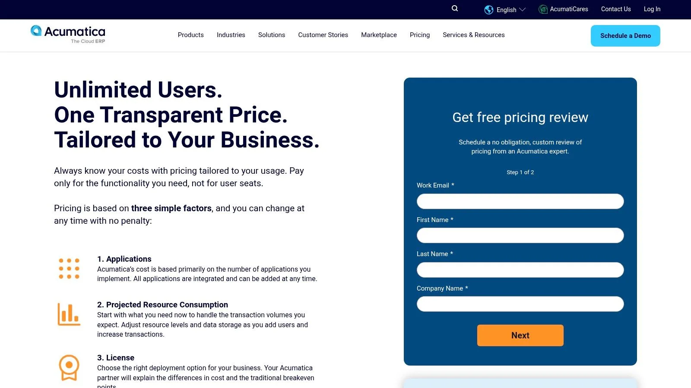
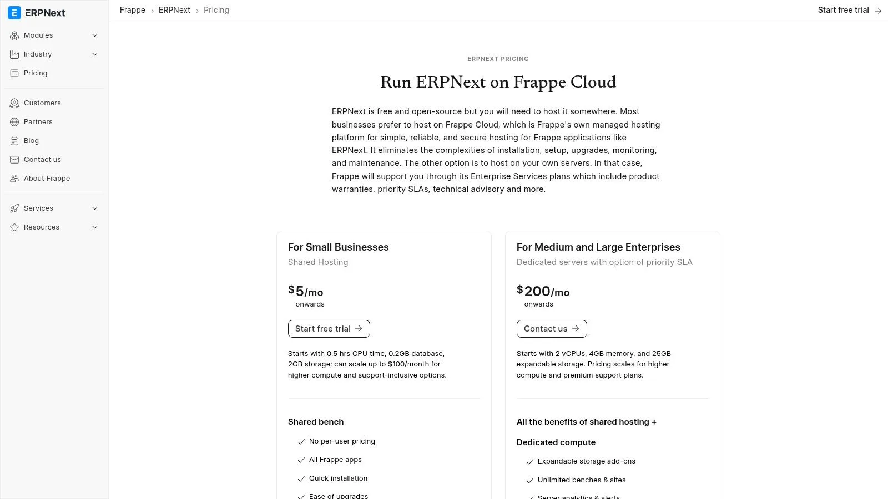
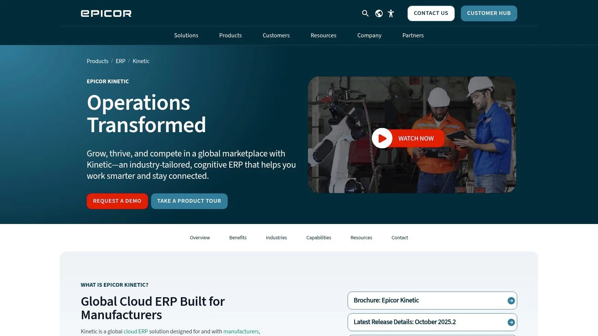
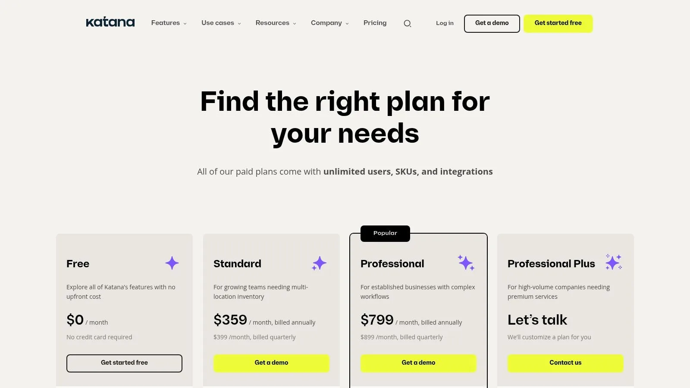

Feeling buried under scattered spreadsheets, manual data entry, and processes that just don’t connect? You’re not alone. Many small businesses hit a growth wall where their current tools start creating more problems than they solve. This guide is designed to cut through the marketing noise and provide actionable insights into the **best ERP software for small business**. We’ll move beyond generic feature lists to explore practical use cases, honest limitations, and what it actually takes to implement these powerful systems.

This isn’t just another list of software. We’ve compiled in-depth profiles of top platforms like Oracle NetSuite, Odoo, and Microsoft Dynamics 35, complete with screenshots and direct links to help your research. You will learn how each system handles core functions-from inventory management and accounting to CRM and project management-so you can find the right operational backbone to scale your business. Before embarking on the ERP journey, preparing your internal processes is key; consider a comprehensive [business process automation checklist for SMBs](https://www.growthprocessautomation.com/post/business-process-automation-checklist-for-smbs) to streamline your pre-implementation efforts.

Our goal is to give you a clear, realistic understanding of what to expect. Each profile provides an honest assessment, highlighting specific features, pricing considerations, and the type of business each platform is truly built for. Whether you need a comprehensive, off-the-shelf solution or a flexible, custom-built system, this list will help you make an informed decision and finally move beyond the limitations of disconnected tools.

## 1. Airtable

Airtable distinguishes itself by not providing a generic ERP product. Instead, it offers a customized ERP-like system built on its adaptable and robust platform. This solution is particularly suitable for small businesses that find traditional ERPs too inflexible, costly, or complicated. Airtable’s agency, Automatic Nation, excels in converting disorganized spreadsheets and manual operations into a unified, automated operational center.

This service focuses on crafting a central operating system for your business rather than simply selling software. The team develops structured, interconnected databases with clear user interfaces and comprehensive automations. This approach saves your team time by eliminating manual data entry, reducing the need to search for information, and minimizing errors, making it a viable option for small businesses seeking a custom-fit solution without the high cost of custom coding.

### Why It’s Our Top Choice

Airtable combines extensive expertise with practical, effective integrations using tools like Make (Integromat), n8n, and Zapier. This allows your Airtable hub to integrate smoothly with your entire tech ecosystem, from Slack and Google Sheets to Shopify and Notion, creating dependable workflows that automate essential business functions. Their method includes hands-on training to ensure your team can confidently use and adapt the system as your business grows.

**Practical Use Case:** Consider a custom e-commerce furniture company struggling with managing orders, inventory, and production schedules across multiple spreadsheets. You can establish a central Airtable base where a new Shopify order automatically generates a production ticket, assigns it to a craftsman, updates raw material inventory levels, and sends an automated email to notify the client of the estimated completion date. This integrated system offers a real-time overview of the entire operation, from sale to delivery. [Airtable experts](/#book) can help you get set up.

### Key Features & Benefits

- **Customized System Design:** Solutions are specifically designed to match your workflows, encompassing everything from sales CRMs and project management to invoicing and inventory tracking.
- **Effective Automation & Integration:** Airtable can be easily integrated to the tools you currently use, automating data transfer and removing manual tasks between platforms.
- **Adaptable & User-Friendly:** Provides intuitive interfaces that require minimal training and can be adjusted as your operational needs evolve.

| **Pros**                                       | **Cons**                                                             |
| ---------------------------------------------- | -------------------------------------------------------------------- |
| Custom-fit system.                             | May not be suitable for enterprises needing a fully bespoke backend. |
| Wide integrations with popular business tools. |                                                                      |
| Interfaces                                     |                                                                      |

**Website:** [https://airtable.com](/)

## 2. Oracle NetSuite

Oracle NetSuite is a comprehensive, cloud-based ERP system designed for small and midsize businesses poised for growth. It stands out by offering a unified platform that integrates financials, inventory management, CRM, and e-commerce into a single source of truth. This makes it one of the best ERP software for small business owners who want to eliminate data silos and automate core processes from a single dashboard.

The platform is particularly powerful for businesses with complex operations, such as those managing multiple legal entities or currencies. Its “SuiteSuccess” implementation methodology provides pre-configured roles, dashboards, and KPIs tailored to specific industries like software, retail, or manufacturing, significantly shortening the time to value.

### Key Features and Considerations

- **Scalability:** NetSuite’s modular design allows businesses to start with core financial management and add functionality like advanced inventory or project management as they grow. This prevents you from paying for features you don’t yet need.
- **Implementation:** The initial setup can be complex for teams without dedicated IT resources. However, NetSuite’s extensive partner ecosystem offers expert implementation support, which is a crucial consideration when budgeting.
- **Pricing:** Pricing is not publicly listed and is customized based on the required modules, number of users, and contract length. You must engage with their sales team for a custom quote, which includes the annual subscription and implementation costs.

> **Actionable Insight:** When exploring NetSuite, be sure to request a demo tailored to your specific industry. This will showcase the pre-built workflows and reports from their SuiteSuccess program, giving you a much clearer picture of its day-to-day value compared to a generic overview. For example, ask a retail-focused demo to show exactly how it handles multi-channel inventory from your e-commerce site and physical store.

**Best for:** Ambitious SMBs that anticipate significant growth, operate in multiple locations, or require industry-specific functionality right out of the box.

- **Website:** <https://www.netsuite.com/portal/products/erp.shtml>

## 3. Microsoft Dynamics 365 Business Central

Microsoft Dynamics 365 Business Central is a cloud-based ERP solution designed specifically for small and midsize businesses. It stands out by offering a comprehensive suite of tools for finance, sales, service, and operations that is deeply embedded within the familiar Microsoft ecosystem. This makes it one of the best ERP software for small business owners who already rely on Microsoft 365 and want to unify their data without a steep learning curve.

The platform’s key strength is its native integration with tools like Outlook, Excel, Teams, and Power BI. Users can manage quotes, process orders, and submit invoices directly from their Outlook inbox, drastically reducing the need to switch between applications. This seamless connectivity empowers teams to streamline processes and gain real-time insights from a single, unified environment.

### Key Features and Considerations

- **Microsoft Ecosystem Integration:** Business Central provides unparalleled integration with Microsoft 365 and the Power Platform. For example, you can export financial data to Excel, modify it with familiar tools, and publish it back to the ERP with a single click.
- **Implementation:** The system is typically purchased and implemented through a network of Microsoft partners. This adds a layer of expertise but also introduces variability in implementation quality and cost, which must be carefully evaluated.
- **Pricing:** Microsoft offers transparent, per-user per-month pricing with two main tiers: Essentials and Premium. The Premium license is required for advanced manufacturing and service management features. A free 30-day trial is readily available on their website.

> **Actionable Insight:** Leverage the free trial to test the Outlook integration. Set up a test customer and send yourself a quote directly from your inbox. This simple exercise will demonstrate the platform’s power to improve your sales-to-cash cycle, a key benefit of its deep ecosystem connectivity. You can also explore how to further enhance these processes by [understanding workflow automation](/what-is-workflow-automation/).

**Best for:** SMBs heavily invested in the Microsoft ecosystem that need a scalable and familiar ERP to manage core financial, supply chain, and operational processes.

- **Website:** <https://www.microsoft.com/en/dynamics-365/products/business-central>

## 4. Odoo

Odoo is a unique, all-in-one suite of open-source business apps that function as a highly flexible and affordable ERP system. It stands apart with its modular approach, allowing small businesses to start with just one application (like accounting or CRM) and add more as needed. This makes it one of the best ERP software for small business owners who want a cost-effective, a la carte solution that can grow with them.

The platform’s strength lies in its extensive app catalog, which covers everything from inventory and manufacturing (MRP) to e-commerce, sales, and project management. Unlike many competitors, Odoo offers transparent pricing and multiple deployment options, including a cloud-hosted version and on-premise installations, giving businesses total control over their data and infrastructure.

### Key Features and Considerations

- **Modular and Cost-Effective:** Odoo’s “One App Free” plan allows unlimited users to use a single application for free. Paid plans that unlock all apps are very competitively priced, making it accessible for startups and budget-conscious SMBs.
- **Deployment Flexibility:** You can choose between a simple, managed Odoo Online account, the more customizable Odoo.sh cloud platform, or a self-hosted on-premise deployment. This flexibility is rare in the ERP market.
- **Implementation:** While basic setup is straightforward for tech-savvy users, complex configurations or data migrations often require assistance from an Odoo implementation partner. The initial configuration can be time-consuming if you are integrating many apps at once.

> **Actionable Insight:** Start with the “One App Free” plan to solve your most urgent business need, such as inventory management or accounting. For example, a small bakery could use the free Inventory app to track flour and sugar levels. As they master it, they can add the Accounting and Sales apps for a small fee, connecting their entire operation without a massive upfront investment. This allows you to learn the Odoo interface and processes without any financial commitment before deciding to scale up.

**Best for:** Startups and small businesses needing a highly affordable and modular ERP that can be customized and expanded over time.

- **Website:** <https://www.odoo.com/pricing>

## 5. Zoho One

Zoho One is often called an “operating system for business,” and for good reason. Rather than a traditional, monolithic ERP, it offers a suite of over 45 integrated applications covering nearly every business function imaginable, from finance and sales to marketing and HR. This makes it one of the best ERP software for small business owners who want an all-in-one solution without the typical complexity and cost of a full-scale ERP implementation.

The platform’s strength lies in its incredible breadth and straightforward pricing. Small businesses can manage accounting with Zoho Books, track customer relationships with its powerful CRM, handle projects with Zoho Projects, and manage inventory all under a single login. This connected ecosystem allows for impressive cross-departmental automation from day one.

### Key Features and Considerations

- **Breadth of Functionality:** The bundle includes apps for CRM, finance, HR, inventory management, business intelligence, and much more. While its CRM is a standout, you can [learn more about its capabilities and how it compares to others](/best-crm-for-small-business/).
- **Architecture:** It is important to note that Zoho One is a suite of integrated apps, not a single unified ERP database. While data flows seamlessly between apps, businesses with highly complex manufacturing or warehouse needs may find it lacks the deep, singular data structure of a traditional ERP.
- **Pricing:** Zoho One offers two transparent and highly competitive pricing models. The All-Employee plan requires a license for every employee in your company, while the Flexible-User plan lets you purchase licenses only for the users who need them.

> **Actionable Insight:** Start by identifying your three most critical business functions (e.g., accounting, CRM, and inventory). Focus on implementing the corresponding Zoho apps first. For instance, a marketing agency could start with Zoho CRM to manage leads, Zoho Projects for client work, and Zoho Books for invoicing. Master these core tools before gradually rolling out additional apps like Zoho Social or Zoho Campaigns to other departments to avoid overwhelming your team.

**Best for:** Small businesses and startups looking for a comprehensive and affordable suite of business tools that can grow with them, without the high initial cost of a traditional ERP.

- **Website:** <https://www.zoho.com/one/pricing/>

## 6. Sage Intacct

Sage Intacct is a powerful, cloud-native financial management platform designed for service-based small and midsize businesses that have outgrown basic accounting software. It distinguishes itself with sophisticated financial capabilities, such as multi-entity consolidation and dimensional reporting, making it a top contender for the best erp software for small business owners who need deep financial insight without the operational overhead of a manufacturing-focused ERP.

The platform excels at automating complex accounting processes, including revenue recognition and project accounting. Its strength lies in providing finance teams with a real-time, multi-dimensional view of business performance, allowing leaders to slice and dice data by department, project, or location directly within the system.

### Key Features and Considerations

- **Financial Depth:** Sage Intacct offers best-in-class core financials, including accounts payable, accounts receivable, and a dimensional general ledger. This is ideal for businesses in sectors like professional services, healthcare, or nonprofits.
- **Implementation:** Setup is handled through a network of certified partners rather than directly by Sage. This ensures you get expert, tailored implementation, but it also means the quality of your onboarding experience can depend on the partner you choose.
- **Pricing:** The pricing is quote-based and tailored to your specific needs, including core modules and user count. It is generally positioned as a premium financial solution, so expect costs to be higher than entry-level accounting tools.

> **Actionable Insight:** During a demo, ask to see how “dimensions” work for reporting. For example, have them demonstrate how a professional services firm could track revenue and expenses by individual marketing campaigns, specific consultants (employees), and client industry (locations) all at once without cluttering the chart of accounts. This highlights its core value proposition.

**Best for:** Service-centric businesses and nonprofits needing sophisticated, multi-entity financial management and deep, real-time reporting capabilities.

- **Website:** <https://www.sage.com/en-us/sage-business-cloud/intacct/pricing/>

## 7. Acumatica

Acumatica is a cloud-based ERP solution that champions a unique pricing model based on resource consumption rather than per-user licenses. This approach makes it a standout choice for small and midsize businesses, especially those in sectors like manufacturing, construction, and distribution. By offering unlimited user access, it allows companies to provide ERP system access across the entire organization without incurring additional fees, a key differentiator that makes it one of the best ERP software for small business growth.

The platform is built on a modern, flexible architecture that can be deployed on-premise or in the cloud. Acumatica’s strength lies in its industry-specific editions, which come pre-packaged with relevant workflows, reporting, and functionality, reducing the need for extensive customization and allowing businesses to get started faster.

### Key Features and Considerations

- **Pricing Model:** The “unlimited users” approach is a significant advantage. Your costs are tied to the computing resources your transactions consume, making it predictable and scalable as your team grows, not your headcount.
- **Implementation:** Acumatica is sold and implemented exclusively through a network of Value-Added Resellers (VARs). Engaging with a partner is mandatory for scoping, pricing, and setup, which ensures expert guidance but also adds a layer to the procurement process.
- **Flexibility:** It offers strong APIs and an open platform, simplifying integration with other business-critical applications. This is ideal for companies that rely on a diverse software ecosystem to run their operations.

> **Actionable Insight:** Use the ROI and pricing calculators available on the Acumatica website before engaging a partner. For example, a distribution company could input its number of monthly orders and warehouse staff to get a resource-based cost estimate. This provides a data-driven baseline, allowing you to have a more informed discussion when you request a formal quote from a reseller.

**Best for:** Growing SMBs in manufacturing, distribution, or construction that need to provide ERP access to a large number of employees without facing per-user licensing costs.

- **Website:** <https://www.acumatica.com/pricing/>

## 8. ERPNext (Frappe Cloud)

ERPNext is a powerful, open-source ERP system that offers a surprisingly comprehensive suite of modules, including accounting, inventory, manufacturing, CRM, and project management. It stands out as one of the best ERP software for small business owners who are budget-conscious but technically inclined. The Frappe Cloud hosting option removes the complexity of self-hosting while keeping costs exceptionally low, providing an accessible entry point into full-featured ERP.

Unlike most competitors that charge per user, ERPNext’s pricing is resource-based, making it incredibly affordable for growing teams. This model, combined with its open-source nature, gives businesses complete control over their data and the flexibility to customize the software to fit unique workflows without paying exorbitant licensing fees. It is an ideal solution for businesses wanting to escape vendor lock-in.

### Key Features and Considerations

- **Affordability:** Hosted plans on Frappe Cloud start at very low monthly costs, making it accessible for startups and micro-businesses. The lack of per-user fees means you can add team members without increasing your subscription cost.
- **Implementation:** While Frappe Cloud simplifies deployment, the initial setup and configuration can be time-consuming. Non-technical users might face a steeper learning curve compared to more polished commercial ERPs, as it requires a more hands-on, DIY approach to tailor modules.
- **Customization:** As an open-source platform, ERPNext offers unparalleled flexibility. Businesses with development resources can modify the source code to build custom features, integrations, and reports, creating a truly bespoke system.

> **Actionable Insight:** Take full advantage of the 14-day free trial on Frappe Cloud to set up a core process, like creating a sales order that triggers an inventory deduction and generates a delivery note. This hands-on test will quickly reveal if your team can manage its configuration independently or if you’ll need to budget for an implementation partner to assist with the setup.

**Best for:** Startups, small businesses, and tech-savvy teams that need a comprehensive, low-cost ERP and are willing to invest time in configuration and customization.

- **Website:** <https://frappe.io/erpnext/pricing>

## 9. Epicor Kinetic

Epicor Kinetic is a cloud-first ERP platform specifically engineered for small and midsize manufacturing businesses. It excels in environments with complex, product-centric operations, such as discrete or make-to-order (MTO) manufacturing. This makes it a top contender for the best erp software for small business owners who need deep, industry-specific functionality for production planning, scheduling, and shop floor management.

The platform stands out with its modern, web-based user interface and a strong focus on the entire production lifecycle, from quote to cash. With integrated Manufacturing Execution System (MES) and Advanced Planning and Scheduling (APS) options, Epicor provides real-time visibility into your factory floor, helping to optimize resource utilization and streamline workflows directly from the ERP.

### Key Features and Considerations

- **Deep Manufacturing Functionality:** Kinetic offers robust modules for bill of materials (BOM), job costing, quality control, and production management. This granular control is essential for manufacturers needing precise operational oversight.
- **Implementation:** Setup is typically a project-based engagement led by Epicor or one of its certified partners. While this ensures a tailored fit, it means the system is not a simple plug-and-play solution and requires a planned implementation budget.
- **Pricing:** Epicor Kinetic uses a quote-based pricing model. The final cost depends on required modules, user count, and choice of cloud, hybrid, or on-premise deployment. A direct conversation with their sales team is necessary to get an accurate estimate.

> **Actionable Insight:** When evaluating Epicor Kinetic, focus your demo request on a specific, challenging production scenario you face. For example, ask them to model how the system handles a complex, multi-level BOM for a custom machine order or how its scheduling tool would react to an unexpected machine downtime. This provides a real-world test of its core capabilities.

**Best for:** Small to midsize manufacturers in discrete industries that require a comprehensive, end-to-end solution for managing complex production processes.

- **Website:** <https://www.epicor.com/en-us/products/enterprise-resource-planning-erp/kinetic/>

## 10. Katana Cloud (Katana MRP)

Katana is a modern, cloud-based manufacturing ERP designed specifically for small and growing direct-to-consumer and B2B brands. It excels by focusing on the core operational needs of makers: real-time inventory control, production scheduling, and material requirements planning (MRP). This laser focus makes it an exceptionally strong choice for businesses that need to master their production and inventory workflows without the complexity of a traditional, all-in-one ERP system.

Unlike comprehensive suites, Katana acts as a powerful operational hub that integrates seamlessly with accounting software like QuickBooks Online or Xero, and e-commerce platforms such as Shopify. This approach allows businesses to build a best-of-breed software stack, combining Katana’s manufacturing prowess with their preferred financial and sales tools, making it a flexible and accessible option for modern manufacturers.

### Key Features and Considerations

- **Transparent Pricing:** Katana offers clear, tiered pricing on its website based on features, with all paid plans including unlimited users. Optional add-ons for advanced manufacturing or a warehouse management system (WMS) allow you to scale functionality as needed.
- **Ease of Use:** The platform is known for its intuitive user interface and fast implementation time. Small manufacturers can get up and running quickly, often without needing extensive IT support, which is a significant advantage for lean teams.
- **Integration-Reliant:** Katana is not a full financial suite. You must integrate it with a separate accounting system to manage financials like general ledger, accounts payable, and payroll. This is a critical factor to consider in your overall software budget and workflow.

> **Actionable Insight:** Start by connecting your e-commerce store (like Shopify) during the free trial. This will automatically pull in products and sales orders, giving you an immediate, real-world view of how Katana’s live inventory and production scheduling can streamline your order fulfillment process. For example, you can see how a new online sale instantly reserves the necessary raw materials for production.

**Best for:** Small manufacturers and direct-to-consumer brands that prioritize production, inventory, and purchasing management and prefer to integrate with existing accounting software.

- **Website:** <https://katanamrp.com/pricing>

## 11. G2 (ERP Systems for Small Business category)

G2 is not an ERP system itself, but a peer-review marketplace that has become an essential starting point for finding the best ERP software for small business. Its dedicated category page allows you to compare dozens of solutions based on real user reviews, satisfaction scores, and detailed feature breakdowns. This approach empowers you to build a shortlist based on authentic user experiences rather than just marketing materials.

The platform provides a data-driven way to evaluate contenders by filtering products based on market segment, user satisfaction, and specific features. By aggregating sentiment from verified users, G2 helps you understand the practical strengths and weaknesses of each system, offering a transparent view of the ERP landscape. This is similar to how you might research other critical business infrastructure; you can [find in-depth software comparisons on G2](/best-database-software-for-small-business/) for many different categories.

### Key Features and Considerations

- **Independent Reviews:** The core value lies in unbiased, verified user feedback. You can read detailed accounts of implementation experiences, customer support quality, and day-to-day usability to create a realistic shortlist.
- **Side-by-Side Comparisons:** G2’s comparison tool allows you to place top contenders like NetSuite, Acumatica, and Business Central head-to-head, evaluating them on specific features and user satisfaction ratings.
- **Potential Bias:** Be aware that some vendor listings may be sponsored. It’s crucial to cross-reference your findings with vendor websites and demos, as review depth and recency can vary significantly between products.

> **Actionable Insight:** Use the G2 Grid® report for ERP Systems to quickly identify leaders in market presence and user satisfaction. Drill down into the reviews of vendors in the “High Performers” quadrant, as these often represent products that are highly rated by their users but may have less market visibility. For example, you might discover a niche manufacturing ERP here that perfectly fits your needs but wasn’t on your initial radar.

**Best for:** Businesses in the initial research phase who want to build an unbiased, data-driven shortlist of potential ERP vendors based on peer experiences.

- **Website:** <https://www.g2.com/categories/erp-systems/small-business>

## 12. Capterra (ERP software directory)

Instead of a single platform, Capterra is a comprehensive software directory that serves as an essential research tool for finding the best ERP software for your small business. It aggregates hundreds of ERP solutions, allowing you to compare features, read verified user reviews, and get pricing snapshots all in one place. This makes it an invaluable starting point for business owners who need to survey the market before committing to demos.

The platform’s strength lies in its extensive filtering system and user-generated content. You can narrow down options by industry (like construction or non-profit), business size, and required features. The “Capterra Shortlist” report highlights top-rated and popular products, offering a quick way to see which vendors are leading the market based on real-world feedback.

### Key Features and Considerations

- **Extensive Filtering:** Capterra allows you to discover niche and industry-specific ERP tools that you might otherwise overlook, moving beyond the big-name vendors. This is perfect for businesses with unique operational needs.
- **Pricing Information:** Many listings include vendor-provided pricing tiers and plan details. However, this information isn’t always current, so it’s crucial to verify pricing directly on the vendor’s website.
- **User Reviews:** Verified user reviews offer honest insights into the pros and cons of implementation, customer support, and day-to-day usability, providing a perspective you won’t find in a sales pitch.

> **Actionable Insight:** Use Capterra’s comparison tool to select three to five promising ERPs. Create a side-by-side view of their features, pricing, and user ratings. For example, a construction business could compare ERPs based on their “Job Costing” and “Project Management” feature ratings. This organized approach helps you build a data-driven shortlist before you even start talking to sales reps.

**Best for:** Small business owners in the initial research phase who want to compare a wide range of ERP options and read unbiased user reviews before creating a vendor shortlist.

- **Website:** <https://www.capterra.com/enterprise-resource-planning-software/>

## Top 12 ERP Solutions for Small Business — Comparison

| Solution                  | Core fit & ✨                                                                                | UX / Quality ★                           | Pricing / Value 💰                                     | Target Audience 👥                                               |
| ------------------------- | ------------------------------------------------------------------------------------------- | ---------------------------------------- | ------------------------------------------------------ | ---------------------------------------------------------------- |
| **🏆 Airtable**           | ✨ Custom relational DBs + end‑to‑end automations; integrations (Make/n8n/Zapier) & training | ★★★★☆ — clear UI, fast delivery          | 💰 Custom quote; ROI‑driven time savings               | 👥 SMBs, ops/project managers, teams needing targeted automation |
| Oracle NetSuite           | ✨ Unified cloud ERP: finance, inventory, CRM, commerce; industry editions                   | ★★★★☆ — mature, scalable                 | 💰 Quote‑based; can be costly with modules             | 👥 Growing SMBs / midsize, multi‑entity firms                    |
| Microsoft Dynamics 365 BC | ✨ Cloud ERP with deep Microsoft 365 & Power Platform integration                            | ★★★★☆ — familiar MS UI, rich extensions  | 💰 Published SKUs + partner fees                       | 👥 Microsoft-centric SMBs, partners/IT teams                     |
| Odoo                      | ✨ Modular app catalog (online, Odoo.sh, on‑prem); “One App Free” starter                    | ★★★★☆ — flexible UX, customizable        | 💰 Transparent tiers; cost‑effective entry             | 👥 Small businesses needing flexible modules                     |
| Zoho One                  | ✨ Bundle of 45+ integrated apps with central admin                                          | ★★★★☆ — broad coverage, integrated tools | 💰 Competitive bundled pricing (All‑Employee/Flexible) | 👥 Small teams wanting wide toolset at value                     |
| Sage Intacct              | ✨ Finance‑first cloud ERP: dimensional reporting & multi‑entity consolidation               | ★★★★☆ — excellent financial depth        | 💰 Quote‑based; premium for depth                      | 👥 Services‑centric SMBs, nonprofits needing strong accounting   |
| Acumatica                 | ✨ Industry editions + resource‑based (not per‑user) pricing                                 | ★★★★☆ — flexible, API‑friendly           | 💰 Usage/resource pricing; predictable for large teams | 👥 SMBs in manufacturing, distribution, construction             |
| ERPNext (Frappe Cloud)    | ✨ Open‑source ERP (accounting, MRP, HR) with hosted plans                                   | ★★★★☆ — customizable but DIY             | 💰 Very affordable; hosting from low monthly rates     | 👥 Budget‑conscious small teams & devs                           |
| Epicor Kinetic            | ✨ Deep manufacturing / production planning & MES options                                    | ★★★★☆ — shop‑floor focused UX            | 💰 Quote‑based; implementation required                | 👥 SMB manufacturers (discrete/MTO)                              |
| Katana Cloud              | ✨ MRP + inventory & purchasing; unlimited users on paid plans                               | ★★★★☆ — modern UX, fast time‑to‑value    | 💰 Transparent tiers + add‑ons                         | 👥 Small manufacturers, e‑commerce makers                        |
| G2 (ERP category)         | ✨ Aggregated peer reviews, rankings & vendor filters                                        | ★★★★☆ — helpful real‑user insights       | 💰 Free to use; links to vendor pricing                | 👥 Buyers researching & shortlisting ERPs                        |
| Capterra (ERP directory)  | ✨ Large directory with shortlists, pricing snapshots & reviews                              | ★★★★☆ — broad vendor discovery           | 💰 Free to use; verify vendor pricing                  | 👥 Buyers comparing many ERP options                             |

## Making Your Choice: From Shortlist to System

Navigating the landscape of ERP software can feel like a monumental task, but this comprehensive review is designed to transform that challenge into a strategic advantage. We’ve explored a wide spectrum of solutions, from industry titans like Oracle NetSuite and Microsoft Dynamics 365 to flexible, open-source platforms like Odoo and ERPNext. Each tool offers a unique value proposition, tailored to different business models, scales, and operational priorities.

The central takeaway is that there is no single “best erp software for small business”; there is only the best fit for _your_ business. A rapidly scaling e-commerce brand will find Katana’s sharp focus on manufacturing and inventory invaluable, while a service-based consultancy might gravitate toward the integrated financial and project management prowess of Sage Intacct. The key is to shift your perspective from finding a perfect system to identifying the right partner for your growth journey.

### From Analysis Paralysis to Actionable Steps

Choosing your ERP is not just a software purchase; it’s a foundational business decision. To move from your initial research to a confident choice, follow a structured evaluation process. Rushing this stage can lead to costly implementation failures and user adoption issues down the line.

Here’s a practical roadmap to guide your final decision:

1. **Revisit Your Core Needs:** Start by listing your top three to five operational bottlenecks. Are you losing time on manual financial reconciliations? Is poor inventory visibility leading to stockouts or overstock? This list is your compass. For example, if your primary pain point is disconnected sales and project data, a solution like Zoho One, with its tightly integrated CRM and project modules, should be high on your list.
2. **Create a Realistic Shortlist:** Based on your needs, select three to four platforms from this guide for a deeper dive. Don’t just look at features; consider the ideal use cases we’ve outlined. If you’re a small manufacturer with plans to scale, your shortlist might include Katana, Epicor Kinetic, and perhaps a modular Odoo implementation.
3. **Conduct Scripted Demos:** When you schedule demos, don’t let the sales team run the show with a generic presentation. Provide them with specific scenarios relevant to your business. Ask them to demonstrate exactly how their software would handle your unique order fulfillment process or your specific project billing cycle. This forces them to show, not just tell, how their system solves _your_ problems.
4. **Validate Total Cost of Ownership (TCO):** Look beyond the monthly subscription fee. Ask pointed questions about implementation costs, data migration fees, mandatory training packages, and charges for additional user support. A seemingly affordable ERP can become expensive once all associated costs are factored in, so a clear understanding of TCO is essential for accurate budgeting.

### Beyond the Software: Implementation and Adoption

Remember, the success of your ERP implementation hinges as much on people and processes as it does on the technology itself. A powerful system that your team doesn’t understand or refuses to use is a wasted investment.

Prioritize these critical factors during your final evaluation:

- **User Interface (UI) and Experience (UX):** Is the system intuitive? A clean, modern interface will significantly reduce the training burden and encourage user adoption. During demos, imagine your least tech-savvy employee navigating the platform.
- **Scalability and Flexibility:** Your business will evolve. The best ERP software for your small business today should also support you tomorrow. Ask about the process for adding new modules, integrating with other tools, and customizing workflows as your needs change. Platforms like Acumatica and Odoo shine here, offering modular growth paths.
- **Support and Community:** What happens when you encounter a problem? Evaluate the quality and accessibility of the vendor’s support team. For open-source options like ERPNext, consider the strength of the community and the availability of third-party implementation partners.

Ultimately, selecting an ERP is about empowering your team and future-proofing your operations. Use the detailed insights, comparisons, and practical resources in this guide to build your shortlist, ask the right questions, and choose a system that will not just solve today’s challenges but also serve as a scalable foundation for years of growth.

---

Feeling overwhelmed by the complexity and cost of traditional ERPs? If your business needs a system that molds perfectly to your unique processes without the rigid structure of off-the-shelf software, a custom solution might be the answer. **Automatic Nation** specializes in building powerful, flexible, and scalable business systems on platforms like Airtable, delivering the precise functionality you need to streamline operations and unlock growth. [Discover how a bespoke system from Automatic Nation can be the smartest ERP alternative for your business.](/)
