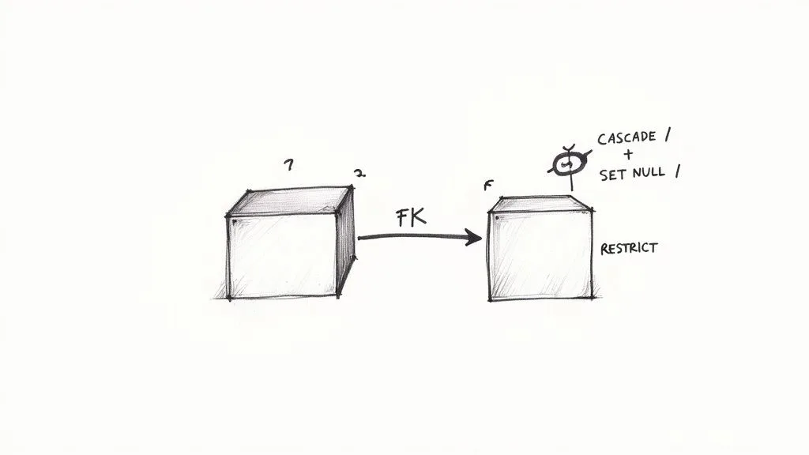
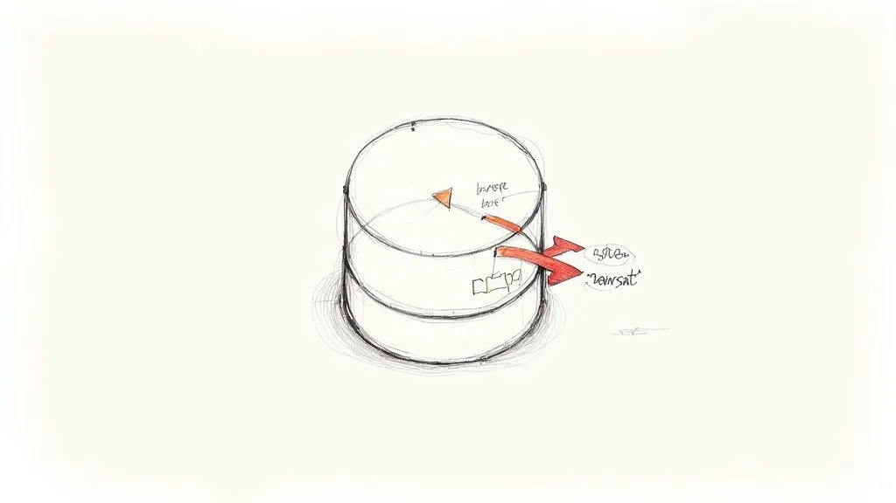

In a data-driven business, a well-designed database is the bedrock of any successful application. It’s the difference between a system that scales gracefully and one that crumbles under pressure, between fast, reliable reporting and slow queries that halt productivity. Moving from scattered spreadsheets to a robust, relational system requires more than just creating tables; it demands a strategic approach grounded in proven principles. As your business scales, establishing a solid model becomes crucial; for larger analytics needs, proper [data modeling for data warehouse design](https://vizule.io/data-modeling-for-data-warehouse/) is essential for building a truly robust foundation.

Weak database architecture leads directly to data corruption, performance bottlenecks, and maintenance nightmares that can cripple your operations. A poorly planned structure makes it difficult to add new features, ensure data accuracy, and protect sensitive information. This isn’t just a technical problem; it’s a business problem that impacts everything from customer satisfaction to your bottom line.

This guide cuts through the noise to deliver 10 essential **database design best practices**. We will go beyond theory to provide a comprehensive roundup of actionable techniques. Each point is packed with practical examples, clear rationale, and specific steps you can implement immediately. By following these guidelines, you can build a database that is not only powerful and efficient but also secure, scalable, and easy to maintain for years to come. Let’s dive into the core principles for building a bulletproof data foundation.

## 1. Normalization (Database Normalization Forms)

Normalization is the cornerstone of relational database design, a systematic process for organizing data to minimize redundancy and dependency. By dividing larger tables into smaller, well-structured ones and defining relationships between them, normalization ensures data integrity and eliminates undesirable characteristics like insertion, update, and deletion anomalies. This structured approach is a fundamental part of the best database design practices, ensuring your data remains consistent, reliable, and easy to manage.

The process involves applying a series of guidelines known as “normal forms” (NF). The most common forms are First (1NF), Second (2NF), and Third (3NF), along with the Boyce-Codd Normal Form (BCNF). For example, a single `Orders` table containing repeating customer and product details would be split into separate `Customers`, `Products`, and `Orders` tables. The `Orders` table would then use foreign keys (`customer_id`, `product_id`) to reference specific customers and products, avoiding the need to repeat customer or product information with every single order.

### Why This Practice Is Essential

Without normalization, you risk significant data integrity issues. An unnormalized database might require you to update a customer’s address in multiple rows, leading to inconsistencies if one entry is missed. Similarly, deleting the last order for a specific product might unintentionally remove the only record of that product’s existence. Normalization prevents these issues by ensuring that each piece of data is stored in only one place. For a hands-on look at how this applies to modern platforms, you can explore detailed examples of [how data normalization can transform operational workflows](/how-airtable-data-normalization-transforms-operations-workflows/).

### Actionable Implementation Tips

- **Target 3NF:** For most business applications, achieving Third Normal Form (3NF) provides a healthy balance between data integrity and performance. Going further can sometimes over-complicate the design for minimal benefit.
- **Map Dependencies:** Before you start, create an Entity-Relationship (ER) diagram to visually map out data entities and their functional dependencies. This blueprint reveals where data is repeated and how tables should be split.
- **Consider Denormalization Strategically:** For applications with high read-traffic, like reporting dashboards, you might intentionally denormalize certain tables to improve query speed. **Example**: Add a `customer_name` column to the `Orders` table to avoid joining to the `Customers` table on every query for a sales report.

## 2. Primary Key Design and Constraints

Primary keys are the fundamental mechanism for uniquely identifying each record in a table, acting as an unchangeable address for every piece of data. Proper primary key design is a critical aspect of database design best practices, ensuring data integrity, enabling efficient indexing for faster queries, and supporting relationship enforcement through foreign keys. A primary key must adhere to two core constraints: it must be **unique** for every record and it must be **non-null**.

The primary choice in key design is between natural keys (business-meaningful identifiers) and surrogate keys (system-generated identifiers). For instance, a vehicle’s VIN could be a natural key, while most e-commerce systems use an auto-incrementing integer (`order_id`) as a surrogate key. For distributed systems where records are created on multiple servers, a Universally Unique Identifier (UUID) is often preferred to prevent collisions.

### Why This Practice Is Essential

A well-chosen primary key is the bedrock of data reliability and performance. Without it, you cannot reliably reference, update, or delete a specific record, leading to data corruption and ambiguity. It is the anchor for all table relationships, as foreign keys in other tables depend on its stability. A poor choice, such as using an email address as a primary key, is risky because if a user changes their email, it would trigger a cascade of updates across many related tables, potentially leading to errors. You can see how these principles apply to modern platforms by exploring how platforms manage and define unique identifiers; for an overview, it helps to understand [the key terminology and concepts in platforms like Airtable](/understanding-airtable-key-concepts-and-terminology/).

### Actionable Implementation Tips

- **Prefer Surrogate Keys:** In most scenarios, use surrogate keys (auto-incrementing integers or UUIDs) over natural keys. They are immutable and have no business meaning, which prevents issues if the business logic changes. **Example**: Use `user_id` instead of `username`.
- **Keep Keys Simple:** Choose the smallest, most efficient data type for your primary key (e.g., `INT` or `BIGINT`). Smaller keys result in more compact, faster indexes and improved join performance. A `BIGINT` is better than a `VARCHAR(255)`.
- **Avoid Composite Keys as Primary:** While composite keys (a primary key made of multiple columns) have their uses, they can be cumbersome for foreign key relationships. It’s often better to create a surrogate key and apply a separate unique constraint to the business columns (e.g., `(user_id, course_id)` in a course enrollment table).

## 3. Foreign Key Relationships and Referential Integrity

Foreign keys are the glue that holds a relational database together, creating logical links between tables and enforcing data consistency. A foreign key in one table points to the primary key in another, establishing a relationship that ensures referential integrity. This critical mechanism prevents “orphaned” records, such as an order with a non-existent customer, making it a foundational element of sound database design best practices. By maintaining these links, you guarantee that relationships between data entities remain valid and trustworthy.

This concept is easy to visualize. In a blogging platform, a `Comments` table would contain a foreign key column like `post_id` that references the primary key of the `Posts` table. This constraint makes it impossible to insert a comment for a post that doesn’t exist. Similarly, an `Orders` table uses a `customer_id` foreign key to link to the `Customers` table, ensuring every order is associated with a valid customer record. Referential integrity constraints also define what happens when a referenced record is updated or deleted, using rules like `CASCADE`, `SET NULL`, or `RESTRICT`.

### Why This Practice Is Essential

Without enforced referential integrity, your database can quickly descend into a state of chaos. Imagine a user deletes their account from the `Customers` table. What happens to their past orders in the `Orders` table? Without a foreign key constraint, those orders become orphaned records, pointing to a customer that no longer exists. This data inconsistency can cause application errors, corrupt reports, and undermine the reliability of your entire system. Enforcing these relationships at the database level provides a robust, centralized defense against data corruption.

### Actionable Implementation Tips

- **Define On-Delete/On-Update Rules:** Carefully decide what should happen when a parent record is modified. **Example**: For an `Orders` table, use `ON DELETE RESTRICT` for the `customer_id` foreign key to prevent deleting a customer who still has orders. For a `Comments` table, `ON DELETE CASCADE` might be appropriate so deleting a post also removes its associated comments.
- **Index Your Foreign Keys:** Joins are one of the most common database operations. Adding an index to each foreign key column significantly speeds up queries that link related tables, which is crucial for performance.
- **Use Consistent Naming Conventions:** Name your foreign key columns clearly, such as `table_name_id` (e.g., `customer_id` in the `Orders` table). This practice makes your schema self-documenting and easier for developers to understand.
- **Visualize with ER Diagrams:** Always map out your foreign key relationships in an Entity-Relationship (ER) diagram during the design phase. This visual tool helps identify potential issues and ensures all relationships are correctly defined before implementation.

## 4. Indexing Strategy and Performance Optimization

Indexing is a powerful technique for accelerating database query performance by creating specialized data structures that enable rapid data retrieval. Much like an index in a book, a database index allows the query engine to find specific rows quickly without scanning the entire table. A well-planned indexing strategy is a critical component of database design best practices, balancing the significant boost in read performance against the overhead of maintaining these indexes during write operations (inserts, updates, and deletes).

An effective strategy involves choosing the right columns and the right type of index. For instance, an e-commerce platform would use a standard B-tree index on the `product_id` column for fast lookups. A blog platform might create a composite index on `(category_id, publish_date)` to efficiently power a page that shows the latest posts in a specific category. Similarly, columns frequently used in `WHERE` clauses, like `email` or `username`, are prime candidates for indexing.

### Why This Practice Is Essential

Without proper indexing, databases are forced to perform full table scans for many queries, a process that becomes exponentially slower as data volume grows. This leads to sluggish application performance, poor user experience, and inefficient resource utilization. A strategic indexing plan ensures that common queries are executed almost instantaneously, directly impacting application responsiveness and scalability. It prevents performance bottlenecks and is fundamental to maintaining a high-performance system as your data scales.

### Actionable Implementation Tips

- **Analyze Query Patterns:** Before creating any index, use database monitoring tools to identify slow queries and analyze columns frequently used in `WHERE`, `JOIN`, and `ORDER BY` clauses. Focus on high-traffic queries first.
- **Avoid Over-Indexing:** Every index consumes storage and adds overhead to write operations. Be selective. **Actionable Insight**: Don’t index low-cardinality columns (like a ‘gender’ column with only three options), as the index may be less efficient than a full table scan.
- **Use&#x20;**`EXPLAIN`**&#x20;and&#x20;**`ANALYZE`**:** Leverage built-in database tools to view a query’s execution plan. **Example**: Run `EXPLAIN SELECT * FROM users WHERE last_name = 'Smith';` to see if the database uses an index on `last_name` or performs a costly full table scan.
- **Monitor and Maintain:** Indexes can become fragmented over time, reducing their effectiveness. Regularly monitor index health and rebuild or reorganize them as part of your database maintenance schedule to ensure optimal performance.

## 5. Data Type Selection and Column Constraints

Choosing the correct data type for each column is a foundational database design best practice that directly impacts data integrity, storage efficiency, and query performance. This process involves selecting a type that precisely matches the nature of the data it will hold, such as numeric, string, or temporal, while applying constraints to enforce business rules. Using overly broad or incorrect types leads to wasted space, slower queries, and potential data corruption.

For instance, storing a phone number as a numeric type (`INT`) would strip leading zeros, making it useless. A `VARCHAR(20)` is more appropriate. Similarly, financial data should be stored using a `DECIMAL` or `NUMERIC` type to avoid the rounding errors inherent in `FLOAT` types. Each choice should be deliberate, ensuring the database schema is both efficient and self-enforcing.

### Why This Practice Is Essential

Meticulous data type selection acts as the first line of defense for data quality. It prevents invalid data from ever entering the database, such as text in a numeric field or a malformed date. This strictness improves storage efficiency by allocating only the necessary space, which can lead to significant cost savings and faster data retrieval, as smaller data sizes mean quicker reads from disk. Enforcing constraints like `NOT NULL` ensures that critical information is always present.

### Actionable Implementation Tips

- **Be Specific and Minimal:** Always choose the smallest data type that safely accommodates the full range of potential values. **Example**: Use `TINYINT` for a status flag that only has values from 0-3 instead of a full `INT`. Use `BOOLEAN` for true/false values.
- **Enforce Non-Nullability:** Apply the `NOT NULL` constraint to any column that requires a value. Nullable columns should be an exception, used only when a missing value has a specific business meaning.
- **Use Constraints for Business Logic:** Implement `CHECK` constraints to enforce domain-specific rules directly within the database. **Example**: `ALTER TABLE Products ADD CONSTRAINT price_check CHECK (price >= 0);` ensures a product price can never be negative.

## 6. Partitioning and Sharding Strategies

As datasets grow exponentially, managing monolithic tables becomes inefficient and slow. Partitioning and sharding are advanced database design best practices that address this scalability challenge by breaking down large datasets into smaller, more manageable segments. Partitioning divides a large table into smaller pieces within a single database instance, while sharding distributes those pieces across multiple separate databases or servers. This proactive approach is critical for maintaining high performance and availability in large-scale applications.

These strategies work by dividing data based on a specific key. For example, a logging system might partition an `events` table by date range (e.g., a new partition for each month). This allows the system to quickly query recent events without scanning years of historical data. An international SaaS company could shard its `users` table based on region (`shard_us`, `shard_eu`, `shard_asia`) to reduce latency and comply with data residency laws.

### Why This Practice Is Essential

Without partitioning or sharding, databases with massive tables suffer from severe performance bottlenecks. Queries that scan the entire table become progressively slower, and maintenance tasks like index rebuilding can cause significant downtime. By dividing the data, queries can target smaller, relevant subsets, dramatically improving response times. Sharding takes this further by enabling horizontal scaling, allowing a system to handle increased load simply by adding more servers. To dive deeper into these distinct scaling methodologies, consider exploring [understanding the nuances of data sharding and partitioning](https://hw.glich.co/p/difference-between-data-sharding-and-partitioning).

### Actionable Implementation Tips

- **Choose the Right Key:** Select a partition or shard key that aligns with your most common query patterns. For a multi-tenant application, sharding by `tenant_id` is often effective as most queries will be specific to one tenant.
- **Avoid “Hot Spots”:** Ensure your chosen key distributes data and workload evenly. A poorly chosen key can create a “hot spot” where one partition or shard receives a disproportionate amount of traffic. **Example**: Sharding by the first letter of a username might overload the ‘S’ shard.
- **Plan for Growth:** Design your strategy with future growth in mind. Consider how you will add new partitions or rebalance shards as your data volume increases over time.
- **Monitor and Manage:** Regularly monitor partition sizes and query performance to ensure balanced distribution and identify potential issues before they impact users.

## 7. Denormalization and Materialized Views for Performance

While normalization is a cornerstone of sound database design, sometimes adhering to its strictest forms can lead to performance bottlenecks, especially in read-heavy applications. Denormalization is the strategic, intentional process of introducing controlled redundancy back into a database. By reducing the number of complex table joins required to retrieve data, this technique significantly improves query performance at the cost of increased storage and a more complex data-update process.

This practice is often paired with materialized views, which are pre-computed query results stored as physical tables. Instead of executing a resource-intensive query repeatedly, applications can simply query the static, pre-aggregated results. For example, a social media site could use a materialized view to store the `like_count` for each post, updating it periodically instead of counting likes in real-time. This is one of the most practical _database design best practices_ for scaling analytics.

### Why This Practice Is Essential

In systems like data warehouses, business intelligence platforms, and high-traffic web applications, query speed is paramount. A perfectly normalized schema might require five or more joins to generate a single report, making it too slow for user-facing dashboards. Denormalization and materialized views directly address this by trading write-time complexity and storage space for significant read-time performance gains. This pragmatic compromise ensures that while the transactional side of the database remains clean (normalized), the reporting and analytics side is fast and responsive.

### Actionable Implementation Tips

- **Benchmark First:** Only apply denormalization after identifying specific, measurable performance bottlenecks through query analysis. Do not denormalize speculatively. **Actionable Insight**: If a query joining 5 tables is consistently your slowest query, that’s a prime candidate.
- **Use Triggers or Jobs:** Implement triggers or scheduled jobs to automatically update denormalized columns or refresh materialized views. This helps maintain data consistency. **Example**: A trigger on the `likes` table can increment the `like_count` in the `posts` table.
- **Document Everything:** Clearly document the rationale for every instance of denormalization, including what data is duplicated and the mechanisms in place to keep it synchronized.
- **Consider Incremental Refreshes:** For very large materialized views, use incremental refresh strategies that only update changed or new data, reducing the overhead of a full rebuild.

## 8. Backup, Recovery, and Disaster Recovery Planning

A robust database is not only well-designed for performance but also resilient against failure. Backup, recovery, and disaster recovery planning are critical components of database design, serving as the ultimate safety net for your data. This practice involves creating a comprehensive strategy to protect data from hardware failure, software corruption, human error, or catastrophic events, ensuring business continuity. Incorporating this into your initial design is a fundamental part of the best database design practices, safeguarding your most valuable asset.

This strategy goes beyond simply making copies of data. It involves defining key metrics like Recovery Time Objective (RTO), which is how quickly you must restore service, and Recovery Point Objective (RPO), which dictates the maximum acceptable amount of data loss. For example, a banking application may have an RPO of seconds, requiring real-time, continuous backups (replication), while an internal reporting tool might have an RPO of 24 hours, making nightly backups acceptable.

### Why This Practice Is Essential

Without a tested recovery plan, a single unexpected event could lead to permanent data loss, extended downtime, and severe financial and reputational damage. An effective strategy ensures that you can reliably restore data and resume operations within a predictable timeframe. Financial institutions, for instance, often maintain real-time replication to a secondary datacenter to meet strict regulatory requirements and guarantee service availability, preventing catastrophic losses in the event of an outage.

### Actionable Implementation Tips

- **Define Clear RTO and RPO:** Before implementing any backup solution, work with business stakeholders to define acceptable RTO and RPO targets. These metrics will dictate your entire backup architecture.
- **Test Recovery Procedures Regularly:** A backup is only as good as its ability to be restored. Schedule and perform regular recovery drills (e.g., quarterly) to a staging environment to validate your procedures, identify potential issues, and ensure your team is prepared.
- **Automate and Monitor:** Automate all backup processes to eliminate human error. Implement robust monitoring and alerting to be instantly notified of any backup failures or anomalies.
- **Maintain Geographic Redundancy:** Store backup copies in multiple, geographically separate locations. **Actionable Insight**: Use cloud storage solutions like Amazon S3 or Azure Blob Storage with cross-region replication enabled to protect against regional disasters.

## 9. Security, Access Control, and Data Privacy

Integrating robust security from the initial design phase is not just an option; it’s a fundamental requirement for modern data management. Database security encompasses a multi-layered strategy of authentication, authorization, encryption, and auditing to protect sensitive information from unauthorized access, breaches, and misuse. This proactive approach to security is a critical component of the best database design practices, ensuring you meet regulatory compliance and maintain user trust.

A secure design goes beyond a simple password. It involves implementing granular controls like Role-Based Access Control (RBAC), where permissions are assigned to roles rather than individual users. For example, in an e-commerce database, an ‘analyst’ role might have `SELECT` access to sales tables, while a ‘support\_agent’ role can only `SELECT` and `UPDATE` specific customer records, but never `DELETE` them. This is far more manageable and secure than assigning permissions user by user.

### Why This Practice Is Essential

Neglecting security in your database design can lead to catastrophic consequences, including data breaches, significant financial penalties from regulatory bodies like GDPR or CCPA, and irreparable damage to your organization’s reputation. By embedding security measures directly into the schema and architecture, you create a resilient system that inherently protects its most valuable asset: its data. It isolates tenants in a multi-tenant SaaS application using row-level security and prevents developers from seeing sensitive customer PII in test environments through data masking.

### Actionable Implementation Tips

- **Enforce Least Privilege:** Grant users and applications the absolute minimum level of access required to perform their functions. **Example**: An application that only reads product data should have a read-only user account; it should not be able to write or delete data.
- **Encrypt Data at Rest and in Transit:** Use Transparent Data Encryption (TDE) for entire databases and column-level encryption for specific sensitive fields like credit card numbers or social security numbers. Always use TLS/SSL for data moving over a network.
- **Implement Strong Authentication:** Move beyond simple passwords. Enforce strong password policies and implement multi-factor authentication (MFA) for all database access, especially for administrative accounts.
- **Maintain Comprehensive Audit Trails:** Configure logging to track all significant database events, such as logins, data modifications (DML), and schema changes (DDL). **Practical Step**: Set up alerts for suspicious activity, like a user attempting to access a table they don’t have permissions for.
- **Secure Non-Production Environments:** Use data masking or anonymization techniques to protect real, sensitive data when it’s used in development, testing, or QA environments.

## 10. Documentation, Naming Conventions, and Maintainability

Comprehensive documentation and consistent naming conventions are the unsung heroes of database design, serving as the foundation for long-term maintainability. This practice involves creating a clear, accessible record of your database’s structure, rules, and logic, alongside a standardized system for naming all its components. By making the database intuitive and self-explanatory, you ensure that it can be understood, managed, and evolved by any developer or DBA, not just its original creator. This is a crucial aspect of the best database design practices for collaborative and enduring projects.

The process extends beyond just code comments. It includes creating Entity-Relationship (ER) diagrams to visualize structure, maintaining a data dictionary, and standardizing naming. For example, a clear convention might be: use `snake_case` for all table and column names (`order_details`), use singular nouns for table names (`user` instead of `users`), and use the suffix `_id` for all primary keys (`user_id`). This consistency makes queries more predictable and easier to write.

### Why This practice Is Essential

An undocumented database is a black box that quickly accumulates technical debt. Without clear naming conventions and supporting documentation, developers must reverse-engineer the logic, leading to slower development cycles, increased risk of bugs, and onboarding friction for new team members. Maintainability ensures that as your application grows, your database can scale with it gracefully. It transforms a complex system into a manageable asset, safeguarding business continuity and facilitating future enhancements.

### Actionable Implementation Tips

- **Standardize Naming Early:** Choose a single convention (e.g., `snake_case` or `PascalCase`) for tables, columns, indexes, and constraints, and enforce it from the project’s start using a style guide.
- **Maintain a Data Dictionary:** Create a central document that defines each table and column, its data type, constraints, and business purpose. **Example**: The column `is_active` in the `users` table is a `BOOLEAN` where `1` means the user can log in and `0` means their account is disabled.
- **Use Version Control:** Treat your database schema like code by managing it with a version control system like Git. Tools like Liquibase or Flyway can automate schema migrations.
- **Automate Documentation:** Leverage tools like SchemaCrawler or Dataedo to generate documentation directly from your database metadata, ensuring it stays current with schema changes.
- **Document the “Why”:** Beyond defining what a field is, explain _why_ it exists. For example, document the business rule that led to the creation of a specific `is_premium_user` flag. For a practical guide on applying such rules, you can review this Airtable best practices checklist.

## 10-Point Database Design Best Practices Comparison

| Item                                                   | Implementation complexity 🔄                                       | Resource requirements ⚡                                                  | Expected outcomes ⭐ 📊                                                                              | Ideal use cases 💡                                                                | Key advantages ⭐                                                   |
| ------------------------------------------------------ | ------------------------------------------------------------------ | ------------------------------------------------------------------------ | --------------------------------------------------------------------------------------------------- | --------------------------------------------------------------------------------- | ------------------------------------------------------------------ |
| Normalization (Database Normalization Forms)           | 🔄 Moderate–High — iterative schema design and dependency analysis | ⚡ Low–Moderate — developer time; can reduce storage via less duplication | ⭐⭐⭐⭐ High data integrity; reduced redundancy and fewer anomalies (📊 consistent transactional data) | OLTP systems: e‑commerce, banking, healthcare                                     | Minimizes duplication; simplifies updates and consistency          |
| Primary Key Design and Constraints                     | 🔄 Low–Moderate — key selection and policy decisions               | ⚡ Low — small storage and index overhead                                 | ⭐⭐⭐ Strong uniqueness and efficient indexing (📊 reliable joins and lookups)                        | All relational tables; distributed systems (use UUIDs)                            | Guarantees uniqueness; enables referential integrity and indexing  |
| Foreign Key Relationships and Referential Integrity    | 🔄 Moderate — define constraints, cascade rules, and testing       | ⚡ Moderate — constraint checks and indexed FKs                           | ⭐⭐⭐⭐ Enforces referential integrity; prevents orphaned records (📊 consistent relationships)        | Parent-child data: orders/customers, comments/posts, self-referencing hierarchies | DB-level enforcement of relationships; reduces app-side validation |
| Indexing Strategy and Performance Optimization         | 🔄 Moderate — query analysis and index tuning                      | ⚡ Moderate–High — additional storage and write overhead                  | ⭐⭐⭐⭐⭐ Dramatic read/query performance improvements (📊 faster searches and sorts)                   | Large datasets, read-heavy workloads, frequent JOIN/ORDER BY queries              | Speeds lookups/sorts; can enforce uniqueness; improves query plans |
| Data Type Selection and Column Constraints             | 🔄 Low–Moderate — schema planning and validation rules             | ⚡ Low — influences storage and execution efficiency                      | ⭐⭐⭐ Improved data integrity and storage efficiency (📊 predictable behavior and fewer type errors)  | All schemas; especially financial, temporal, and validated domains                | Ensures data correctness; optimizes storage and query semantics    |
| Partitioning and Sharding Strategies                   | 🔄 High — architecture, partition/shard key design, and ops        | ⚡ High — multiple servers, orchestration, monitoring                     | ⭐⭐⭐⭐ Enables horizontal scalability and smaller scan ranges (📊 higher throughput at scale)         | Time-series, big data, multi‑tenant SaaS, log aggregation                         | Improves scale and maintenance; enables parallelism and archiving  |
| Denormalization and Materialized Views for Performance | 🔄 Moderate — design of duplication and refresh logic              | ⚡ Moderate — extra storage and refresh/maintenance cost                  | ⭐⭐⭐⭐ Significantly faster reads and complex aggregations (📊 better analytics and UX)               | Read-heavy analytics, dashboards, reporting, OLAP workloads                       | Reduces joins; speeds complex queries; precomputes aggregates      |
| Backup, Recovery, and Disaster Recovery Planning       | 🔄 Moderate–High — backup policies, testing, runbooks              | ⚡ High — storage, replication, tooling, and testing time                 | ⭐⭐⭐⭐ Ensures continuity and recoverability (📊 reduced downtime and data loss risk)                 | Production systems, regulated industries, high-SLA services                       | Protects data; supports compliance and rapid recovery              |
| Security, Access Control, and Data Privacy             | 🔄 Moderate–High — RBAC, encryption, auditing implementation       | ⚡ Moderate — encryption CPU, key management, audit storage               | ⭐⭐⭐⭐ Prevents unauthorized access and supports compliance (📊 traceable access and controls)        | PII/regulated data (healthcare, finance), multi‑tenant apps                       | Protects sensitive data; enforces least privilege and auditability |
| Documentation, Naming Conventions, and Maintainability | 🔄 Low–Moderate — process, standards, and tooling                  | ⚡ Low — documentation effort and tools                                   | ⭐⭐⭐ Improves maintainability and onboarding (📊 fewer errors, faster ramp-up)                       | Team projects, long-lived schemas, enterprise systems                             | Reduces confusion; accelerates onboarding and collaboration        |

## From Blueprints to Automated Workflows

Navigating the landscape of database design can feel like an intricate architectural challenge, where every decision has lasting implications. Throughout this guide, we have deconstructed the ten foundational pillars of robust database architecture. From the logical precision of **Normalization** to the performance-driven strategies of **Indexing** and **Partitioning**, each practice serves a critical purpose: to transform raw data into a reliable, scalable, and secure asset for your organization.

We began by establishing the groundwork with Normalization, ensuring data integrity by eliminating redundancy and inconsistent dependencies. Then, we explored the crucial role of **Primary and Foreign Keys**, the very mechanisms that enforce relationships and maintain referential integrity across your entire data model. These are not just abstract concepts; they are the bedrock of any trustworthy database. A poorly chosen primary key or a missing foreign key constraint can lead to data anomalies that corrupt reports and undermine business decisions.

### Turning Theory into Tangible Performance

Beyond structural integrity, we delved into the practical aspects that directly impact user experience and system efficiency. Effective **Indexing Strategy** and judicious **Data Type Selection** are prime examples of how small, upfront decisions yield significant performance dividends. Choosing a `VARCHAR(255)` when a `VARCHAR(50)` will suffice, or neglecting to index a frequently queried column, can slow your application to a crawl as data volumes grow.

Similarly, we addressed the proactive measures essential for long-term viability:

- **Backup and Recovery Planning:** This isn’t an optional add-on; it’s a non-negotiable insurance policy against data loss.
- **Security and Access Control:** Protecting sensitive information is paramount for maintaining customer trust and regulatory compliance.
- **Documentation and Naming Conventions:** These practices ensure your database remains understandable and maintainable for years to come, long after the original designers have moved on.

These **database design best practices** are not isolated checklist items. They form an interconnected ecosystem. A well-normalized design is easier to index. Clear naming conventions simplify security rule implementation. A documented schema makes disaster recovery more straightforward. The true power emerges when these principles are applied in concert, creating a system that is greater than the sum of its parts.

### The Ultimate Goal: A Strategic Business Asset

Ultimately, a well-designed database does more than just store information efficiently. It empowers your business to operate with greater clarity and agility. It provides the clean, reliable data needed for accurate reporting, insightful analytics, and streamlined operational workflows. When your data is structured logically and performs optimally, you spend less time wrestling with technical debt and more time leveraging information to drive growth.

The journey from a conceptual blueprint to a high-performing database is a strategic investment. By mastering these core principles, you are not just building a data repository; you are architecting a central nervous system for your business operations. This foundation enables you to build powerful applications, automate tedious processes, and unlock insights that were previously hidden within disorganized data. This is how a technical discipline like database design translates directly into a tangible competitive advantage.

---

Ready to transform these database design best practices into a powerful, automated system for your business? At **Automatic Nation**, we specialize in building custom Airtable solutions that implement these core principles, turning your data into an engine for efficiency and growth. [Learn how we can build a streamlined, automated workflow for you at Automatic Nation](/).
