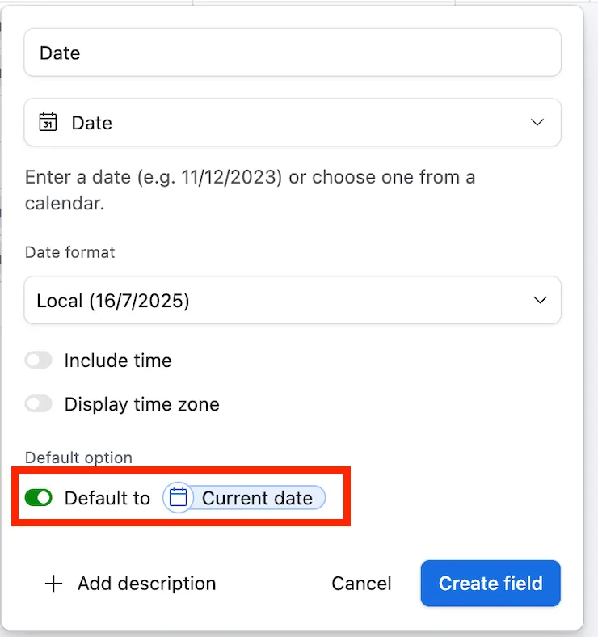

Managing dates effectively in a Customer Relationship Management (CRM) system is crucial for maintaining an accurate and dynamic dashboard. Airtable, with its versatile fields and configuration options, offers a powerful way to control how date entries are recorded and displayed. Here, we’ll explore how to use a customizable date field instead of an auto ‘Created Date’ to manage historical and adjustable entry dates, ensuring your data reflects real scenarios accurately.

## Using a Custom Date Field with Automated Defaults

The common challenge with the auto ‘Created Time’ field is its rigidity. Once set, it records the date when a new record was added to your base, which is not modifiable. This can misrepresent actual data when records are not entered on time.

**Step-by-Step Solution:**

- **Create a New Date Field:** Instead of relying solely on an auto ‘Created Time’ field, you can add a new regular Date field to your Airtable base. This will hold the date information for your records.

- **Set Default to Current Date:** When setting up your custom Date field, enable the option ‘Default to Current Date’. This serves dual purposes:

  - Automatically populates today’s date in the field, simulating the behavior of the ‘Created Date’.
  - Allows manual adjustment to the date, making it possible to backdate entries or correct them as needed, thereby offering the flexibility missing in the auto created date.

By implementing this approach in Airtable, you provide your team with a tool that naturally adapts to the practical needs of data entry, without compromising on the ease of use and automation that Airtable’s fields typically offer.

## Benefits of a Customizable Date Field

Using a customizable Date field with a ‘Default to Current Date’ setting strikes a balance between automation and manual control, offering several benefits:

- **Accuracy:** Ensures that your database reflects actual event dates rather than simply recording when data was entered.
- **Flexibility:** Allows adjustments to be made for past or erroneously entered data, which is particularly useful in dynamic environments where data entry might be delayed or overlooked.
- **Efficiency:** Maintains the automatic nature of date entries for typical use cases, reducing the need for manual data entry on a day-to-day basis.
- **Native:** Does not require setting up formulas and automations, which could cause further issues.

Integrating this practice into your Airtable CRM setup not only simplifies processes but also elevates the reliability of your reporting and tracking systems.

Feel free to check this other post on [how calculate date time differences accurately in Airtable](/a-guide-to-more-accurate-date-differences-in-airtable/).
