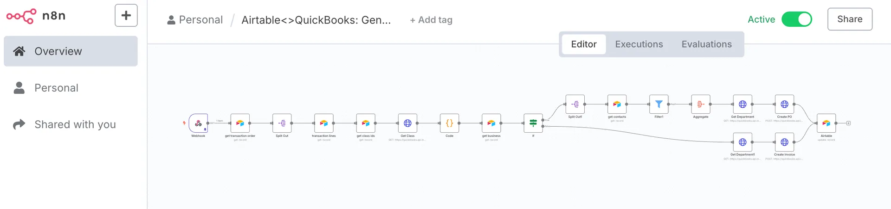

Managing small business finances often means juggling spreadsheets, manual data entry, and constant updates. This process is time-consuming and prone to errors. By using Airtable QuickBooks integration, small business owners can automate bookkeeping, reduce mistakes, and gain real-time insights into their financial health.

Connecting [QuickBooks](https://quickbooks.intuit.com/) with Airtable is straightforward. With the right integration, transactions, invoices, and expenses flow automatically from Airtable into Quickbooks. This eliminates the need for manual updates and ensures that your financial data is always current. As a result, you can focus on running your business instead of chasing down numbers.

### Why choose Airtable QuickBooks integration for your business? Consider these benefits:

– Centralized financial tracking: All your data is in one place, making it easy to monitor cash flow and expenses.\
– Automated workflows: Routine bookkeeping tasks are handled automatically, saving hours each week.\
– Improved accuracy: Automation reduces the risk of human error in your records.\
– Customizable dashboards: Airtable lets you build views and reports tailored to your business needs.\
– Scalable solutions: As your business grows, your financial tracking system adapts with you.

To get started, select an integration tool that connects QuickBooks and Airtable. Many [automation no-code platforms](/what-automation-tool-suits-your-business/) offer pre-built connectors, so you do not need technical expertise. Set up triggers to sync new transactions, update records, or generate reports automatically. For example, when a new Order is created in Airtable, it can appear instantly in your Quickbooks (invoice) for easy tracking.

For small businesses, QuickBooks workflow optimization is essential. By automating repetitive tasks, you free up time for strategic planning and customer service. You also gain confidence that your financial records are accurate and audit-ready.

In conclusion, Airtable QuickBooks integration transforms how small businesses manage finances. By automating bookkeeping with Airtable and QuickBooks, you eliminate spreadsheet headaches and unlock new efficiencies. [Reach out to an expert](/#book), and start integrating today to simplify your financial workflows and focus on growing your business.
