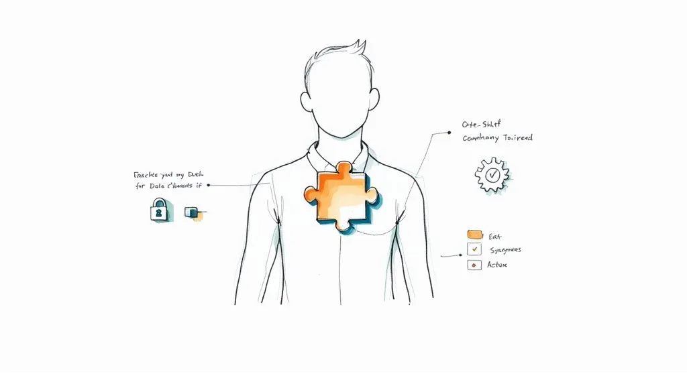
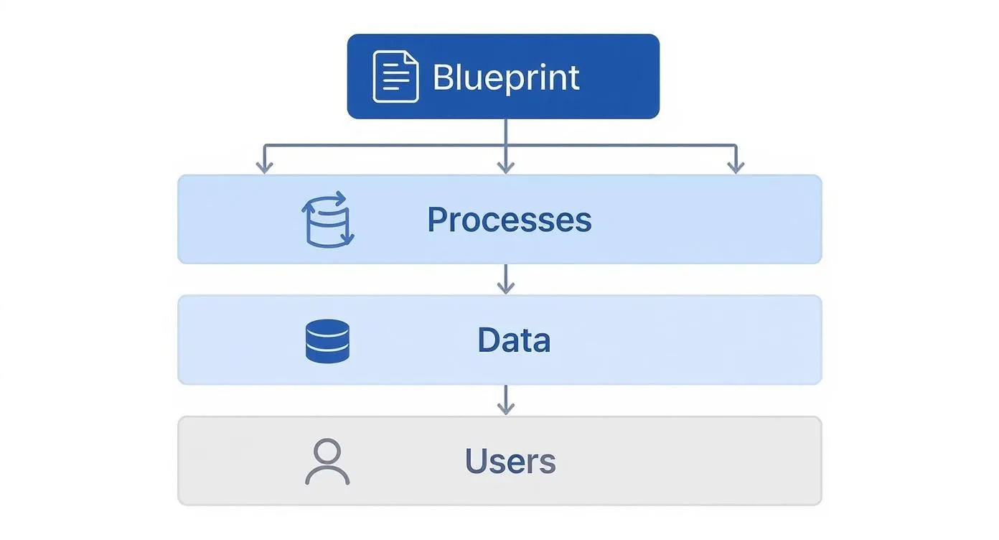

The thought of building your own CRM system might sound intimidating, but it really comes down to a simple concept: _mapping your business processes into a flexible database_. With modern tools like [Airtable](https://www.airtable.com/), you can design a totally custom CRM by figuring out what data you need, connecting related pieces of information, and automating the grunt work—all without touching a single line of code.

## Why Build a Custom CRM in the First Place

Before we jump into the “how,” it’s worth spending a minute on the “why.” Plenty of businesses go for off-the-shelf CRM software, but a growing number are taking the custom route. The reason is simple: generic software makes you bend your processes to fit its rigid structure. A custom CRM does the exact opposite—it molds itself to the unique way you find, sell to, and support your customers.

This isn’t just a trend; it’s a strategic move. A custom CRM isn’t just another monthly subscription; it’s an asset you own and control completely.

> A custom CRM stops you from paying for bloated features you’ll never use. Instead of navigating a complex, one-size-fits-all interface, your team gets a clean, focused tool designed for their exact daily tasks.

### Gaining a True Competitive Edge

The real magic of a custom CRM is its ability to give you a genuine competitive advantage. Imagine a system where every field, dropdown menu, and automation is built to support _your specific sales methodology_. Instead of forcing your team to use generic deal stages, you can create a sales pipeline that perfectly mirrors your actual customer journey.

**Practical Example:** A creative agency might track project milestones and creative approvals right inside a deal record—something you just can’t do in most standard CRMs. They could have deal stages like “Initial Brief,” “Concept Presentation,” “Client Revisions,” and “Final Sign-off.” A real estate firm could build a system to manage property listings, link them to interested buyers, and automate follow-up reminders after a viewing. This level of specificity drives efficiency and gives your team the exact information they need, right when they need it.

To help you decide what’s best for you, here’s a quick comparison.

### Custom CRM vs Off-the-Shelf CRM

| Feature             | Custom-Built CRM                                             | Off-the-Shelf CRM (e.g., Salesforce)                                |
| ------------------- | ------------------------------------------------------------ | ------------------------------------------------------------------- |
| **Flexibility**     | Completely tailored to your unique business processes.       | Pre-defined features and workflows that may not fit your needs.     |
| **User Experience** | Simple, intuitive interface with only the features you need. | Can be complex and bloated with features your team never uses.      |
| **Cost**            | Higher upfront cost for development, lower long-term costs.  | Lower upfront cost, but recurring subscription fees per user.       |
| **Scalability**     | Scales perfectly with your business as it grows and changes. | May require expensive upgrades or migrations to a new plan.         |
| **Integrations**    | Unlimited integration possibilities with any tool you use.   | Limited to the integrations offered by the platform.                |
| **Ownership**       | You own the system and your data completely.                 | You are renting the software and your data lives on their platform. |

Ultimately, off-the-shelf CRMs work for many, but a custom build offers an unmatched level of control and alignment with your business.

### The Power of Full Data Ownership and Integration

When you use a standard CRM, your data is sitting on someone else’s platform, often with limits on how you can access or export it. Building your own system puts you in the driver’s seat with your most valuable asset: your customer data. This ownership allows for deeper, more powerful integrations.

The global CRM market is exploding for a reason—it’s projected to hit **$298.61 billion** by 2025, a surge driven by the demand for flexible, cloud-based solutions. As you start thinking about your own system, it helps to understand the core [customer relationship management and customer retention strategies](https://www.upcraft.ai/post/customer-relationship-management-and-customer-retention) that make these tools so effective. If you’d like to dig into the numbers, you can see [why so many businesses rely on CRM software](https://www.dialectica.io/community-hub/crm-software-consulting-market-insights-for-2025).

Modern tools have made this more achievable than ever. By learning how to build a CRM, you can connect your operations in ways off-the-shelf software just can’t match. If you’re still weighing your options, our guide on the [best CRM for small business](/best-crm-for-small-business/) offers more context on what to look for.

## Creating Your CRM Blueprint

Before you even think about picking a tool like [Airtable](https://www.airtable.com/), let’s talk about the most important step in building a CRM people will actually use: creating the blueprint. Jumping straight into the software is a classic mistake that almost always leads to a messy, disorganized system that creates more problems than it solves. A solid plan is everything.

This blueprinting phase is where you translate your business goals into a concrete, actionable plan. Think of it like an architect drawing up plans for a house. You wouldn’t start pouring a foundation without knowing where the walls and doors go, right? The same logic applies here.

### Mapping Your Core Business Processes

The heart of your blueprint is a clear map of how your business _actually_ works. You need to trace the entire customer journey, from the moment they first hear about you all the way through to becoming a long-term, happy customer. Forget about the software for a minute and just focus on the human side of things.

**Actionable Insight:** The best way to do this is to get your team in a room with a whiteboard or a stack of sticky notes. Ask them to walk you through their day, step-by-step.

- **Lead Generation:** Where do leads come from? A website form? A booth at a trade show? A referral? **Action:** Write down each source and what happens _immediately_ after a lead comes in. _Example: “A lead from the ‘Contact Us’ form is emailed to_ [_mike@automaticnation.com_](mailto:mike@automaticnation.com)_.”_
- **Sales Pipeline:** What are the real stages a deal moves through? Is it something like “New Lead > Qualified > Proposal Sent > Negotiation > Closed Won”? Get specific. **Action:** List every stage and the key action needed to move a deal to the next one. _Example: To move from “Qualified” to “Proposal Sent,” a sales rep must complete a discovery call and log their notes._
- **Customer Onboarding:** Once a deal is won, who takes over? What’s the handoff process? **Action:** Document the exact handoff. _Example: “Sales rep updates deal to ‘Closed Won’ and assigns a task to the onboarding specialist.”_
- **Ongoing Support:** How do you handle questions or problems? Is there a ticketing system or a dedicated support email? **Action:** Map the flow. _Example: “Customer emails_ [_mike@automaticnation.com_](mailto:mike@automaticnation.com)_, which creates a ticket in Help Scout.”_

This exercise isn’t just about documentation; it’s about finding the exact moments where your custom CRM can add the most value through automation and clear data.

### Defining Mission-Critical Data Points

With your processes mapped out, you can now figure out what data you _actually_ need to collect. It’s so tempting to try and capture every tiny piece of information, but that just leads to a cluttered, unusable system. You have to be ruthless and focus only on **mission-critical data**.

**Actionable Insight:** For each stage of your process map, ask: “What information do we absolutely need to make a decision and keep work moving?”

- **For Contacts:** Sure, name and email are a given. But do you _really_ need their LinkedIn profile URL to qualify a lead? Maybe, maybe not. **Example:** A recruiting firm _absolutely_ needs a LinkedIn URL, but a local bakery probably doesn’t.
- **For Companies:** What’s essential here? Industry, location, number of employees? **Example:** A SaaS company selling to enterprises needs “Employee Count” to segment their leads. A B2C business doesn’t.
- **For Deals/Opportunities:** You’ll track the Deal Name and Value. But what about the specific “Next Action Step”? **Example:** A field for “Next Action Date” is crucial for sales follow-ups. A “Blocker” text field can help managers see what’s holding up a deal.

> Your goal is to create a single source of truth. By thoughtfully defining these data points, you’re laying the groundwork for a clean, organized, and powerful relational database structure.

Understanding how all this data connects is fundamental. For instance, one _Company_ record can be linked to multiple _Contacts_ and have several _Opportunities_ tied to it over time. This structure is what makes a custom system so powerful. If this concept is new to you, checking out [what a relational database is](/what-is-a-relational-database/) will give you a solid foundation. Beyond your blueprint, it’s also smart to understand the full project lifecycle; this article offers [a comprehensive step-by-step guide to CRM implementation](https://www.martechdo.com/how-to-implement-crm-system/) that pairs nicely with this planning phase.

### Clarifying User Roles and Permissions

Finally, your blueprint needs to define who will be using the CRM and what they should be able to see and do. Not everyone needs access to everything, and setting up roles from the start keeps your data secure and makes the interface less overwhelming for each user.

**Actionable Insight:** Create a simple table outlining roles and what they can do.

| Role              | Can Create          | Can Edit                  | Can View                  |
| ----------------- | ------------------- | ------------------------- | ------------------------- |
| **Sales Rep**     | New Contacts, Deals | Their own records         | Their own records         |
| **Sales Manager** | All record types    | All records in their team | All team records, reports |
| **Administrator** | All record types    | Everything                | Everything                |

By outlining these roles and their specific permissions, you make sure the CRM is secure and perfectly tailored to each person’s job. This alone will dramatically boost your chances of getting the whole team on board.

## Building Your Core Architecture in Airtable

Okay, you’ve got your CRM blueprint. Now it’s time to stop planning and start building. We’re going to take that blueprint and lay the digital foundation for your entire customer management system using [Airtable](https://www.airtable.com/). Its flexible, database-style setup is perfect for this—no coding required.

The heart of any good CRM is a handful of interconnected tables that keep your data organized. For most businesses, this boils down to four key building blocks: **Contacts**, **Companies**, **Opportunities**, and **Interactions**. Getting this structure right from the beginning is the single most important part of building a system that brings clarity, not more chaos.

This diagram shows exactly how your blueprint’s core ideas—your Processes, Data, and Users—translate directly into the architecture we’re about to create.

It’s a good reminder that a solid CRM isn’t just a collection of data; it’s a reflection of your workflows and how your team actually needs to use the information.

### Setting Up Your Primary Tables

First things first, let’s create the four main tables in a new Airtable base. Think of each table as a dedicated bucket for a specific type of information. This separation is what keeps your data clean and stops it from becoming a mess as you grow.

- **Companies Table:** This is your master list of every organization you work with. **Practical Example:** You’d have a record for “Acme Inc.” here.
- **Contacts Table:** This table is all about the individuals. **Practical Example:** It would contain records for “Jane Doe” and “John Smith,” who both work at Acme Inc.
- **Opportunities (or Deals) Table:** Here’s where you’ll manage your sales pipeline. **Practical Example:** A record here might be “Q4 Website Redesign Project” valued at $25,000 for Acme Inc.
- **Interactions Table:** This is your activity log. **Practical Example:** Records would include “Discovery Call with Jane Doe on Oct 26” or “Sent proposal to John Smith on Nov 2.”

### Designing Fields for Each Table

With the tables in place, it’s time to add fields (which are just columns in Airtable). The goal here isn’t to capture every data point imaginable. Instead, focus on the essential information your team needs to get their job done.

**Actionable Insight:** Start with the basics and only add fields that answer a specific business question.

**Companies Table**

- **Company Name:** The primary text field.
- **Industry:** A single-select field. _Why? So you can later filter and see which industries are most profitable._
- **Website:** A URL field.
- **Lead Source:** A single-select field. _Why? To track marketing ROI._
- **Status:** A single-select field (e.g., “Prospect,” “Active Client,” “Past Client”). _Why? For quick segmentation for marketing campaigns._

**Contacts Table**

- **First Name:** A simple text field.
- **Last Name:** A simple text field.
- **Email:** An email field type.
- **Phone Number:** A phone number field.
- **Job Title:** A text field.
- **Company:** A **linked record field** that connects to the _Companies_ table. This one is critical.

> **Key Takeaway:** The “Linked Record” field is Airtable’s superpower. It’s what turns a bunch of flat spreadsheets into a true relational database by creating clickable connections between records in different tables.

### Creating Powerful Relationships with Linked Records

This is where the magic really happens. By connecting your tables using linked records, you build a complete, 360-degree view of every customer relationship. No more hunting for information—it’s all in one place.

**Actionable Insight:** Follow this linking strategy to build your relational core.

1. **Link Contacts to Companies:** In your _Contacts_ table, make the “Company” field a link to the _Companies_ table. **Result:** When you view “Acme Inc.,” you’ll see a list of all your contacts who work there.
2. **Link Opportunities to Companies and Contacts:** In your _Opportunities_ table, add a linked record field for “Company” and another for “Primary Contact.” **Result:** You can see every deal associated with a specific company, and know exactly who your champion is for each deal.
3. **Link Interactions to Everything:** In your _Interactions_ table, create linked record fields for _Companies_, _Contacts_, and _Opportunities_. **Result:** When you log a call, you tag the person, their company, and the specific deal discussed. This creates a complete, filterable history of all communications.

**Practical Example in Action:** A sales rep logs a new “Discovery Call” in the Interactions table. They link it to “Jane Doe” (Contact), “Acme Corp” (Company), and the “Q4 Website Redesign” (Opportunity). From that moment on, anyone can look at any of those three records and see that this call happened. It completely breaks down data silos and ensures everyone is working from the same script.

## Integrating Your Tech Stack for a Unified View

Alright, you’ve built the foundation of your custom CRM. It’s solid, but right now, it’s just an island. The real magic happens when you connect it to the other tools you use every single day. This is how your CRM goes from being a fancy database to the central nervous system of your entire business.

The goal here is simple: create an interconnected ecosystem where data flows between your apps automatically. This puts an end to the soul-crushing, error-prone task of manual data entry that costs you time and, worse, deals.

### Connecting Your Tools with Automation Platforms

You don’t need to be a developer to get your apps talking to each other. Tools like [**Zapier**](https://zapier.com/), **Make and n8n** ([more on these here](/what-automation-tool-suits-your-business/)) are the universal translators for your software stack. They work on a simple “when this happens, do that” model, letting you build automated workflows that link your new [Airtable](https://www.airtable.com/) CRM to thousands of other apps.

**Actionable Insight:** Start by identifying your top 3 most repetitive data-entry tasks. These are your first targets for automation.

Here are a few practical examples that deliver immediate value:

- **Website Form to CRM:** **Trigger:** A new entry is submitted on your website’s contact form (e.g., via Gravity Forms, Webflow). **Action:** Create a new record in the _Contacts_ table in Airtable and a new record in the _Opportunities_ table with a status of “New Lead.”
- **Email Marketing Sync:** **Trigger:** A new subscriber is added to a specific audience in [Mailchimp](https://mailchimp.com/). **Action:** Search for that email in your Airtable _Contacts_ table. If it doesn’t exist, create a new contact record.
- **Calendar Events as Interactions:** **Trigger:** A new event is created in [Calendly](https://calendly.com/). **Action:** Create a new record in the _Interactions_ table in Airtable, logging the meeting details and linking it to the attendee’s contact record.

These automations keep your CRM fresh with the latest information, and nobody has to lift a finger. This frees up your team to do what they do best: build relationships, not act as data entry clerks.

### Creating a 360-Degree Customer View

Connecting your tools isn’t just a time-saver; it’s about getting the full story on every customer. When your CRM is pulling data from your website, email campaigns, and calendar, you get a complete, 360-degree view of every interaction.

**Practical Example:** A sales rep is prepping for a call with “Jane Doe” from “Acme Inc.” By opening Jane’s contact record in Airtable, they can see:

- **Lead Source:** “Webinar Sign-up” (pulled from your marketing tool).
- **Recent Emails:** A list of the last 3 marketing newsletters she opened (synced from Mailchimp).
- **Past Meetings:** “Discovery Call – Oct 26,” “Demo – Nov 10” (logged automatically from Calendly).
- **Open Deal:** The “Q4 Website Redesign” opportunity, currently in the “Proposal Sent” stage.

Having this unified view is a massive advantage. It helps your team have smarter, more relevant conversations because the entire history of the relationship is right there at their fingertips.

> A well-integrated CRM demolishes data silos. Instead of information being trapped in different apps, it all flows into a central hub. This gives everyone on your team a single source of truth for everything customer-related.

Building a modern CRM also means it needs to be accessible. It should be cloud-based, just like Airtable, and work seamlessly on mobile devices for your team on the go. The mobile CRM market is expected to jump from **$28.43 billion in 2024 to $58.07 billion by 2034**—a clear sign that real-time access from anywhere is no longer a nice-to-have, it’s essential. You can find more [CRM trends and statistics on SLTCreative.com](https://www.sltcreative.com/crm-statistics).

### Choosing the Right Integrations Strategically

It’s easy to get excited and try to connect every single app you use. A better approach? Be strategic. Start by pinpointing the most critical data flows and the biggest time-wasters in your current process.

**Actionable Insight:** Ask your team this one simple question: “If you could stop manually copying and pasting information between two apps, which two would they be?” Their answer is your top priority for integration.

For example, if your sales team lives in their email inbox, an integration that syncs emails to the CRM is a no-brainer. If generating leads from your website is the top priority, that’s the first connection you should build. Focus on the integrations that will have the biggest impact first. You can always add more as your system—and your business—grows.

## Automating Workflows to Boost Productivity

Alright, your custom CRM is built and connected. You now have a solid, centralized source of truth for your business. The next step is where the magic really happens: turning that static database into an active, productive member of your team. This is all about automation.

Automation is what transforms your CRM from a simple data library into an engine that drives your business forward. It’s about taking the repetitive, manual tasks off your team’s plate so they can focus on what they do best—building relationships and making sales. Think of it as scaling your operations without having to scale your payroll.

### Understanding Triggers and Actions

At its core, every automation boils down to two simple concepts: a **trigger** and an **action**.

- **Trigger:** This is the event that starts the automation. **Practical Example:** A deal’s “Stage” field is updated to “Proposal Sent.”
- **Action:** This is the task that happens automatically right after the trigger. **Practical Example:** A task is created for the Sales Manager to “Review Proposal for \[Deal Name]” with a due date of 2 days from now.

Tools like [Zapier](https://zapier.com/) and Airtable’s own native automations run on this exact logic. You’re just setting up a series of cause-and-effect rules that mimic your ideal business processes. If you’re new to this, exploring how to [boost your workflow productivity with Airtable Automations](/airtable-automations-boost-your-workflow-productivity/) is a great place to start.

It’s no secret that industry giants like Salesforce and Microsoft are dominating the CRM market, with their combined revenue soaring past **$22 billion**. A huge part of their appeal is sophisticated, AI-powered automation. The good news is, by building your own automations, you can create the same kind of powerful, time-saving features—but tailored perfectly to _your_ business needs.

### Designing High-Impact Automation Workflows

The best way to get started is by tackling the low-hanging fruit. Look for the most repetitive, time-sucking, and error-prone tasks your team deals with every day.

Here are a few high-impact examples you can set up right now.

**1. Automated Lead Assignment**\
This is a classic. It makes sure new leads get immediate attention instead of sitting in a queue and going cold.

- **Trigger:** A new record enters an Airtable view named “New Unassigned Leads.”
- **Action:** Set a round-robin app to find the next sales rep in line and update the record’s “Owner” field with their name.
- **Bonus Action:** Send a Slack notification to the assigned rep: “@jane.doe, you have a new lead: \[Lead Name]. View it here: \[Link to Airtable Record].”

**2. Proactive Deal Follow-Up**\
This automation keeps your pipeline healthy by flagging opportunities that have gone stale.

- **Trigger:** In Airtable Automations, set a trigger for “When record matches conditions,” where the condition is “Last Modified Date is more than 7 days ago” AND “Stage is not Closed Won/Lost.”
- **Action:** Create a new task record in an “Actions” table, link it back to the deal, and assign it to the deal owner. A simple title like “Follow up on idle deal” works perfectly.

> This single workflow enforces your sales process without anyone needing to manually babysit dates. It’s a dead-simple way to boost pipeline velocity and ensure no opportunity gets left behind.

**3. Seamless Customer Onboarding Handoff**\
This creates a fantastic customer experience from the moment a deal closes and ensures a smooth transition.

- **Trigger:** An “Opportunity” record’s “Stage” field is updated to “Closed Won.”
- **Action 1:** Send an email to the new client’s primary contact from a pre-written template using Gmail or Outlook integrations.
- **Action 2:** Automatically create a new project in Asana or Trello from a project template, populating key fields like Client Name and Project Value.
- **Action 3:** Post a message in the #new-clients Slack channel with a summary: “🎉 New Client! \[Company Name] just signed on for the \[Opportunity Name] project. Congrats, @sales-rep!”

These are just starting points. The real power comes when you deeply understand your own business processes and build automations that fix your specific bottlenecks. When you do that, your custom CRM stops being just a tool and becomes a proactive assistant that works for you 24/7.

## Common Questions About Building a CRM

Diving into building your own CRM is a big move, and it’s totally normal to have a few questions. It’s one thing to map out the steps, but it’s another to think through the real-world stuff like costs, getting your team on board, and keeping the system running smoothly down the road.

Let’s dig into some of the most common worries that pop up. Getting these cleared up from the start helps you build with confidence and create something that’s a genuine asset, not just another piece of software.

### What Are the Real Costs to Build a CRM with No-Code Tools?

When people hear “no-code,” they sometimes think “no-cost,” but that’s not quite the full picture. While you’ll save a ton by not hiring a team of developers, there are still some key expenses to plan for.

Your main costs will be the monthly subscriptions for the tools you choose. For a small team just starting out, here’s a realistic look at the budget:

- **Airtable:** This is the heart of your CRM. The **Team** plan (around **$20-$24 per user/month**) is the best starting point, as it unlocks crucial features like more records, automation runs, and extensions.
- **Zapier or Make:** This is your automation engine. Your cost here is all about usage. **Actionable Insight:** Start with a free plan. Only upgrade when you consistently hit the task limit. A starter plan will likely be in the **$20 to $50 per month** range.

For a team of three, you’re probably looking at a software bill around **$100 to $120 a month**. That’s a fraction of the cost of most big-name, enterprise-level CRMs.

> But the biggest “hidden” cost isn’t a subscription—it’s your time. The hours you put into planning, building, testing, and training are a very real investment. If the build feels too complex, it can be a smart move to hire a freelance expert for the initial setup. A one-time cost of a few thousand dollars could save you dozens of hours and get it done right the first time.

### How Can I Ensure My Team Actually Uses the New CRM?

This is the big one. You can architect the most brilliant system imaginable, but if your team doesn’t use it, it’s a failure. The secret is to make the CRM a tool that actually _helps_ them do their jobs better, not just another task your boss is making you do.

**Actionable Insight:** The single best way to guarantee adoption is to involve your team from day one. Don’t build in a vacuum.

Instead, pull them into the blueprinting phase. Ask them: “What’s the most annoying, repetitive data entry you do every day?” Then, build an automation that solves that specific problem first. When they see their own frustrations being solved by the features you’re building, they’ll become champions for the system before it even launches.

Once it’s ready, run a hands-on training session. **Practical Example:** Instead of a generic demo, have each sales rep add a real lead they’re working on to the CRM, update its stage, and log a recent interaction. This makes the training tangible and immediately useful.

### How Do I Make My Custom CRM Scalable for Future Growth?

You don’t want to build a system that’s perfect for a team of five but falls apart when you hit twenty. Building for scale isn’t about over-engineering everything from the start; it’s about making smart, deliberate choices that keep your future options open.

**Actionable Insight:** Adhere strictly to the relational model.

- **Clean Data Structure:** Use separate tables for **Contacts**, **Companies**, **Opportunities**, and **Interactions**. Resist the temptation to just dump everything into one giant table. A tidy, logical database is infinitely easier to build upon later.
- **Pick Scalable Tools:** Platforms like [Airtable](https://www.airtable.com/) and Make are designed to scale. They can handle hundreds of thousands of records and complex automations, so you won’t have to worry about hitting a technical ceiling.
- **Build in Modules:** Start with your core sales pipeline. Later, you can add a new set of tables for project management or customer support tickets. This modular approach lets you add new functionality over time without having to rebuild the whole thing.

### Is It Difficult to Maintain a Custom-Built CRM?

The idea of long-term maintenance can sound intimidating, but for a no-code system, it’s way more manageable than you’d think. You’re in total control—no forced updates or rigid features you can’t change.

Maintenance here isn’t about writing code patches. It’s about ongoing optimization. It usually breaks down into a few simple activities:

- **Reviewing Workflows:** **Actionable Insight:** Set a recurring calendar event every quarter called “CRM Health Check.” During this time, review your automations. Are they still firing correctly? Could they be more efficient?
- **Updating User Permissions:** As people join or leave your team, you’ll need to add or remove them. This takes just a few clicks.
- **Adapting to Business Changes:** Your sales process will evolve. **Practical Example:** When your team decides to add a new “Technical Demo” stage to the pipeline, you can add it to the single-select field in Airtable in under a minute.

This agility is the real power of a custom system. You can continually fine-tune it to be a perfect fit for how your team actually works.

---

Building a custom CRM is a journey, but you don’t have to do it alone. If you’re ready to create a system that organizes your data and automates your workflows, **Automatic Nation** can help. We specialize in building custom Airtable systems that save you hours each week.

[Schedule a call with one of our experts, and learn how we can build your perfect operational hub.](/#book)
