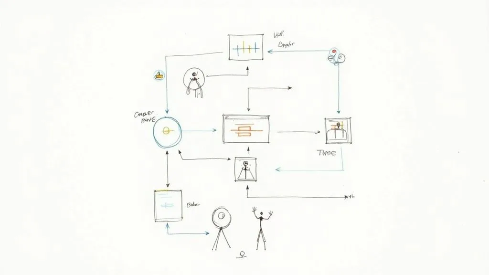
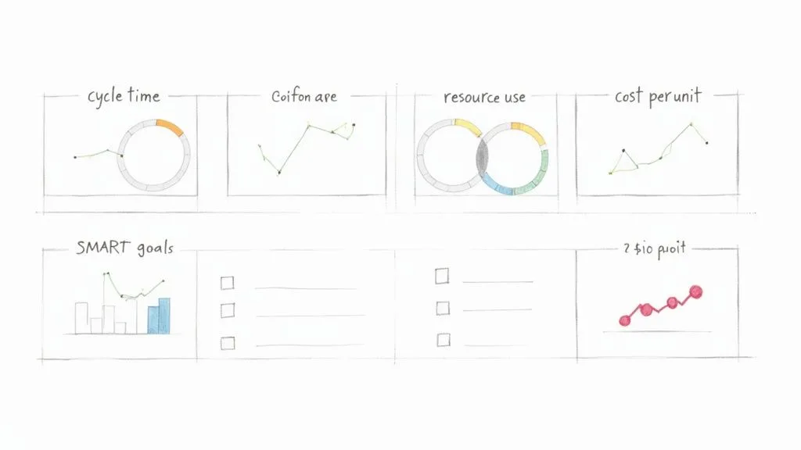
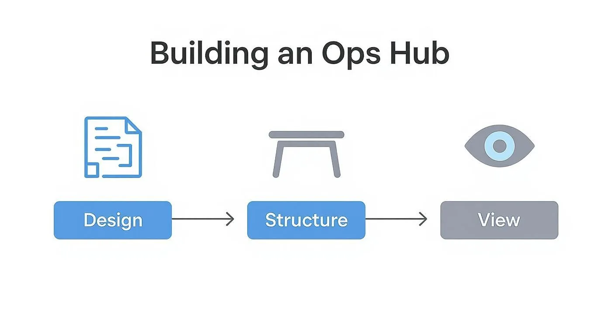

You can’t fix a problem you don’t understand. The first step toward a more efficient operation isn’t about buying new software or overhauling your entire business—it’s about getting an honest, clear-eyed view of how things _actually_ get done.

This means moving beyond assumptions and digging into the real-world mechanics of your workflows. It’s time to replace guesswork with a data-driven map of your current operations.

## Diagnosing Inefficiency in Your Operations

Before you can plug the leaks, you have to find them. Many businesses run on inherited processes that were never really designed—they just… happened. A task gets done a certain way “because that’s how we’ve always done it,” even if it’s clunky and slow.

Our goal here is to shine a light on these hidden habits, find the bottlenecks, and spot the repetitive tasks that are quietly eating away at your team’s time and energy.

### Start with Process Mapping

Process mapping is just a fancy term for visualizing a workflow from start to finish. The real value isn’t the final diagram; it’s the conversation you have while creating it.

Get the people who actually _do the work_ in a room (or on a video call). Whether it’s client onboarding or content creation, use a whiteboard or a virtual tool like Miro to map out every single step, decision, and handoff.

Ask these questions:

- **Who is involved?** List every single person or team that touches the process.
- **What are the tasks?** Get granular. Detail each action taken, from “Receive client email” to “Update spreadsheet” to “Send confirmation.”
- **What tools are used?** Note every app, spreadsheet, or platform involved.

This exercise is always an eye-opener. A marketing agency might think their blog approval process is straightforward, but mapping it out reveals **12 distinct steps**, seven back-and-forth emails, and three different software tools. No wonder it takes so long.

### Identify Bottlenecks and Repetitive Tasks

With your process map laid out, the problems start to jump out at you. You’re hunting for two things: bottlenecks and repetition.

A **bottleneck** is any point where work piles up faster than it can be handled, slowing everything that comes after it. Is every creative approval stuck waiting for one specific art director? Does your team constantly have to pause while waiting for data from another department? Those are classic bottlenecks.

> The most impactful inefficiencies are often not the big, obvious problems but the small, repetitive tasks that accumulate over time. A 15-minute manual data entry task performed daily by five team members adds up to over 325 hours of lost productivity per year.

At the same time, look for the boring, predictable, rule-based tasks that are perfect for automation. These are the things that consume human brainpower but don’t require human creativity.

**Practical Example: A Design Agency**\
A design agency maps out its invoicing process. They discover the project manager spends four hours every Friday manually:

1. Copying billable hours from their project management tool (like Asana).
2. Pasting them into an Excel spreadsheet to calculate totals.
3. Generating a PDF invoice from a Word template.
4. Drafting and sending a templated email with the invoice attached.

This workflow is a prime candidate for automation because it’s predictable, time-consuming, and a recipe for human error. To see more strategies like this, check out this excellent [guide on how to improve operational efficiency](https://usewhale.io/blog/improve-operational-efficiency/).

### Gather Qualitative and Quantitative Data

Data is what turns “this feels slow” into a measurable problem. You need numbers to back up your observations.

- **Time Tracking:** Use timers in tools like Harvest or Toggl to measure how long tasks _really_ take. What’s the actual time from a new client signing a contract to being fully onboarded?
- **Resource Allocation:** See where your team’s time is actually going. If **40% of a skilled developer’s week** is spent on administrative busywork instead of coding, you have a clear inefficiency problem.
- **Qualitative Feedback:** Just talk to your team. Ask them, “What’s the most frustrating or time-wasting part of your day?” Their insights are gold and will often highlight pain points that data alone can’t reveal. Organizing this feedback is a great use case for a database; you can learn more about using [Airtable’s Views for better data organization](/airtables-views-a-quick-guide/).

By combining visual maps with hard data and firsthand accounts from your team, you build a complete picture of what’s really going on. This baseline is your starting point—it lets you prioritize the biggest problems first and gives you a benchmark to measure your success against later.

## Setting Meaningful Efficiency KPIs and Goals

Alright, you’ve pinpointed the bottlenecks and weak spots in your workflows. Now what? The next step is to get crystal clear on what “better” actually looks like for your business.

Saying you want to “improve operational efficiency” is a great start, but it’s not a goal you can actually hit. It’s too vague. You need specific, measurable targets that act as a scoreboard, telling you whether the changes you’re making are truly working.

This is where Key Performance Indicators (KPIs) come into play. They turn your broad ambition into a set of numbers you can track and improve.

### From Vague Ideas to Concrete Metrics

The trick is to connect the problems you uncovered during your audit to real, quantifiable outcomes. Instead of saying, “We need to get faster,” you should be asking, “What can we measure that actually represents speed in this process?”

Think back to the issues you found. Long delays between steps? High rates of rework? Team members stretched too thin? Each one of these pain points can be translated into a specific KPI.

Here are a few of the most critical KPIs I see businesses track to measure operational efficiency:

- **Cycle Time:** The total time it takes to get something done from start to finish. For an e-commerce brand, this might be the time from when a customer clicks “buy” to the moment their order is shipped.
- **Error Rate:** This tracks the percentage of outcomes that have mistakes or need to be redone. A content agency, for instance, could track the percentage of first drafts rejected by clients for not following the brief.
- **Resource Utilization:** This metric shows how effectively your assets—both people and equipment—are being used. For a consulting firm, this could be the percentage of a consultant’s time that is **billable** versus time spent on admin.
- **Cost Per Unit:** This calculates the total cost to produce one thing, whether it’s a product or a service. A software company could measure the cost per ticket to resolve a customer support issue.

To help you get started, here is a quick breakdown of some essential metrics.

### Key Operational Efficiency KPIs to Track

This table outlines key metrics, how to calculate them, and why they are vital for measuring and improving your operational performance.

| KPI                          | What It Measures                                  | Example Calculation                               | Why It’s Important                                             |
| ---------------------------- | ------------------------------------------------- | ------------------------------------------------- | -------------------------------------------------------------- |
| **Process Cycle Time**       | Total time from process start to end.             | (End Time – Start Time) / Number of Units         | Identifies bottlenecks and shows overall process speed.        |
| **Error Rate**               | Percentage of outputs with defects.               | (Number of Errors / Total Outputs) \* 100         | Measures quality and highlights areas needing better controls. |
| **First Contact Resolution** | % of customer issues solved on the first try.     | (Resolved on First Contact / Total Cases) \* 100  | A key indicator of both efficiency and customer satisfaction.  |
| **Resource Utilization**     | How effectively resources (e.g., staff) are used. | (Actual Output / Maximum Potential Output) \* 100 | Helps optimize capacity and reduce wasted time or money.       |
| **Cost Per Unit**            | The total cost to produce one unit of output.     | Total Production Costs / Number of Units Produced | Directly ties operational activities to financial performance. |

Tracking a balanced set of these KPIs gives you a much clearer picture of what’s really happening inside your business.

### Aligning KPIs With Business Objectives

Choosing the right KPIs isn’t just about measuring everything you can. It’s about measuring what actually matters to your company’s big-picture goals. Your efficiency efforts should be a direct line to larger objectives, like boosting profitability or delighting customers.

For example, if a primary company goal is to improve customer retention, a super relevant KPI would be the **First Contact Resolution Rate** in your support team. When you improve that number, you’re solving customer problems faster and more effectively. That directly contributes to a better customer experience and, you guessed it, higher retention.

> A classic mistake is getting tunnel vision on cost-reduction KPIs. While they’re important, they don’t tell the whole story. An obsession with cutting costs can sometimes tank quality, which ultimately hurts customer satisfaction and can cost you way more in the long run.

Your KPIs should create a balanced dashboard covering speed, quality, cost, and customer happiness. A marketing agency, for instance, might track both **Project Turnaround Time** and **Client Satisfaction Score** to make sure that getting faster doesn’t come at the expense of doing great work.

### Setting SMART Goals for Your Team

Once you’ve locked in your KPIs, it’s time to set clear, motivating goals. The **SMART** framework is a simple but incredibly effective tool for this. It ensures your targets are well-defined and actually achievable.

- **Specific:** What, exactly, do you want to accomplish?
- **Measurable:** How will you track progress and know when you’ve won?
- **Achievable:** Is the goal realistic with your current resources?
- **Relevant:** Does this goal line up with your bigger business objectives?
- **Time-bound:** When do you need to achieve this by?

Let’s put this into a real-world context. Imagine an e-commerce business wants to speed up its order fulfillment.

A weak goal is: “We need to ship orders faster.” It’s a nice thought, but it’s not actionable.

A SMART goal is a game-changer: “**Reduce the average order fulfillment cycle time from 48 hours to 24 hours by the end of Q3.**”

See the difference? This goal is specific (reduce cycle time), measurable (from **48** to **24** hours), achievable (a tough but possible target), relevant (faster shipping makes customers happy), and time-bound (by the end of Q3). Setting goals like this gives your team a clear finish line to run toward and makes it easy to celebrate when you cross it.

## Building a Central Operations Hub in Airtable

So, you’ve nailed down your KPIs. Now what? The next move is to build a single source of truth to actually track them. Let’s be real—scattered spreadsheets, siloed apps, and never-ending email chains are where operational efficiency goes to die. They create blind spots, bring decision-making to a crawl, and make it impossible to see the whole picture.

The answer is a central operations hub, one organized place for all your critical data. For this, [Airtable](https://www.airtable.com/) is an absolute powerhouse. It’s so much more than a spreadsheet; it’s a relational database you can mold to your exact workflows without touching a single line of code.

### From Scattered Data to a Structured Base

Think of an Airtable “base” as the digital headquarters for a specific process. Instead of client info living in one spreadsheet, project tasks in another, and invoices somewhere else entirely, you can pull it all together. Just getting everything in one place is the first big win.

But the real magic is how Airtable connects everything. Each piece of information—a client, a project, a task, an invoice—can be linked. That means you can pull up a client’s record and instantly see every project you’ve ever done for them, every associated task, and the status of every single invoice. No more hunting around.

To get started, you need to get comfortable with the basic building blocks. If you’re new to the platform, taking a few minutes to get the fundamentals down will pay off big time. We’ve got a great primer you can check out in our guide on [**understanding Airtable’s key concepts and terminology**](/understanding-airtable-key-concepts-and-terminology/).

### Designing Your First Operations Hub: A Practical Example

Let’s walk through a classic scenario: a marketing agency trying to manage its content production pipeline. The goal is simple: track every article from idea to publication and kill the constant “what’s the status of this post?” emails for good.

Your Airtable base for this might have a few key tables:

- **Content Ideas:** A brain dump for every potential topic, with fields for a quick description, a potential author, and a priority score.
- **Articles:** This is your main tracking table. Each record is a single article. You’d have fields for the title, author, status (like Writing, Editing, Awaiting Approval, Published), due date, and target keyword.
- **Authors:** A simple table listing all your writers, their email, and their rates.
- **Publishing Channels:** A table for where you publish (e.g., Company Blog, LinkedIn, Guest Post), including links and login details.

Here, the `Articles` table links to both the `Authors` and `Publishing Channels` tables. This structure means you can instantly filter your view to see all articles assigned to a specific writer or all content planned for the company blog next month.

The interface makes structuring and managing this kind of relational data surprisingly intuitive.

This screenshot gives you a feel for a project tracker in Airtable. It highlights how different bits of information—tasks, owners, due dates—can be organized visually. The key takeaway here is the power to customize fields for what you actually need, like status tags, date pickers, and user assignments. This is what turns a static grid into a dynamic workflow tool.

### Creating Views for Every Stakeholder

A single, massive table of all your data is just noise. The real genius of an Airtable hub lies in creating custom **views**. A view is just a saved way of looking at your data, with specific filters, sorts, and layouts applied.

For our content pipeline, you could create a few killer views:

- **Writer’s Dashboard:** A view filtered to show only articles assigned to the person currently logged in. It’s a clean, focused to-do list for each writer.
- **Editor’s Queue:** A simple grid view filtered to show only articles with the status “Ready for Editing.”
- **Upcoming Deadlines:** A calendar view that plots all articles on their due dates, making it easy to spot bottlenecks before they happen.
- **Management Overview:** A Kanban view where articles are cards you can drag and drop between columns representing their status (e.g., Ideation, In Progress, Published).

> Centralizing data and then creating tailored views for different roles is a cornerstone strategy for boosting productivity. When you give people transparent access to the tools they need, you increase both their confidence and their output. This is a core part of modernizing operations, especially as companies grapple with rising costs.

By building a hub like this, you graduate from a chaotic mess of disconnected files to a single, organized environment. Everyone on the team gets the exact information they need, right when they need it, which slashes miscommunication and wasted time.

## Automating Workflows with Zapier, Make, and n8n

Once you’ve centralized your data in a hub like Airtable, the next giant leap forward is getting your systems to talk to each other automatically. This is where you start reclaiming your team’s most valuable asset: time. We’re diving into the world of no-code automation, connecting the apps you use every day to finally kill off that soul-crushing manual work.

Think of tools like [Zapier](https://zapier.com/), Make, and [n8n](https://n8n.io/) as the digital plumbing for your business. They listen for a “trigger” in one app—like a new client added to your CRM—and then perform a series of “actions” in others, like creating a project folder in Google Drive and a new task in Airtable. This isn’t about replacing people; it’s about freeing them from robotic, repetitive tasks so they can focus on work that actually requires a brain.

### Choosing Your Automation Platform

The three big players in this space each have their own personality, and the right one for you often comes down to how complex your workflows are and what your budget looks like. Getting this choice right is pretty critical.

- **Zapier:** Known for its dead-simple interface and a massive library of over **5,000** app integrations. It’s incredibly user-friendly, making it the perfect starting point for most businesses. Its linear, step-by-step “Zap” builder is as intuitive as it gets.
- **Make (formerly Integromat):** This one gives you a more visual, flowchart-style canvas that’s brilliant for handling complex, multi-path scenarios. It’s often more cost-effective for high-volume automations and gives you more flexibility to manipulate data between steps.
- **n8n:** A powerful, developer-friendly option that can be self-hosted for maximum control and cost savings. It has a steeper learning curve, no doubt, but offers nearly limitless customization for highly technical or data-heavy workflows.

This visual shows how the whole process comes together, from designing your hub and structuring your data to actually creating useful views for your team.

The key takeaway here is that a solid foundation—thoughtful design and structure—is non-negotiable. You have to get that right before you can effectively automate anything.

### Building Your First High-Impact Automation

Let’s walk through a practical, high-impact automation that nearly any service-based business can use right away: a new client onboarding workflow. This single process often touches multiple departments and is loaded with manual, error-prone tasks.

**The Scenario:** A deal is marked “Won” in your CRM (like HubSpot or Salesforce). You want to kick off the entire project setup process without anyone lifting a finger.

Here’s how the logic flows:

1. **Trigger:** A deal’s stage is updated to “Won” in your HubSpot CRM.
2. **Action 1 (Google Drive):** Create a new client folder in Google Drive using the client’s name from the HubSpot data.
3. **Action 2 (Google Drive):** Inside that folder, create a standard set of subfolders (e.g., “Contracts,” “Project Files,” “Invoices”).
4. **Action 3 (Airtable):** Create a new project in your Airtable operations hub, pulling in the client name, project value, and start date from HubSpot.
5. **Action 4 (Slack):** Send a notification to a specific Slack channel (e.g., #new-clients) that says, “🎉 New Project Won: \[Client Name]! Project Manager: @\[PM’s Name].”

> This kind of automation doesn’t just save time; it enforces consistency. Every new project gets set up identically, which eliminates those “Oops, I forgot to create the invoice folder” moments that lead to chaos down the line. It ensures nothing ever falls through the cracks.

### Advanced Automation: Using Filters and Paths

Once you get comfortable, you can start building more sophisticated workflows. Imagine your onboarding automation needs to behave differently based on the project’s size. That’s where you can use filters or paths to create conditional logic.

It’s a simple idea with a huge impact.

**Example with a Filter:**

- Add a filter step in Zapier or Make right after the trigger.
- **The Rule:** Only continue if the “Deal Value” from the CRM is greater than **$10,000**.
- **Path A (if > $10k):** Run the full onboarding sequence and notify the Head of Client Success.
- **Path B (if < $10k):** Run a simplified onboarding sequence and only notify the assigned project manager.

As you dive deeper into automation, understanding how AI fits into the picture is a game-changer. For a great primer, it’s worth reading up on [**What is AI and how it benefits business operations**](https://scaleautomation.dev/faq/what-is-ai-and-how-can-it-benefit-my-business). By bringing these ideas into your builds, you move from just automating simple tasks to creating truly intelligent systems that can handle complex decisions—and that’s the next frontier in operational excellence.

## Fostering a Culture of Continuous Improvement

Look, having the best tools and the slickest workflows is great, but it’s only half the battle. You can’t just “install” efficiency and walk away. Real, lasting operational improvements are nurtured, not mandated. They come from a team that’s actively engaged and sees making things better as part of their job—not just another order from the top.

This is the final, and maybe most important, piece of the puzzle. It’s about shifting your company’s mindset. We need to build a culture where everyone is on the lookout for bottlenecks and feels empowered to suggest a better way.

### Empowering Employees to Be Efficiency Champions

Your frontline employees—the people doing the work day in and day out—are your real process experts. They know exactly where the friction is. They know which tasks are a frustrating time-suck and which steps feel completely pointless.

The secret is to give them a way to share those insights without fear of pointing fingers.

Instead of managers dictating changes from an ivory tower, you want your team to identify and solve the problems they face firsthand. This creates a sense of ownership that’s way more powerful than any top-down decree.

### Creating Effective Feedback Loops

A dusty old suggestion box isn’t going to cut it. If ideas just disappear into a black hole, people will stop offering them—fast. You need to build a genuine, visible feedback loop.

Here are a few practical ways to get this going:

- **A dedicated Slack channel:** Fire up a channel like `#process-improvements` where anyone can drop an idea or a frustration. The crucial part? Have someone responsible for acknowledging every single post and explaining the next step, even if it’s just, “Thanks, we’re looking into this.”
- **An Airtable “Idea Base”:** Set up a simple [Airtable](https://www.airtable.com/) base for submitting improvement ideas. Include fields for the problem, the proposed solution, and the potential impact. This makes it easy to track, prioritize, and report back on what’s happening with each suggestion.
- **“Fix-It Fridays”:** Block off an hour every other Friday for teams to huddle up, discuss the small-scale improvements they’ve identified, and maybe even implement them on the spot.

The goal is simple: make giving feedback easy, visible, and rewarding. When your team sees their ideas are taken seriously and actually get implemented, they’ll stay engaged and keep the good ideas coming.

> True operational efficiency blossoms when the people doing the work are given the agency to improve it. It’s not about finding fault; it’s about collectively finding a better way forward, one small adjustment at a time.

### Running Productive Process Retrospectives

Borrow a play from the agile software development book: the **process retrospective**. This is a meeting you hold after a project or at the end of a quarter to talk about what went well, what didn’t, and what you can improve for next time.

This isn’t a post-mortem to assign blame for results. It’s a deep dive into the _how_. A simple framework for this meeting works wonders:

1. **What to Keep Doing?** Which parts of our process were smooth and genuinely helpful? (e.g., “The new client intake form saved us a ton of back-and-forth.”)
2. **What to Stop Doing?** Where did we hit friction? What caused delays or confusion? (e.g., “Stop having internal reviews via email; threads get lost.”)
3. **What to Start Doing?** What new ideas or changes could we experiment with next time to be more effective? (e.g., “Let’s try a 15-minute daily stand-up to sync on project status.”)

Keep these meetings blameless and focused on the future. The output should be a short list of **actionable experiments** to try in the next cycle, with a clear owner assigned to each one.

### Celebrating the Wins to Build Momentum

Finally, make efficiency something worth celebrating. When a team member’s suggestion shaves five hours off a weekly report or an automation kills a soul-crushing data entry task, make it a public win.

Shout it out in your all-hands meeting or the company-wide Slack channel. Put a number on it if you can—”Big thanks to Sarah for her idea! We’re now saving **20 hours a month** on client reporting.” This kind of positive reinforcement shows everyone that their contributions matter and that making the business run better is a win for all of us.

## Frequently Asked Questions

When you start digging into operational efficiency, a lot of questions pop up. Here are some straight-to-the-point answers to the ones we hear most often.

### Where Is the Best Place to Start?

Don’t try to boil the ocean. The best way to start is by mapping a single, critical business process from beginning to end. Pick a workflow that’s either high-volume, like processing customer orders, or one that’s directly tied to your revenue, like client onboarding.

By zeroing in on one high-impact area, you can do a thorough audit without getting completely overwhelmed. This approach helps you spot the biggest bottlenecks and make targeted changes that deliver a real, noticeable ROI. That first win builds the momentum you need to tackle the rest of the business.

### How Do I Get My Team on Board with New Processes?

Team buy-in is everything. Without it, even the most brilliant system is dead on arrival. The trick is to get them involved from the very beginning. When you’re diagnosing the problems, ask your team what their biggest daily frustrations are—they’re the ones in the trenches and know where the real friction is.

When it’s time to introduce a new tool or process, don’t just talk about company goals. Explain the “why” in a way that matters to _them_. Show them how it’s going to eliminate that tedious report they hate doing or cut down on after-hours work.

> A common mistake is just announcing a change and expecting everyone to fall in line. Real buy-in comes from co-creation. When your team helps build the solution, they’re invested in its success.

Make sure you provide solid training and create simple documentation they can actually use, like a quick video walkthrough. It also helps to pick a “champion” on the team who can offer peer support. And when you get those early wins, celebrate them publicly! It shows everyone the positive impact and gets others excited to jump on board.

### How Can I Measure the ROI of My Efficiency Improvements?

Measuring the ROI comes down to tracking the “before” and “after” numbers for the KPIs you set earlier. The most direct way is by calculating time saved. For instance, if a new automation saves a team member **5 hours** a week and their loaded cost is **$50/hour**, that’s a direct saving of **$250 per week**. Over a year, that’s **$13,000** back in your pocket from just one workflow.

But don’t stop at time savings. Look at other key metrics too:

- **Reduced Error Rates:** How much did rework or customer complaints cost you before versus after?
- **Faster Project Completion:** If you can finish projects faster, you can take on more revenue-generating work. What’s that worth?
- **Improved Customer Satisfaction:** Keep an eye on metrics like your Net Promoter Score (NPS) or customer retention. Happier clients stick around longer.

When you add up all these gains—both the hard numbers and the softer benefits—you build a rock-solid business case for every operational improvement you make.

---

Ready to stop wrestling with scattered spreadsheets and build a truly efficient operational hub? The experts at **Automatic Nation** design and build custom Airtable systems with end-to-end automations that save your team hours every week. [Schedule a free consultation to see how we can transform your workflows](/).
