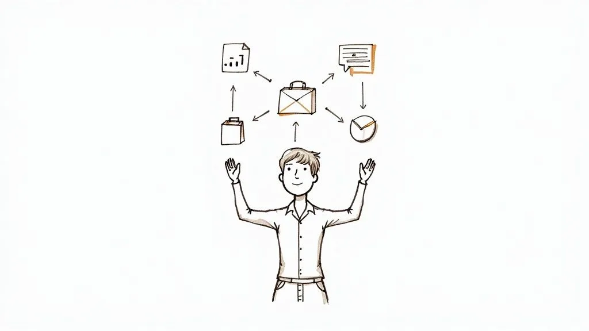
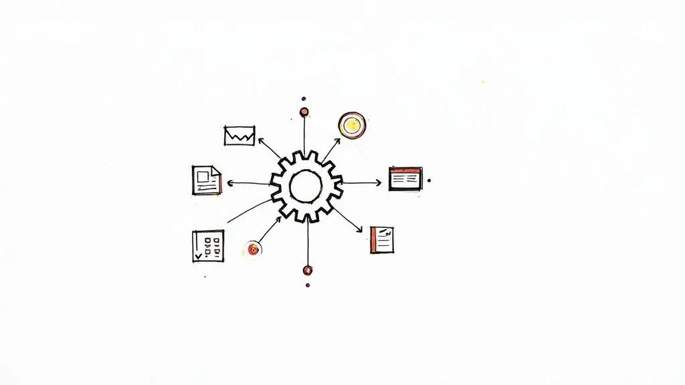

If you’re juggling a dozen projects at once, you’ve probably realized that just “working harder” isn’t a strategy—it’s a recipe for burnout. The real key to managing multiple projects is to move away from scattered to-do lists and chaotic inboxes and build a centralized system. Think of it as your command center for tracking, prioritizing, and communicating.

Success here isn’t about sheer effort; it’s about having a solid structure in place. For example, instead of tracking a client website launch in Asana, a marketing campaign in a Google Sheet, and an internal software update via email, you’ll learn how to bring all of them into one unified dashboard.

## Why Juggling Projects Is the New Normal

Welcome to the reality of modern work. If handling just one project feels like a distant memory, you’re not alone. The way we work has changed, driven by a need to be leaner, faster, and more agile.

Companies are running on tighter teams and resources, which means most of us are wearing multiple hats. This isn’t just a hunch; the data backs it up. Over **85% of project managers** are now handling multiple projects at the same time. It’s a clear shift toward portfolio-style work, especially in fast-paced fields like tech and consulting, where nearly 9 out of 10 managers are overseeing several projects a year.

### From Chaos to Control

Without a system, managing all this is pure chaos. Sound familiar?

- Critical tasks get buried in endless email threads and forgotten spreadsheets. For instance, a key design approval for “Project Phoenix” is lost in a 50-reply email chain, delaying the entire timeline.
- You struggle to give accurate status updates because the information is all over the place. When an executive asks for a progress report, you spend an hour hunting through Slack, Google Docs, and Trello just to piece together an answer.
- Conflicting demands from different stakeholders pull you in a million directions. The marketing head wants a campaign launched by Friday, but the lead developer is committed to a critical bug fix for another project due to the same day.

This constant firefighting is a one-way ticket to exhaustion. If you want to dive deeper into sustainable approaches, there are great guides on [how to manage multiple projects without burnout](https://recapio.com/blog/how-to-manage-multiple-projects). The core idea is to stop reacting and start building a fireproof system from the ground up.

> The goal isn’t just to survive managing multiple projects. It’s to build a reliable operational base that lets you deliver consistently without losing your mind.

This guide is all about giving you the actionable strategies to build that foundation. We’ll get into creating a central hub for everything, mastering the art of prioritization, and setting up automations that put you back in control.

## Create Your Centralized Project Hub

If you’re juggling multiple projects, you’re probably all too familiar with scattered spreadsheets, chaotic email chains, and disconnected to-do lists. The first—and most critical—step to getting organized is to build a **centralized project hub**. Think of it as a single source of truth where every single piece of information about every project lives.

This isn’t just about tidying up. It’s about building a dynamic command center. Imagine knowing exactly where a project stands, who’s responsible for what, and what’s coming up next without having to dig through a dozen different places. That’s what a proper hub gives you.

### Building Your Project Command Center

Something like [Airtable](https://www.airtable.com/) is perfect for this job. It’s way more than a spreadsheet; it’s a flexible database that you can mold to fit your exact workflow. You’ll start by creating a dedicated “base” for all your projects, which will serve as the foundation for everything.

Inside your hub, you’ll want to set up distinct tables for the most important information:

- **Projects Table:** This is your 30,000-foot view. Each record is a project, with fields for the project name, owner, current status (like Planning, In Progress, On Hold), and key deadlines. For example, a project record might be “Q4 Marketing Campaign,” owned by “Sarah Chen,” with a status of “In Progress.”
- **Tasks Table:** Here’s where the granular work gets tracked. Every single task gets its own entry and is linked directly back to its parent project. You’ll want fields for who it’s assigned to, its due date, and its priority level. An example task could be “Draft ad copy,” assigned to “Mark Lee,” due “10/25,” and linked to the “Q4 Marketing Campaign” project.
- **Stakeholders Table:** Think of this as a lightweight CRM. It tracks everyone involved—team members, clients, contractors—and links them to the projects they’re working on. This helps you quickly see that “Client XYZ” is a stakeholder on three different active projects.
- **Resources Table:** This is where you can log assets, budgets, or even team member availability, all linked to the specific projects they support. For instance, you could track the “Video Production Budget” or see that your lead designer has “10 hours/week” allocated to “Project Alpha.”

This structure keeps information from getting trapped in silos. Instead, you get a clean, interconnected view of your entire workload.

> A centralized hub transforms project management from a frantic search for information into a calm, organized process of making informed decisions based on real-time data.

The data backs this up. While **82% of companies** say they use project management tools, there’s still a huge gap between just _having_ a tool and using it effectively. In fact, **77% of high-performing projects** are powered by proper PM software. Teams that make the switch save an average of **498 hours per employee annually**. It’s a pretty compelling reason to ditch the basic spreadsheets.

Here’s a quick look at how a clean, visual project hub in Airtable can bring everything together in one spot.

Just a quick glance at a layout like this tells you exactly who owns what and where each project stands.

### Custom Views for Every Audience

One of the best things about a centralized system is the ability to create custom views. Let’s be honest, your CEO doesn’t need to see the nitty-gritty task list, and your design team doesn’t need to see the budget breakdown for every project.

You can easily spin up different views for different people:

- **A High-Level Executive Dashboard:** A simple, visual interface showing just project statuses, major milestones, and overall progress. This view might only include a bar chart showing the percentage completion for each project and a list of upcoming deadlines, with no individual tasks visible.
- **A Team-Specific Kanban Board:** This is a classic “To Do, In Progress, Done” view filtered for a specific project. For example, the content team sees only tasks related to the “Blog Redesign” project, helping them stay focused without the distraction of other departments’ work.
- **A Master Calendar View:** This view plots all major deadlines and milestones across all your projects onto one calendar. It’s a lifesaver for spotting potential resource conflicts. For example, you can immediately see that two major project launches are scheduled for the same week, allowing you to adjust resources before it becomes a crisis.

By creating these tailored views, you give every stakeholder the clarity they need without overwhelming them. This is absolutely fundamental to managing multiple projects well—it keeps communication smooth and ensures everyone has the right information at the right time.

## Mastering Prioritization When Everything Feels Urgent

When every project has a flashing “URGENT” sign over its head, it’s all too easy to get stuck in a reactive loop, just bouncing from one fire to the next. The only way out is to stop treating every task like it has the same weight.

Real prioritization isn’t about gut feelings or who shouted the loudest. It’s about applying a consistent framework to make objective, data-driven decisions. This is how you move from a simple to-do list to a strategic roadmap that actually aligns with your most important business goals. To get there, you’ll need to lean on robust [priority management systems](https://www.useharmony.com/blog/priority-management-systems) that bring structure to the chaos.

### Start with the Eisenhower Matrix for Daily Triage

For sorting through the day-to-day noise, the **Eisenhower Matrix** is a fantastic starting point. It’s a simple but incredibly effective tool that forces you to categorize tasks based on just two things: urgency and importance.

- **Urgent & Important (Do First):** These are the true emergencies and high-stakes deadlines. Think fixing a critical bug on a client’s live website or prepping for a major project kickoff happening tomorrow.
- **Important & Not Urgent (Schedule):** This is where strategic, high-value work lives. We’re talking long-term planning, process improvements, or learning a new skill. **Actionable step:** Block 90 minutes on your calendar every Tuesday morning for “Strategic Planning” to ensure this work gets done.
- **Urgent & Not Important (Delegate):** These tasks are interruptions that demand attention but don’t require your unique expertise. This could be routine admin work like scheduling a team meeting or responding to non-critical internal emails. Hand them off.
- **Neither Urgent nor Important (Eliminate):** These are the time-wasters and distractions, like scrolling through irrelevant industry news or attending a meeting with no clear agenda. Get rid of them without a second thought.

### Use Weighted Scoring for Strategic Alignment

When you’re dealing with bigger decisions, like which new project to greenlight, you need something more robust than a simple four-quadrant box. This is where **Weighted Scoring** comes in. It helps you rank projects based on what _really_ matters to your business.

First, you define your key criteria—things like “Revenue Impact,” “Strategic Alignment,” and “Resource Cost.” Next, you assign a weight to each one based on its relative importance. Finally, you score each potential project against those criteria.

Imagine a marketing manager trying to decide between three big initiatives. Their scoring might look like this:

| Project          | Revenue Impact (50%) | Strategic Alignment (30%) | Resource Cost (20%) | Total Score |
| ---------------- | -------------------- | ------------------------- | ------------------- | ----------- |
| Website Redesign | 4/5 (2.0)            | 5/5 (1.5)                 | 2/5 (0.4)           | **3.9**     |
| Product Launch   | 5/5 (2.5)            | 3/5 (0.9)                 | 3/5 (0.6)           | **4.0**     |
| Content Campaign | 2/5 (1.0)            | 4/5 (1.2)                 | 5/5 (1.0)           | **3.2**     |

Based on this objective math, the **Product Launch** is the clear winner. This data-driven approach removes emotion from the equation and gives you a rock-solid justification for your decisions. It gives you the confidence to look at other projects and say, “Not right now.”

### Choosing Your Prioritization Framework

The Eisenhower Matrix and Weighted Scoring are just two of many proven methods. The key is to pick one that fits the complexity and context of your work. Here’s a quick comparison to help you choose the right tool for the job.

| Framework             | Best For                                                              | Potential Drawback                                                |
| --------------------- | --------------------------------------------------------------------- | ----------------------------------------------------------------- |
| **Eisenhower Matrix** | Quick daily and weekly task management.                               | Can oversimplify complex tasks with multiple dependencies.        |
| **Weighted Scoring**  | Comparing large, strategic projects with multiple variables.          | Requires upfront time to define criteria and weights accurately.  |
| **MoSCoW Method**     | Agile development and feature prioritization within a single project. | Ambiguity between “Must-have” and “Should-have” can cause debate. |
| **Kano Model**        | Product development, focusing on customer satisfaction and delight.   | Relies heavily on accurate customer feedback and research.        |

Ultimately, the best framework is the one you and your team will actually use consistently. Don’t be afraid to try one out for a sprint or a month, see how it feels, and adjust as needed.

> Prioritization isn’t about finding more time to do everything; it’s about creating a system that ensures you’re always working on the right things at the right time.

This decision-making process is visualized perfectly when you think about where your project information lives. You have two paths: centralize it for clarity or face the inevitable chaos of scattered data.

As the infographic makes clear, having a single, centralized hub isn’t just a nice-to-have. It’s the only sustainable path to gaining real control when you’re juggling multiple projects at once.

## Automate Workflows to Reclaim Your Time

The real secret to handling a monster workload isn’t working more hours—it’s getting rid of the manual busywork. Think about all the time you spend on repetitive tasks: sending status updates, creating new tasks from emails, or pulling together reports. These don’t just eat up your day; they drain the mental energy you need for creative thinking and real problem-solving.

This is where building an automation engine comes in. By setting up a few simple, trigger-based workflows, you can essentially put the administrative side of project management on autopilot.

### Build Your First Automation

Let’s dive into a real-world example using Airtable Automations. Say you have a “Projects” table with a status field, and you need to let the project lead know the second a project is put “On Hold.”

Here’s the quick and dirty on how to set it up:

1. **Set the Trigger:** The automation will fire when a “record is updated” in your Projects table. You’ll then get specific, telling it to only run when the “Status” field is changed to “On Hold.”
2. **Pick the Action:** Next, you’ll choose to “send a message” to a specific Slack channel. For instance, you could send it to the `#project-alerts` channel.
3. **Craft the Message:** This is where it gets cool. You can create a dynamic message that pulls info straight from the Airtable record, like: “Heads up! The project **{Project Name}** has been moved to On Hold. Owner: **@{Slack Username}**.”

With this one simple automation, key people are instantly notified of critical changes without you ever lifting a finger to type a message. You can use the exact same logic to email clients when a milestone is hit or ping the finance team when a project is ready to be invoiced.

### From Simple Alerts to Smart Systems

Once you’ve got the hang of basic notifications, you can start building more sophisticated workflows. A classic bottleneck for many teams is turning client emails into actual tasks. Instead of the old copy-and-paste routine, you can set up a system to forward certain emails directly to Airtable, which then automatically creates a new task record.

To see exactly how to build this out, check out this **step-by-step guide to automating project task creation**. It’s a game-changer for making sure nothing falls through the cracks.

Another powerful move is scheduling a weekly report. You can configure an Airtable automation to run every Monday at 9 AM, find all projects updated in the last seven days, bundle the info into a clean summary, and post it to your team’s main Slack channel. This means everyone arrives on Monday morning with a clear, consistent overview of progress without you spending an hour compiling it.

> Automation isn’t about replacing human oversight; it’s about freeing up your brainpower for the high-impact work that machines can’t do—like strategy, negotiation, and creative thinking.

This shift is happening whether we’re ready or not. The artificial intelligence (AI) project management market is on track to jump from **$3.08 billion in 2024 to $7.4 billion by 2029**. Experts even predict that by 2030, AI will handle **80% of routine PM tasks** like reporting and scheduling. As automation takes over these chores, managers can finally focus more on true leadership and interpreting the data, not just gathering it.

More projects mean more stakeholders, which is a recipe for communication chaos if you’re not careful. When you’re juggling multiple projects, your role shifts from just tracking tasks to managing the constant flow of information. Get it wrong, and you become a bottleneck, teams get confused, clients get frustrated, and projects start to drift.

The only way to win is to build a deliberate communication system. This isn’t about more meetings or longer emails; it’s about creating a clear rhythm—a cadence—for how and when updates are shared. The key is realizing not everyone needs to know everything.

### Define Your Communication Cadence

For every single project, sketch out a simple communication plan. It just needs to answer a few basic questions:

- **Who needs the info?** Is it the execs, the core team, or the clients?
- **What do they need to know?** High-level summaries? Detailed task updates? Budget reports?
- **When do they get it?** Think daily stand-ups, weekly summary emails, or bi-weekly stakeholder meetings.
- **How is it delivered?** A dedicated Slack channel, an automated report, or a shared dashboard?

A real-world example might look like this: the client for Project A gets a clean, simple summary email every Friday. At the same time, the internal dev team for Project B lives in a dedicated Slack channel with daily updates and has access to a live progress dashboard. This kind of segmentation keeps everyone in the loop with relevant info, cutting out the noise.

### Leverage Your Central Hub for On-Demand Updates

Manual status reports are a soul-crushing time sink. Seriously, just stop doing them. Your centralized hub in [Airtable](https://www.airtable.com/) can make them completely obsolete.

By building out tailored dashboards or interfaces, you can give every stakeholder a live, on-demand window into the exact information they care about. This proactive approach doesn’t just save you time; it builds a massive amount of trust and transparency.

Imagine giving your clients a clean, simple dashboard where they can check project progress, see key milestones, and grab important files anytime they want. This self-service model is a game-changer. For example, a client could log in, see that the “Homepage Wireframe” is “Complete,” and download the file directly, without ever needing to email you for an update.

> Your communication system should be an engine for clarity, not a generator of noise. By tailoring the message, medium, and frequency for each audience, you keep everyone aligned and focused.

### Run More Efficient Check-ins

Finally, it’s time to fix your meetings. Instead of holding separate, scattered check-ins for every single project, start grouping them logically. You might find that a single, hyper-efficient **30-minute** cross-project sync with your core team is all you need to spot shared dependencies or resource conflicts.

For status updates, get everyone to use a consistent template _before_ the meeting. I’m a big fan of the **“3 P’s”** format:

1. **Progress:** What did you get done since the last update? (e.g., “Completed user-testing script for Project Alpha.”)
2. **Plans:** What’s the focus for the next week? (e.g., “Will analyze feedback and create a summary report by Wednesday.”)
3. **Problems:** Are there any roadblocks or risks we need to jump on? (e.g., “The client hasn’t provided the brand assets, which is blocking the design team.”)

This structure forces everyone to be concise and keeps the focus on what actually matters. It’s how you turn those long, rambling meetings into quick, actionable syncs that move things forward instead of just wasting time.

## Still Have Questions About Juggling Projects?

Even with the best Airtable setup humming along, managing a dozen projects at once will throw some curveballs your way. It’s completely normal to hit a few snags when you’re spinning this many plates.

Let’s tackle some of the most common questions that pop up.

### What Is the Single Most Important Skill for Managing Multiple Projects?

If I had to pick just one, it would be **ruthless prioritization**. It’s a game-changer.

This isn’t just about making a to-do list. It’s about having the clarity to look at every single request, task, and project, measure it against the big-picture company goals, and then confidently decide what gets done now, what waits, and what gets a polite “not right now.”

Without this skill, you’re just putting out fires all day, constantly reacting to whatever feels loudest. When you get good at it—maybe using something like an Eisenhower Matrix or a weighted scoring model—you stop being reactive. You start being strategic, and that’s when you really take control of your workload.

> Prioritization isn’t about managing a list of tasks. It’s about protecting your time and energy for the work that actually moves the needle.

### How Do I Handle Conflicting Deadlines from Different Stakeholders?

Ah, the classic “everything is a priority” problem. Conflicting deadlines are going to happen, no matter how well you plan. The key is to lean on **transparent communication and negotiation**, with your data as your backup.

This is where having a centralized project hub in Airtable really pays off. You can see all the timelines and who is assigned to what, giving you a crystal-clear, objective view of the bottleneck.

Instead of just telling a stakeholder “no,” you come to them as a problem-solver.

Try framing the conversation like this:

1. **Show Them the Data:** “Let’s look at the timelines for Project A and Project B together. You can see here that both need our lead designer for that entire first week of March.”
2. **Explain the Trade-Off:** “If we want to hit the deadline for Project A, we’ll need to push the delivery for Project B by about three days. The impact there would be…”
3. **Let Them Make the Call:** “Given the current business goals, which of these should take precedence?”

When you lay out the facts and the consequences, it stops being about _your_ inability to deliver and becomes a strategic business decision. You’re bringing them into the solution instead of just presenting a problem.

### How Can I Prevent Burnout When Juggling So Many Responsibilities?

This is a big one. Burnout rarely comes from working hard; it comes from feeling like you’re constantly losing control and switching gears every five minutes. The solution lies in setting firm boundaries and building systems that cut down on the mental load.

Here are a few strategies that actually work:

- **Block Out “Focus Time”:** Open your calendar right now and block off a few non-negotiable chunks of time for deep work. For example, block 9 AM to 11 AM every day for “Project Alpha Deep Work.” Decline any meeting invites that conflict with it.
- **Automate Everything You Possibly Can:** Remember all those automations we talked about? Use them. Every automated reminder or status report is one less thing taking up space in your brain.
- **Delegate and Trust Your Team:** You are not a superhero. Delegate tasks to the right people and then—this is the hard part—trust them to do the job. If a team member can do a task to 80% of your standard, delegate it. The time you save is worth the small difference.
- **Get Real with Your Timelines:** Be honest with stakeholders from the very beginning about what’s possible. It is always, _always_ better to under-promise and over-deliver. Add a 15-20% buffer to your time estimates to account for unexpected issues.

At the end of the day, successfully managing a ton of projects comes down to having solid systems. When your workflow is clear, centralized, and automated, you free yourself from the daily chaos and can finally focus on doing great work.

---

Ready to stop juggling and start managing with clarity and control? **Automatic Nation** builds custom Airtable systems that replace scattered spreadsheets with organized, automated workflows. [Book a free consultation today](/) and discover how we can build a command center for your projects.
