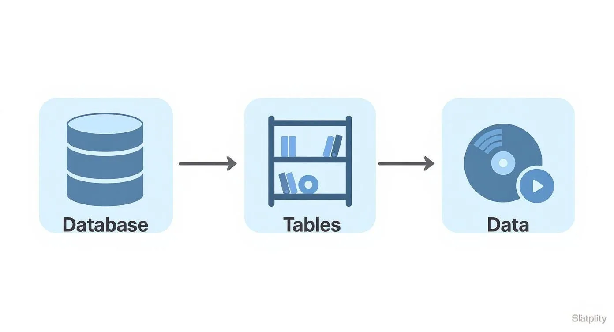
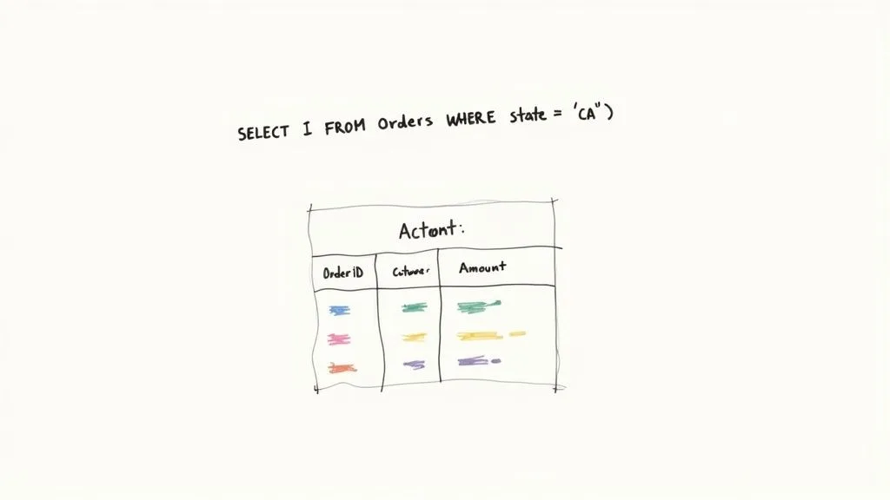
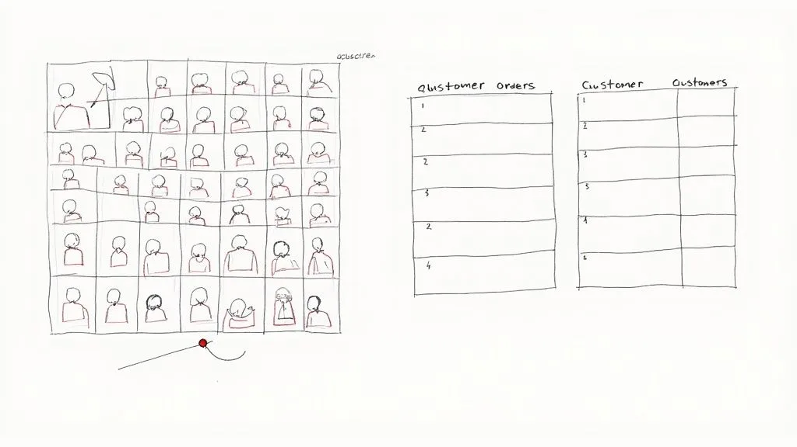

A relational database isn’t just a technical term; it’s a powerful way of organizing information so that it makes sense. Think of it as a perfectly curated digital record store. Everything has a logical, predictable home, making it incredibly easy to find, update, and manage your data.

This simple but powerful structure is the backbone of countless systems we use every day, from the e-commerce site you just browsed to the bank that manages your finances. Understanding it is the first step toward building more efficient, error-proof systems for your own business.

## Understanding the Relational Database Model

Imagine trying to manage a massive music collection using a hundred different, overlapping playlists. It would be total chaos. A relational database swoops in to solve that exact problem by creating a clean, logical structure that mirrors how things are organized in the real world.

Instead of a messy pile of data, you get an interconnected system. The whole point is to eliminate duplicate information and make sure every piece of data is stored only once. This creates a single, reliable source of truth. **For a business, this is an actionable insight:** it means when a customer updates their shipping address, it gets updated everywhere automatically, preventing costly shipping errors.

### The Building Blocks of a Relational Database

Let’s stick with our record store analogy. To really get what a relational database is, you only need to understand its three core parts:

- **Tables:** These are like the main shelves in your record store, each one dedicated to a specific category. **Practical example:** A business might have a `Customers` table, a `Products` table, and an `Orders` table.
- **Rows:** Each row represents a single item on a shelf. It could be one specific album or a particular artist. In database-speak, this is often called a **record**. **Practical example:** In the `Customers` table, one row would be ‘John Smith’.
- **Columns:** Columns hold the specific details about each item. For an album, this would be its “Title,” “Release Year,” or “Genre.” These are also known as **fields**. **Practical example:** For the customer ‘John Smith’, columns would include ‘Email’, ‘Phone Number’, and ‘Address’.

By setting things up this way, a relational database makes it effortless to connect related pieces of data—like linking every album to its correct artist—without creating messy copies. This intuitive and clean structure is exactly why the relational model has been the gold standard in data management for decades.

### Relational Database Concepts at a Glance

To tie it all together, let’s use a practical example from a simple project management system. This table should help the concepts click into place.

| Database Term      | Practical Example                                       | What It Does                                                             |
| ------------------ | ------------------------------------------------------- | ------------------------------------------------------------------------ |
| **Table**          | A “Projects” table                                      | Holds a collection of related data (all your projects).                  |
| **Row / Record**   | A single project, like “Q3 Marketing Campaign”          | Represents one complete item in a table.                                 |
| **Column / Field** | A detail about the project, like “Deadline” or “Budget” | Defines a specific attribute for each record.                            |
| **Primary Key**    | A unique Project ID like “PROJ-101”                     | Uniquely identifies every single record in a table.                      |
| **Foreign Key**    | An “OwnerID” field in the Projects table                | Creates a relationship by linking to a record in a “Team Members” table. |

Seeing these concepts laid out like this makes it clear how everything connects. The goal is always to keep data organized, unique, and logically linked, which provides a solid foundation for any business process.

## The Core Components: Tables, Keys, and Relationships

To really get what a relational database is, you need to peek under the hood at its **three** essential building blocks: **tables**, **keys**, and **relationships**. These parts work together to create a structure that’s both reliable and efficient, stopping the kind of data chaos that plagues disorganized spreadsheets.

The concept map below shows how a database organizes information, starting from the big picture and drilling down to the individual data points.

As you can see, a database is basically a container for tables, and those tables are what hold the actual data. It’s a clean and logical hierarchy.

### From Tables to Unique Keys

First up, we have **tables**. Picture an e-commerce store. You’d likely have a `Customers` table for contact details and a separate `Orders` table for purchase history. Each table holds a specific type of information, which keeps everything tidy and easy to find.

But how do you know which order belongs to which customer? This is where **keys** come into play.

- A **Primary Key** is a totally unique identifier for each record in a table. In our `Customers` table, a `CustomerID` (like C123) is a perfect primary key. It guarantees you’ll never mix up two customers because, like a serial number, it can never be repeated.
- A **Foreign Key** is simply a primary key from one table that you place into another to create a link. The `Orders` table would also have a `CustomerID` column. When customer C123 places an order, their ID “C123” is added to that order’s record, creating a direct connection.

> This system of using keys is the absolute cornerstone of data integrity. By giving every record a unique ID and a clear link to related data, you get rid of any guesswork and create a single source of truth for your entire operation.

### Establishing Powerful Relationships

Finally, these keys are what let us build **relationships** between tables. The foreign key in the `Orders` table points right back to the primary key in the `Customers` table, linking a specific purchase to a specific person.

This simple connection is incredibly powerful. **Actionable insight:** You can now instantly pull up a complete order history for any customer without having to manually search through a massive spreadsheet. This allows for better customer service and targeted marketing. For a deeper look at how platforms like Airtable use these concepts, you can explore our guide on [understanding Airtable key concepts and terminology](/understanding-airtable-key-concepts-and-terminology/). And to make sure your database is robust from the start, it’s always smart to follow established [database design best practices](https://nextnative.dev/blog/database-design-best-practices).

## Using SQL to Communicate with Your Database

So, you’ve got a perfectly structured relational database. Now, how do you actually get information out of it? The answer is **SQL**, which stands for Structured Query Language. It’s the standard language for talking to relational databases.

Think of it less like a scary programming language and more like having a very specific, direct conversation with your data. Instead of digging through endless rows and columns by hand, you write simple commands to pull exactly what you need, instantly.

### Common SQL Commands in Action

Let’s make this real. Imagine you run an online store with a `Customers` table and an `Orders` table. Here’s how you’d use SQL to get actionable answers to business questions.

- **To retrieve data (**`SELECT`**):** Need a list of all your customers in Texas? A `SELECT` query can do that. **Practical example:** The command `SELECT Name, Email FROM Customers WHERE State = 'Texas';` would instantly give you a targeted list for a regional marketing campaign.
- **To add new data (**`INSERT`**):** When a new customer signs up, you use the `INSERT` command to add their details as a new row in the `Customers` table. It ensures every new piece of information lands in exactly the right spot.
- **To modify existing data (**`UPDATE`**):** A customer moved and needs to change their shipping address. The `UPDATE` command finds their record and changes just the address field. **Actionable insight:** This prevents packages from being sent to the wrong location, saving money and keeping customers happy.

> These commands are the building blocks of all data management. They give you a reliable, standardized way to work with your database. Whether you’re grabbing information, adding something new, or making a change, SQL gives you total control with just a few lines of text.

## Why Data Normalization Is a Crucial Step

Think of a messy garage where all your tools, holiday decorations, and old projects are dumped in one giant heap. Finding a specific screwdriver is nearly impossible. An unorganized database feels a lot like that, which is why **data normalization** is the secret to keeping your information clean, efficient, and actually usable.

Normalization is simply the process of tidying up your data to cut down on repetition and make sure everything is reliable. It’s like sorting that messy garage into clearly labeled bins. Instead of having one massive, confusing table, you create several smaller, logical ones and then link them together. This simple step prevents the exact same information from being repeated all over your database.

### A Quick Before-and-After

Let’s walk through a real-world scenario. A small business might start tracking its sales in a single spreadsheet with columns for `OrderID`, `CustomerName`, `CustomerEmail`, `ProductName`, and `ProductPrice`.

This works for a little while, but problems pop up fast. What happens when a customer changes their email address? You’d have to hunt down and manually update every single order they’ve ever placed. If you miss even one, your data becomes inconsistent and you can’t trust it. This is where normalization saves the day.

> The goal of normalization is to make sure every piece of data has one, and only one, place to live. This “single source of truth” is the foundation of any well-built relational database.

By normalizing this data, we would split that one cluttered table into two clean, focused ones:

- **A** `Customers` **Table:** This table would only hold customer-specific information like `CustomerID`, `CustomerName`, and `CustomerEmail`.
- **An** `Orders` **Table:** This one would only track order details, such as `OrderID`, `CustomerID`, `ProductName`, and `ProductPrice`.

**Actionable insight:** Now, if a customer updates their email, you only change it in one spot—the `Customers` table. All their past and future orders automatically point to the correct, updated information, ensuring your customer communication is always accurate. To see this in action, check out our guide on [how Airtable data normalization transforms operations](/how-airtable-data-normalization-transforms-operations-workflows/).

Ultimately, this approach saves a ton of time, prevents costly errors, and sets your database up to grow with your business.

## A Quick Look Back: The Origins of the Relational Model

To really get what a relational database is and why it took over the world, you have to picture the early days of data management. Back in the late 1960s, information was crammed into rigid, clunky systems known as hierarchical or network models. For developers, this was a nightmare—asking a new question or changing how data was structured was a complicated and painful process.

Then came Edgar F. Codd, a researcher at [IBM](https://www.ibm.com/us-en), who saw a much cleaner, more logical way to handle all this information.

### Codd’s Big Idea

In a landmark **1970** paper, Codd introduced the **relational model** to the world. Instead of a tangled mess of pointers and links, he proposed organizing data into simple tables (he called them “relations”) that were connected by common values. Suddenly, the data itself was separate from how it was physically stored on a disk, letting people think about it in a much more intuitive way.

Codd’s work laid the groundwork for the modern relational database, which quickly became the industry standard. His model is the reason we organize information into neat tables with clear relationships today. You can see how this idea shook up the industry on this [timeline of database history](https://www.quickbase.com/articles/timeline-of-database-history).

> Instead of navigating a maze of pointers and records, developers could now think about data in terms of simple, interconnected tables. This was a massive leap in simplifying data management.

This new way of thinking sparked the creation of pioneering systems like IBM’s System R, which gave us SEQUEL—the direct ancestor of the SQL we still use every day. This shift from rigid complexity to logical simplicity is why relational databases have been the backbone of business, science, and just about everything else for decades.

## Where Relational Databases Really Shine

So, where do relational databases actually come into play? Their structured nature makes them the go-to choice for any situation where data integrity and consistency are absolutely critical. They are the bedrock of systems that can’t afford a single mistake.

**Practical example:** Think about an online store. It’s juggling customer accounts, product inventory, and order histories all at the same time. A relational database makes sure that when you buy that last pair of sneakers, the inventory count drops to zero instantly, and the order is tied directly to your account—no mix-ups, no lost data. Financial systems, from your online banking portal to complex accounting software, operate on the same principle of transactional accuracy.

### Built for Reliability, Used Everywhere

This powerful model has been around for a while, but it’s more relevant than ever. The first commercial relational database management system (RDBMS) was launched by [Oracle](https://www.oracle.com/database/) way back in **1979**, and its importance skyrocketed with the standardization of SQL in the 1980s. Today, these databases are the engines for both everyday transaction processing and deep business analytics.

> The strict rules and ACID compliance of relational databases aren’t limitations; they’re features. They guarantee reliability, making these databases essential for any mission-critical operation.

This solid foundation is also what makes modern tools so powerful. For instance, relational databases are often the backbone of larger data ecosystems. As you start connecting different tools, you’ll find that having a structured, reliable database is key to [solving common data integration problems](https://www.surva.ai/blog/data-integration-problems).

Even modern no-code platforms like [Airtable](https://www.airtable.com/) lean heavily on these core concepts to give users their power. A great example of this in action is seeing [how Airtable streamlines museum operations](/how-airtable-streamlines-museum-operations/) by using relational principles in a user-friendly, accessible way.

## Common Questions About Relational Databases

Still got a few questions floating around about relational databases and how they fit into the bigger picture? Let’s clear up some of the most common ones we hear with some practical answers.

### What’s the Main Difference Between SQL and NoSQL Databases?

It really boils down to structure versus flexibility.

Relational databases (which use **SQL**) are like a well-organized library with a strict Dewey Decimal System. Everything has a predefined place. **Practical use case:** They are perfect for transactional systems like an e-commerce checkout process, where you need to ensure every order, payment, and customer detail is consistently and accurately recorded.

On the other hand, non-relational databases (**NoSQL**) are more like a free-form digital scrapbook. **Practical use case:** They’re great for handling massive amounts of unstructured data—like social media posts, IoT sensor readings, or user session data—where the format is unpredictable and speed is more critical than perfect consistency.

### Is Microsoft Excel a Relational Database?

Nope, not quite. While [Excel](https://www.microsoft.com/en-us/microsoft-365/excel) is an incredibly powerful spreadsheet tool, it’s not a true relational database.

Think of it this way: Excel is fantastic for organizing data in a single list or table. But it falls short when you need to enforce strict data rules, manage complex connections between different sets of information, or handle large-scale, multi-user access safely. An **actionable insight** is knowing when to upgrade: if you find yourself manually cross-referencing multiple spreadsheets and correcting data entry errors, it’s a strong sign you need a relational database.

### Do I Need to Be a Developer to Use One?

Not anymore, and that’s the best part.

In the past, you absolutely needed to know **SQL** to build and talk to a database. But modern tools like [Airtable](https://www.airtable.com/) have completely changed the game. They offer intuitive, visual interfaces that let you build powerful relational structures with simple drag-and-drop actions, making all the benefits of a relational database accessible to everyone, from project managers to small business owners.

---

Ready to replace scattered spreadsheets with a single source of truth? At **Automatic Nation**, we build custom Airtable systems that organize your data and automate your workflows, saving you hours of manual work. [Get started with a free consultation](/).
