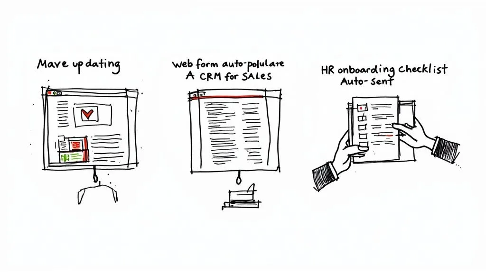

Let’s get right to it: **workflow automation** is simply about teaching software to handle your repetitive, predictable business tasks. Think of it as a digital team member who takes care of the grunt work—like forwarding invoices or updating project trackers—so your actual team doesn’t have to.

### Moving Beyond the Buzzwords

Workflow automation isn’t just some tech-bro buzzword; it’s a dead-simple strategy for getting back your team’s most precious resource: time.

Think about an automatic coffee maker. You set the rules just once (brew at 7 AM, two scoops of coffee), and it does the job perfectly every single day. You don’t have to think about it again. It just works.

That exact same idea applies to your business. Instead of someone manually copy-pasting new lead info from a form into your CRM, an automated workflow does it the second the form is submitted. Instead of a project manager remembering to send a status update every Friday, the system handles it on schedule, without fail.

**Actionable Insight:** Look for a task you do every day that follows the same steps. Do you copy information from an email and paste it into a spreadsheet? That’s a perfect first candidate for automation.

### Why It Matters for Your Business

Every single business runs on a series of processes, whether it’s onboarding a new client, managing inventory, or handling support tickets. When those processes depend entirely on people, you open the door to human error, delays, and a ton of time wasted on work that doesn’t move the needle.

For a deeper dive, this guide on [What is Workflow Automation?](https://sagekit.com/blog/what-is-workflow-automation) is a great resource that breaks down the benefits in more detail.

The real goal here is to tackle those nagging pain points head-on. By building systems to manage the predictable parts of a job, you free up your people to focus on creative problem-solving and big-picture thinking—the stuff that actually grows your business.

> The core idea behind workflow automation is simple: **Let software handle the predictable work so people can focus on the exceptional work.** It’s all about creating systems that are reliable, consistent, and run **24/7** without anyone needing to watch over them.

Throughout this guide, we’ll get into how this works in the real world. We’ll skip the dry, textbook definitions and show you exactly how businesses are using automation to:

- **Slash errors:** No more typos or missed steps that always seem to creep into manual data entry and task management.
- **Boost speed:** Drastically shorten the time it takes to do things like onboard new clients or get purchase orders approved.
- **Lock in consistency:** Make sure every task is done the exact same way, every single time, hitting your quality and compliance standards without a second thought.

To put it in perspective, let’s look at a quick side-by-side comparison.

### Manual vs Automated Workflows at a Glance

This table breaks down the fundamental differences between sticking with old-school manual processes and switching to an automated system.

| Aspect             | Manual Workflow                             | Automated Workflow                          |
| ------------------ | ------------------------------------------- | ------------------------------------------- |
| **Speed**          | Slow, limited by human pace                 | Instantaneous, **24/7** operation           |
| **Accuracy**       | Prone to human error (typos, missed steps)  | **Highly accurate** and consistent          |
| **Consistency**    | Varies by person and day                    | Standardized; every task is identical       |
| **Scalability**    | Difficult; requires hiring more people      | Easy; handles increased volume effortlessly |
| **Cost**           | High labor costs, hidden inefficiency costs | Lower operational costs over time           |
| **Employee Focus** | Repetitive, low-value tasks                 | Strategic, creative, high-impact work       |

As you can see, the shift isn’t just about doing things faster—it’s about fundamentally changing _how_ work gets done, freeing up human potential in the process.

## The Building Blocks of an Automated Workflow

So, how does all this automation magic _actually_ happen? It’s far less complicated than you might think. Every single automated workflow, no matter how complex it looks on the surface, is built on three simple, core components that work together in a logical sequence.

This visual shows the basic flow: a trigger starts the process, a condition checks if a rule is met, and an action completes the task.

This simple “if-then” logic is the engine behind any automated system, allowing you to build reliable processes for almost any business need. Once you grasp these three building blocks, you’ll start seeing opportunities for automation everywhere in your own business.

### Triggers: The Starting Gun

A **Trigger** is the specific event that kicks off an automated workflow. It’s the starting signal—the first digital domino that, once tipped, sets the entire process in motion. Think of it as the “if this happens…” part of the equation.

**Practical Examples of Triggers:**

- A potential customer submits a “Contact Us” form on your website.
- An invoice gets marked as “Paid” in your accounting software.
- A new file is added to a specific folder in [Google Drive](https://www.google.com/drive/).
- A calendar event is scheduled to start in the next **15** minutes.
- A new row is added to a specific view in your [Airtable](https://www.airtable.com/) base.

Each trigger is a defined event that your system is constantly listening for. When it detects one, it immediately moves to the next step.

### Conditions: The Rulebook

Once a workflow is triggered, it often needs to check a set of rules before it proceeds. We call these rules **Conditions**. A condition acts like a gatekeeper, making sure the workflow only continues if specific criteria are met. This is the “only if this is true…” logic.

**Practical Examples of Conditions:**

- **After a form submission (trigger):** Is the “Budget” field greater than **$5,000**? _If yes, assign to a senior sales rep. If no, assign to a junior rep._
- **After an invoice is paid (trigger):** Does the “Service” field contain the word “Retainer”? _If yes, create a project kickoff task. If no, send a thank you email._
- **After a file is added to Google Drive (trigger):** Is the file type a “.PDF”? _If yes, send it for signature. If no, archive it._

Conditions allow you to build intelligent workflows that can handle different scenarios with precision, routing tasks and information exactly where they need to go based on the data you’ve received.

### Actions: The Work Itself

Finally, if the trigger event has occurred and any conditions have been met, the system performs an **Action**. An action is the “then do this” part of the workflow—the actual task you want the software to complete for you. This is the work your team would otherwise have to do by hand.

**Practical Examples of Actions:**

- Create a new deal in your CRM and assign it to the senior sales rep.
- Send a notification to a specific [Slack](https://slack.com/) channel alerting the finance team.
- Generate a project folder in [Dropbox](https://www.dropbox.com/) and share it with the client.
- Add a row to a spreadsheet with the customer’s information.

> In a nutshell, a workflow combines these elements: a **Trigger** (a new support ticket is created) leads to a **Condition** check (is the priority marked ‘Urgent’?), which results in an **Action** (send an instant alert to the on-call technician). It’s this simple sequence that ends up saving thousands of hours.

## So, Why Should You Automate Your Business Processes?

Knowing what automation is and how it works is great, but the real question is _why_ are so many smart businesses doubling down on it? The answer isn’t just about saving a few minutes here and there. It’s about making a strategic choice to build a stronger, more reliable, and more competitive business from the inside out.

At its heart, workflow automation gives your team back its most valuable resource: focus. Research shows that professionals can spend up to **40%** of their week on tedious administrative work like hunting for information or sorting emails. When you hand that work over to software, you free up your people to do what they do best—thinking critically, being creative, and connecting with customers.

### Boost Productivity and Get Things Right the First Time

When your team isn’t stuck doing manual data entry or copy-pasting info between a dozen different apps, they can finally get to the work that actually matters. Imagine a sales team that can generate a proposal in half the time. They’re not just faster; they’re spending that saved time building client relationships instead of wrestling with paperwork. That’s a direct line to better results.

Even better, automation practically eliminates human error. The most careful person can still make a typo, but a well-built automated system follows the rules perfectly, every single time. This is a game-changer for tasks where a small mistake can have big consequences, like financial reporting or processing customer orders.

> **Actionable Insight:** Implement an automated workflow for your invoicing process. When an invoice is paid, automatically log the payment in your accounting software and move the client’s status from “Pending” to “Active” in your project management tool. This eliminates two manual steps and reduces the risk of error.

### Nail Your Compliance and Keep Everything Consistent

Many industries have to follow strict rules and regulations where doing things a certain way isn’t optional—it’s mandatory. Automation ensures those compliance rules are followed to the letter, every time, creating a clear digital trail for every action. It takes the guesswork out of the equation and protects your business from expensive fines or penalties.

From the customer’s point of view, consistency is everything. Workflow automation makes sure that every single client gets the same high-quality experience. For instance, an HR department can use automation to cut down new hire paperwork by over **90%**. This ensures every new team member gets a smooth, professional welcome instead of a messy, inconsistent one.

Ultimately, choosing to automate is about building a more resilient business. It’s about creating systems that do more than just save time and money—they improve quality, enforce standards, and empower your team to do their absolute best work.

## Practical Workflow Automation in Action

Theory is one thing, but seeing workflow automation in a real-world setting is what makes the concept truly click. Let’s move past the definitions and look at the tangible “before and after” stories of businesses that automated key processes.

These examples show how small, strategic changes can lead to huge gains in efficiency across different departments.

This isn’t just about saving time. It’s about building reliable systems that let your team focus on high-impact work instead of getting stuck in the weeds of repetitive, administrative tasks.

### Transforming Marketing Reporting

**The Old Way:** Every Monday morning, the marketing team would spend hours manually pulling data. This meant logging into Facebook Ads, Google Analytics, and their email platform, exporting a bunch of CSV files, and then painstakingly copy-pasting numbers into a master spreadsheet. The process was slow, prone to errors, and the report was already stale by the time it was finished.

**The Automated Way:** Now, an automated workflow connects directly to each marketing platform.

- **Trigger:** The system kicks off automatically every Monday at 6 AM.
- **Action 1:** It pulls key metrics like ad spend, click-through rates, and conversion data from all sources.
- **Action 2:** The information instantly populates a clean, centralized dashboard in [Airtable](https://www.airtable.com/).
- **Action 3:** A summary report with key highlights lands in the team’s Slack channel, ready for their morning meeting.

**The Result:** A real-time, error-free dashboard that frees up **5-10 hours** of the team’s time each week. They can finally focus on analyzing what the numbers mean instead of just collecting them.

### Streamlining the Sales Funnel

**The Old Way:** A new lead fills out a form on the website. The email notification lands in a general inbox, where it sits until a sales admin gets around to it. Hours—or even a full day—later, they manually enter the contact details into the CRM and then try to figure out which sales rep should get the lead. That delay could easily cost the sale.

**The Automated Way:** The moment a lead hits “submit” on the form, a workflow takes over.

1. The form data is instantly captured, creating a new contact and deal in the CRM.
2. The workflow analyzes the lead’s company size and industry to automatically assign it to the right sales rep based on preset rules.
3. A task is immediately created for that rep to follow up within **24 hours**, and they get a notification right away.

**The Result:** This simple change ensures every lead gets immediate, consistent attention, dramatically shortening response times and making sure no one slips through the cracks. For a deeper dive into setting up something similar, check out our step-by-step guide to automating project task creation.

### Perfecting HR Onboarding

**The Old Way:** Onboarding a new employee was a messy checklist for the HR manager. They had to remember to manually email the offer letter, send reminders for tax forms, schedule orientation meetings, and then chase down the IT department to set up accounts. It was a disjointed process that often led to missed steps and a bumpy start for the new hire.

**The Automated Way:** Now, when HR marks a candidate as “Hired” in their system, a complete onboarding workflow kicks off.

- A personalized welcome email with all the necessary documents is sent automatically.
- A series of orientation meetings are scheduled right on the new hire’s calendar.
- Tasks are automatically created for IT (“set up laptop”) and Operations (“assign desk”), so everyone is ready for the employee’s first day.

**The Result:** This turns a chaotic, manual process into a smooth, professional journey that makes new team members feel welcome and valued from day one. Each of these examples highlights how workflow automation replaces manual friction with systematic efficiency.

## How to Build Your First Automated Workflow

So, you’re ready to jump from theory to practice? Good. Building your first automated workflow is less about being a tech wizard and more about thinking logically. You don’t need to be a developer to start clawing back your time—all it takes is a simple, straightforward framework.

This four-step process is a practical roadmap to get your first automation off the ground and running.

### Step 1: Identify the Right Process

The best place to start is with a task that’s a **high-pain point** but has **low complexity**. Look for the repetitive, rule-based jobs your team absolutely dreads. Think manual data entry, copy-pasting between apps, or sending the same reminder emails over and over.

**Actionable Insight:** Grab a notebook and for one day, write down every single task you do that doesn’t require creative thinking. At the end of the day, circle the one you did most often. That’s your first target. A perfect example? Manually creating a project folder with all the standard subfolders every time a new client signs on.

### Step 2: Choose the Right Tools

Once you know _what_ you’re automating, you need the right tools. Don’t overcomplicate it. A powerful combination usually involves just two things: a central database and an integration platform.

- **Central Data Hub:** A tool like **Airtable** works perfectly as your single source of truth. It keeps all the information for your process neatly organized in one spot.
- **Integration Platform:** Think of tools like **Zapier** or **Make** as the digital glue. They connect your apps (like Airtable, Slack, and Google Drive) and let you set the rules for what happens when.

The best platform really depends on what you need it to do. To help you narrow it down, it’s worth understanding [what automation tool suits your business](/what-automation-tool-suits-your-business/) based on things like complexity and the other apps you use.

### Step 3: Build and Test Your Workflow

Now for the fun part: building the logic. Using your integration tool, you’ll map out the sequence: if this happens (the trigger), then do that (the action). For our new client folder example, the logic would look like this:

1. **Trigger:** A deal’s status in Airtable changes to “Closed – Won.”
2. **Action 1:** Create a new parent folder in Google Drive named after the client.
3. **Action 2:** Inside that folder, automatically create standard subfolders like “Contracts,” “Assets,” and “Invoices.”
4. **Action 3:** Ping the project manager in their Slack channel with a direct link to the new folder.

**Actionable Insight:** Before you let this run wild, **always run a test** with your own information. Use your name as the “client name” and your email for notifications. A quick trial run makes sure every step fires correctly and helps you iron out any small kinks before it impacts your real work.

### Step 4: Monitor and Refine Your System

Automation isn’t a “set it and forget it” magic bullet. It’s a process of continuous improvement. Once your workflow is live, keep an eye on it. As your business changes, you’ll almost certainly find ways to make it even better.

> **Actionable Insight:** Set a calendar reminder for one month after you launch a new automation. When it pops up, ask yourself: “Is this still saving me time? Could it be better?” Maybe you can add a step to also create a client invoice automatically. Your first automated workflow is a learning opportunity that builds the confidence to tackle bigger processes.

As you plan your system, it’s smart to consider the [best practices for integrating AI into analytics workflows](https://querio.ai/articles/best-practices-for-integrating-ai-into-your-analytics-workflow). This helps ensure your automations are scalable and effective right from the start, allowing you to build systems that can grow with your business.

## The Future of Automation in Business

If you think workflow automation is just about handling simple, repetitive tasks, think again. The game is changing, and we’re moving well beyond basic, rule-based systems. We’re stepping into an era of intelligent business operations—where automation doesn’t just follow a script, but actually learns, adapts, and even makes decisions on its own.

This huge leap forward is all thanks to **Artificial Intelligence (AI)** and **Machine Learning (ML)**. When these technologies are baked into automation, they create what we call “intelligent automation” systems that can tackle complex, unpredictable situations. Imagine a customer support system that can read an incoming email, figure out if the customer is frustrated or just has a simple question, and automatically send it to the right person—all without a human lifting a finger.

### The Rise of Hyperautomation

This leads us to a much bigger idea: **Hyperautomation**. This isn’t just about automating one or two processes. It’s the ambitious goal of automating every single business process that _can_ be automated. The point is to build a completely interconnected, hyper-efficient ecosystem where all your systems and tools work together like a well-oiled machine.

This isn’t just a small tweak; it’s a fundamental shift in how successful companies will run in the very near future.

> **Actionable Insight:** Start thinking of your business not as a collection of departments, but as a series of interconnected workflows. How does a new lead in marketing trigger actions in sales, which then triggers actions in project management and finance? Mastering workflow automation today is the first step toward building that interconnected, resilient business of tomorrow.

### A Market on the Brink of an Explosion

And this isn’t just some passing tech fad. The numbers back it up. Industry research shows the global workflow automation market is set to explode, jumping from **$23.77 billion in 2025 to an incredible $78.26 billion by 2035**. You can [discover more insights about this rapid expansion](https://www.alliedmarketresearch.com/workflow-automation-market-A11753) in recent industry reports.

That’s a massive jump, representing a compound annual growth rate (CAGR) of **21%**. What’s driving this? A few key things:

- Businesses are demanding automation that works in real-time.
- Digital transformation is no longer optional—it’s a core strategy across every industry.
- Powerful technologies like AI, RPA, and the Internet of Things (IoT) are being integrated into automation platforms.

Bottom line? The companies that lean into this shift now will be the ones that thrive down the road, turning operational efficiency into a serious competitive weapon.

## Common Questions About Workflow Automation

When businesses start digging into workflow automation, a few questions always seem to pop up. Let’s tackle them head-on, so you can feel confident about your next steps.

One of the big ones is the difference between **Workflow Automation** and **Robotic Process Automation (RPA)**. They both make things more efficient, but they work in totally different ways. Think of RPA as a software “bot” that mimics a person doing a single, repetitive task—like copying and pasting data from a spreadsheet into another app. Workflow automation, on the other hand, is the bigger picture. It’s about orchestrating an entire process from start to finish, connecting different tools and people along the way.

### Is Automation Viable for Small Businesses?

Another frequent question is whether automation is just for the big guys with deep pockets. The answer is a hard no. Thanks to modern no-code tools, workflow automation is now totally accessible and affordable for businesses of any size. Even a one-person shop can see huge gains without breaking the bank.

So, where do you start? The best approach is to look for the low-hanging fruit. Find tasks that are:

- **Highly Repetitive:** Things you or your team do the same way over and over, every single day or week.
- **Rule-Based:** Processes that follow a simple “if this, then that” logic.
- **Prone to Human Error:** Any task that involves manual data entry is a prime candidate.

> **Actionable Insight:** Start small. Pick one process that’s a constant headache. Automating something simple, like sending client onboarding emails or chasing down late invoices, delivers an immediate win and builds momentum for bigger projects. For example, set up a workflow where three days after an invoice due date, an automatic, polite reminder email is sent to the client. This saves you from having to remember and do it manually.

As you build, it’s also smart to know the limits of your tools. For instance, when you’re using a platform like [Airtable](https://www.airtable.com/), understanding its specific constraints is key. Knowing the [Airtable automation limits and what you need to know](/airtable-automation-limits-what-you-need-to-know/) from the get-go will help you design more reliable and scalable systems that won’t buckle as your business grows.

---

Ready to replace scattered spreadsheets with organized, automated systems? **Automatic Nation** builds custom Airtable solutions that save your team hours every week. [Get started with a free consultation](/).
